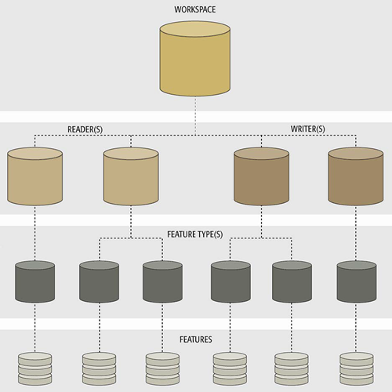
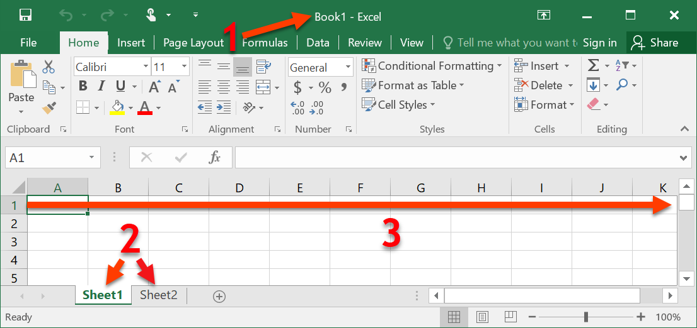

# FME Desktop Components

FME users need to know several concepts. These concepts are necessary to create a common language among the multitude of formats FME supports. Additionally, they are required to describe the different components of FME translations.

## Workspace Components

A workspace is the primary element in an FME translation and is responsible for storing a translation definition. The workspace is the container for all the functionality of a translation. It contains the following components:

### Readers and Writers

A **reader** is the FME term for the component in a translation that reads a source dataset. Likewise, a **writer** is the component that writes to an output dataset.

Readers and writers are represented by entries in the Navigator window.

### Feature Types

**Feature type** is the FME term that describes a subset of records. Common alternatives for this term are *layer*, *table*, *sheet*, *feature class*, and *object class*. For example, each sheet in an Excel workbook, table in a database, or layer in a spatial data file is defined by a feature type in FME.

Feature types are represented by objects that appear on the Workbench canvas.

### Features

**Features** are the smallest single components of an FME translation.

They aren’t individually represented within a workspace, except by the feature counts on a completed translation.

### Relationships

Each workspace can contain multiple readers and writers, each of which can have multiple feature types, with multiple features. They exist in a hierarchy that looks like this:

 <!-- redo with final workspace -->

### Examples

Here is a table showing some examples of how common formats are treated by default in FME.

|Format|Dataset|Reader/Writer|Feature Type|Feature|
|-|-|-|-|-|
|Excel|The .xls or .xlsx file, also known as a workbook|The definition in the workspace of how to read/write the dataset, the path to read or write|A worksheet (single table) within the workbook|Row in a worksheet|
|CSV|The .csv file (a single table)|The definition in the workspace of how to read/write the dataset, the path to read or write|A single table*|Row in a table|
|Esri Geodatabase|A .gdb file ([either a system folder or a database](Enterprise geodatabase))|The definition in the workspace of how to read/write the dataset, the path to read or write|A single ArcGIS feature class or table within the geodatabase|A single geometric feature plus attributes (e.g. a point, line, or polygon), or a row in a table|
*Note: CSV data is stored in a plain text file, with no method of subdivision. Therefore each feature type in FME represents a different CSV file, instead of different divisions in a single file. For more info on each format see the [R+W documentation](https://docs.safe.com/fme/html/FME_Desktop_Documentation/FME_ReadersWriters/Home.htm).

#### Excel Breakdown

Here is a visual example using Excel. In the image below:

1. Dataset = the XLS or XLSX file (a.k.a. the workbook)
2. Feature types = the worksheets (a.k.a. the sheets or tables)
3. Feature = the row (with columns as attributes)

#### In Workbench

A workspace with multiple readers, writers, and transformers might look like this:

This workspace has two readers (each with three feature types), and three writers (with one, two, and one feature types). Each reader and writer is a different format, and each has a different name for its feature types. Note that feature types and transformers appear on the canvas and the Navigator window, while readers and writers appear only on in the Navigator.
