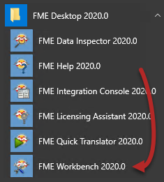
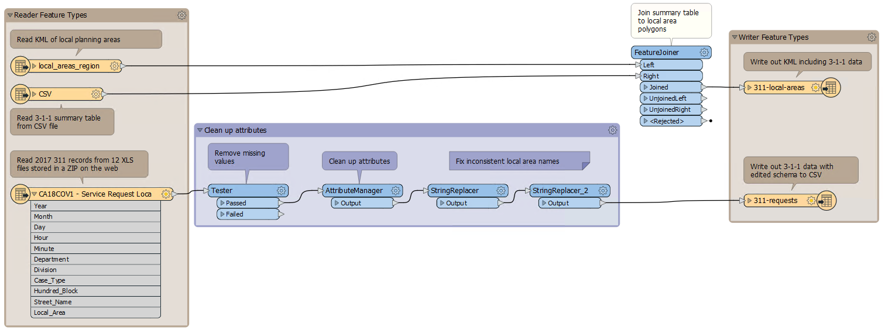
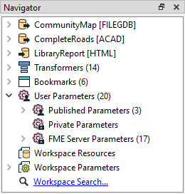
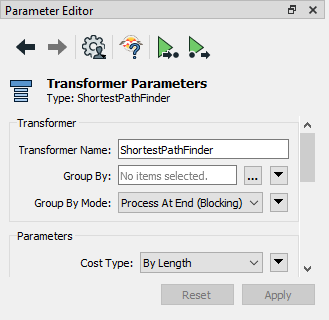

# FME Workbench

Let's take a closer look at FME Workbench. If you have not started it yet, locate Workbench in the Windows start menu:

## Major Components of FME Workbench ##

The FME Workbench user interface has a number of major components:

### Canvas ###

As we've seen, the FME Workbench canvas is where to define a translation. It is the primary window within Workbench:

By default the workspace reads from left to right; data source on the left, transformation tools in the center, and data destination on the right. Connections between each item represent the flow of data and may branch in different directions, merge together, or both.

### Menu/Toolbar ###

The menu bar and toolbar contain a number of tools: for example, tools for navigating around the Workbench canvas, controlling administrative tasks, and adding or removing readers/writers:

### Navigator ###

The Navigator window is a structured list of parameters that represent and control all of the components of a translation:

### Transformer Gallery ###

The transformer gallery is a tool for the location and selection of FME transformation tools.

The number of transformers (above, 484) will vary depending on the version of FME and any optional custom transformers installed:

### Translation Log ###

The translation log reports on translations and other actions. Information includes any warning or error messages, translation status, length of translation, and the number of features processed:

### Parameter Editor Window ###

The Parameter Editor window is for editing parameters for objects on the canvas window:

