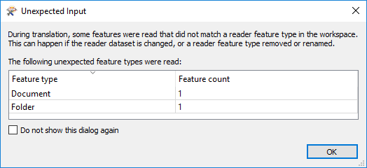
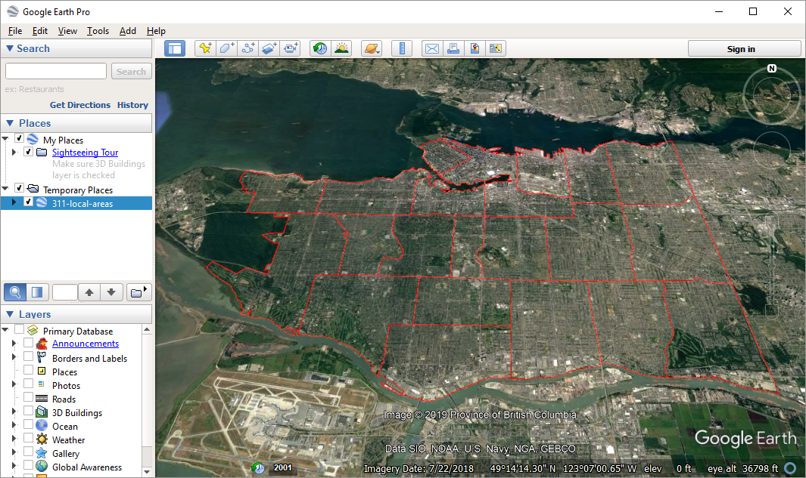

<!-- Adapted from DesktopBasic\Basics-Ex2-Complete.fmw -->



<!-- Which one do we want? -->

{{ template.exercise(1.1,
               "Opening and Running a Workspace",
               "3-1-1 case location details (XLS hosted on the web)",
               "To open and run an FME workspace to explore what it can do with data",
               "Opening and running a workspace",
               "C:\\FMEData2019\\Workspaces\\IntroToDesktop\\Ex1.1-Begin.fmw 
               C:\\FMEData2019\\Workspaces\\IntroToDesktop\\Ex1.1-Begin-Local.fmw (doesn't read from the web, so runs a bit faster)",
               "None")
}}

Rather than trying to explain what FME is and does, let's try it for ourselves! In this exercise you will open the completed version of the FME workspace you will create in this module's exercises. We will explore it, run it, and look at the output.

The workspace provides an example of how a municipal government could use FME to summarize 3-1-1 call records. [3-1-1](https://en.wikipedia.org/wiki/3-1-1) is a special phone number used by municipalities in Canada and the United States to manage non-emergency municipal service calls.

# 1) Locate Workspace File

Translations and transformations in FME are defined in an FMW file.

Using a file explorer, browse to the file C:\\FMEData2019\\Workspaces\\IntroToDesktop\\Ex1.1-Begin.fmw:



If you don't have a good internet connection, you can run C:\\FMEData2019\\Workspaces\\IntroToDesktop\\Ex1.1-Begin-Local.fmw instead, which reads local data instead of reading from the web.



Double-click on the file. It will open an application called FME Workbench. You might be prompted to choose an application to use; if so, select FME Workbench 2019.0 win64.

# 2) Explore FME Workspace

When FME Workbench opens you will see the option of viewing the Workbench Essentials tutorial. You can complete this now if you wish, or view it later under Help > Workbench Essentials. For now, click the `X` to close the window.

The central part of the application will look like this (click to enlarge):

This part we call the canvas. It is where the translation and transformation of data are defined graphically. Although it might appear complex at first glance, it does not take much practice with FME to create similar workflows.

Examine the left-hand side of the canvas:

This area is where we read data. These objects are a KML (mapping data for [Google Earth](https://www.google.com/earth/)) of local planning areas, an Excel spreadsheet of summarized 3-1-1 call records, and an Excel spreadsheet of the records themselves.

Now look at the right-hand side:

This area is where we write data. The objects here represent the KML file of local planning areas, now with the 3-1-1 summary data added (311-local-areas) and a CSV file of the requests with an edited schema (311-requests).

In between the reader and writer are objects that transform data. They alter the structure (e.g., attribute names) and content (e.g., values of attributes) of the data as it moves from left to right.

Labels and other annotations show us what the workspace does:

- Reads 3-1-1 data from CSV
- Cleans the data by removing missing values and fixing inconsistent values
- Removes attributes that aren't needed in the reports
- Writes the edited original data to CSV
- Separately, joins the summarized 3-1-1 data to the KML of local planning areas and writes it back out to KML

# 3) Run FME Workspace

Let's run this workspace.

Before doing so, we want to control _how_ to run the workspace. By default, a feature called **Prompt for User Parameters** is turned on. We don't need this on for this course, so let's turn it off by clicking the dropdown arrow next to the Run button the toolbar, and clicking Prompt for User Parameters:

Now we are ready to run the workspace. Click on the green Run button on the Workbench toolbar:

The workspace will now run. As it does, you will see messages pass by in a log window. You may also see numbers appear on the canvas connections and green annotated icons on each object. We will discuss these later.

You will also receive an Unexpected Input dialog window:

This window appears because FME expects KML features to have a Document and Folder feature type defining metadata about the KML file. We chose not to import those feature types, so FME is just making sure we know they aren't being used. Click OK to ignore the warning.

# 4) Locate and Examine Output

Once the translation is complete, click on the KML writer feature type named **311-local-areas**. Choose the option Open Containing Folder:

In the Explorer dialog that opens you will find the new KML and CSV datasets:

Double-click the **311-local-areas.kml** file to open it with [Google Earth Pro](https://www.google.com/earth/versions/).

You can click each local area to see a bubble with a summary of the number of 3-1-1 calls by city department:

This small demonstration illustrates the power of FME. This workspace read data from multiple datasets and wrote it to datasets in both spatial and spreadsheet (i.e., tabular) formats. In between it carried out a series of transformations, creating added value.

Keep Google Earth open - you will need it for the next section, a quiz on this unit's content.



<ul>
  <li>Open an FME workspace</li>
  <li>Run an FME workspace</li>
  <li>Locate the output from an FME workspace</li>
</ul>


