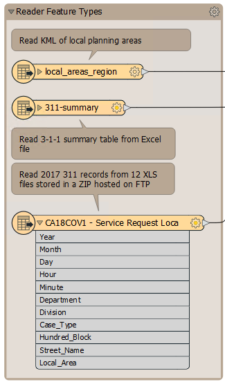
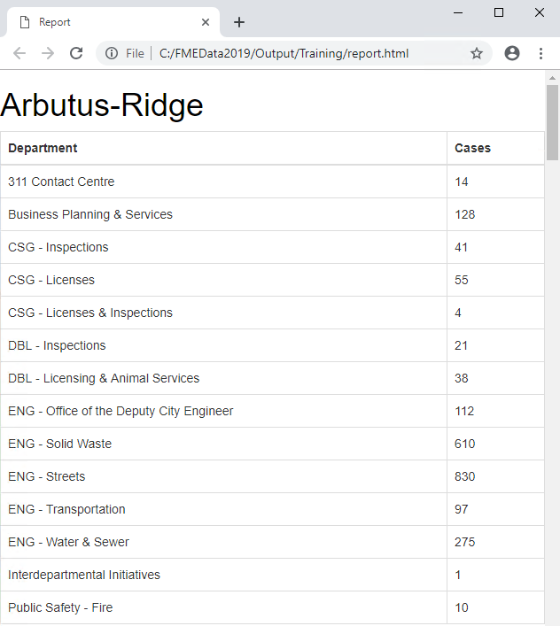

<!-- Adapted from DesktopBasic\Basics-Ex2-Complete.fmw -->



<!-- Which one do we want? -->

{{ template.exercise(1.1,
               "Opening and Running a Workspace",
               "3-1-1 call records (<code>.csv</code>) Local planning areas (<code>.kml</code>)",
               "To open and run an FME workspace to explore what it can do with data",
               "Opening and running a workspace",
               "C:\FMEData2018\Workspaces\DesktopBasic\Basics-Ex1-Begin.fmw",
               "None")
}}

Rather than trying to explain what FME is and does, let's try it for ourselves! In this exercise you will open the completed version of the FME workspace you will create in this module's exercises. We will explore it, run it, and look at the output.

The workspace provides an example of how a municipal government could use FME to summarize 3-1-1 call records. [3-1-1](https://en.wikipedia.org/wiki/3-1-1) is a special phone number used by municipalities in Canada and the United States to manage non-emergency municipal service calls.

# 1) Locate Workspace File

When translations and transformations are defined in FME, they can be saved in a `.fmw` file.

Using a file explorer, browse to the file listed above:

Double-click on the file. It will open an application called FME Workbench.

# 2) Explore FME Workspace

In FME Workbench, dismiss any Getting Started dialog that may open by clicking "Don't Show Me Again."

The main part of the application will look like this:

This part we call the canvas. It is where the translation and transformation of data is defined graphically. Although it might look complicated, it does not take much practice with FME to create workflows of this type.

Examine the left-hand side of the canvas:

This area is where we read data. At the top is a `.kml` file called local_areas_region, containing a map of local planning areas. Below that is a spreadsheet of 3-1-1 call records stored in an Excel spreadsheet (`.xlsx`). It is the "E" (Extract) part of ETL.

Now look at the right-hand side:

This area is where we write data, in this case, a report of the call records in HTML and CSV format, plus a KML map. It is the "L" (Load) part of ETL.

In between the reader and writer are objects that transform data. They represent the "T" (Transform) part of ETL.

Labels and other annotations show us what the workspace does:

- Reads 3-1-1 data from CSV
- Cleans the data by removing missing values and fixing inconsistent values
- Removes attributes that aren't needed in the reports
- Summarizes the number of cases by department for each local planning area, writing the results to CSV
- Generates HTML reports with a table and graph for each local area
- Writes the graph and table to HTML
- Joins the table to the KML of local areas, sets some KML properties, and writes the map to KML

# 3) Run FME Workspace

Let's run this workspace. To do this click on the Green run button on the Workbench toolbar:

<!-- Run with Prompt defaults on! -->

The workspace will now run. As it does so, you will see messages pass by in a log window. You may also see numbers appear on the canvas connections and green annotated icons on each object. We will get to what these are for later!

# 4) Locate and Examine Output

Once the translation is complete, click on the HTML writer object on the canvas. Choose the option to Open Containing Folder:

<!-- Empty local area showing up -->

In the Explorer dialog that opens you will find both the `.html` output and the `.csv` dataset:

Open a web browser such as Firefox or Chrome. Open the output file created by FME (usually <kbd>Ctrl</kbd>+<kbd>O</kbd> or File &gt; Open is the easiest way). You will see a table and a graph of the total number of cases by department for each local planning area. All this has been generated by FME from the original Excel spreadsheets:

This small demonstration illustrates the power of FME. This workspace read data from multiple datasets and wrote it out to datasets in both spatial and spreadsheet (i.e. tabular) formats. In between it carried out a series of transformations, creating added value and information.



<ul>
  <li>Open an FME workspace</li>
  <li>Run an FME workspace</li>
  <li>Locate the output from an FME workspace</li>
</ul>


