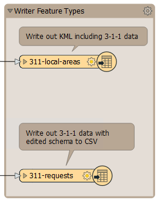
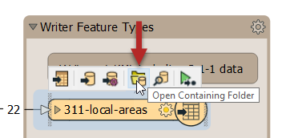

<!-- Adapted from DesktopBasic\Basics-Ex2-Complete.fmw -->



<!-- Which one do we want? -->

{{ template.exercise(1.1,
               "Opening and Running a Workspace",
               "3-1-1 case location details (XLS hosted on FTP)",
               "To open and run an FME workspace to explore what it can do with data",
               "Opening and running a workspace",
               "C:\\FMEData2018\\Workspaces\\IntroToDesktop\\Ex1.1-Begin.fmw",
               "None")
}}

Rather than trying to explain what FME is and does, let's try it for ourselves! In this exercise you will open the completed version of the FME workspace you will create in this module's exercises. We will explore it, run it, and look at the output.

The workspace provides an example of how a municipal government could use FME to summarize 3-1-1 call records. [3-1-1](https://en.wikipedia.org/wiki/3-1-1) is a special phone number used by municipalities in Canada and the United States to manage non-emergency municipal service calls.

# 1) Locate Workspace File

Translations and transformations in FME are defined in an FMW file.

Using a file explorer, browse to the file C:\\FMEData2018\\Workspaces\\IntroToDesktop\\Ex1.1-Begin.fmw:

Double-click on the file. It will open an application called FME Workbench. You might be prompted to choose an application to use; if so, select FME Workbench 2018.1 win64.

# 2) Explore FME Workspace

When FME Workbench opens you will see the option of completing Getting Started exercises. You can complete these now if you wish, or come back to them later. For now, click the `X` to close the window.

The central part of the application will look like this:

This part we call the canvas. It is where the translation and transformation of data are defined graphically. Although it might appear complicated, it does not take much practice with FME to create workflows of this type.

Examine the left-hand side of the canvas:

This area is where we read data. This object is a spreadsheet of 3-1-1 call records stored in an Excel workbook (XLSX).

Now look at the right-hand side:

This area is where we write data. The objects here represent a report of the call records as a simple webpage (HTML) and an Excel file (<@Value(Local Area)>), as well as a CSV file with cleaned and edited data (311-requests).

In between the reader and writer are objects that transform data. They alter the structure (e.g., attribute names) and content (e.g., values of attributes) of the data as it moves from left to right.

Labels and other annotations show us what the workspace does:

- Reads 3-1-1 data from CSV
- Cleans the data by removing missing values and fixing inconsistent values
- Removes attributes that aren't needed in the reports
- Writes the edited original data to CSV
- Summarizes the number of cases by department for each local planning area, writing the results to Excel
- Generates an HTML report with a table and graph for each local area
- Writes the report to HTML

# 3) Run FME Workspace

Let's run this workspace.

Before doing so, we want to control _how_ to run the workspace. By default, a feature called **Run with Prompt** is turned on. We don't need this on for this course, so let's turn it off by clicking the Run with Prompt button on the toolbar:

OK, now we are ready to run the workspace. Click on the Green run button on the Workbench toolbar:

The workspace will now run. As it does so, you will see messages pass by in a log window. You may also see numbers appear on the canvas connections and green annotated icons on each object. We will discuss these later!

# 4) Locate and Examine Output

Once the translation is complete, click on the HTML writer feature type. Choose the option to Open Containing Folder:

In the Explorer dialog that opens you will find the new HTML, Excel, and CSV datasets:

Open a web browser such as Firefox or Chrome. Open the report.html file created by FME (usually <kbd>Ctrl</kbd>+<kbd>O</kbd> or File &gt; Open is the easiest way). You will see a table and a graph of the total number of cases by department for each local planning area. FME generated all of this from the original Excel spreadsheets:

This small demonstration illustrates the power of FME. This workspace read data from multiple datasets and wrote it out to datasets in both spatial and spreadsheet (i.e., tabular) formats. In between it carried out a series of transformations, creating added value and information.

Keep this report open - you will need it for the next section, a quiz on this section's content.



<ul>
  <li>Open an FME workspace</li>
  <li>Run an FME workspace</li>
  <li>Locate the output from an FME workspace</li>
</ul>


