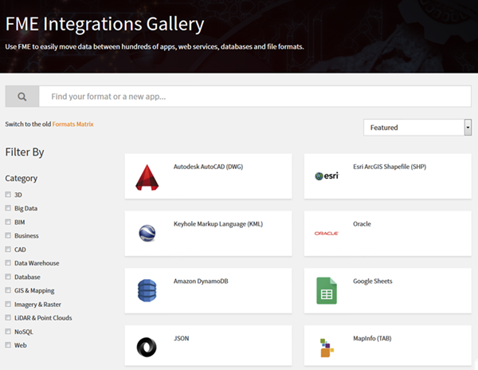

# FME Translations

## Learning Objectives

After completing this section, you will be able to:
- Define what a workspace is and generate one in FME Workbench.
- Explain what a schema is and edit it in FME Workbench.
- Turn feature caching on and off and use it when building a workspace.
- Inspect data using FME Data Inspector.

## Translations

At its heart, FME is a data translation tool, and this is usually the first aspect users wish to learn about.

**Data translation** is the term we at Safe Software use to refer to the conversion of data from one format to another. Have you ever had trouble opening data in an unusual format in your go-to application? Have you ever needed to load tabular data into a database in a systematic way? Have you ever needed to load engineering or architectural data in a CAD format like `.dwg` or `.dgn` into a GIS? Then you have come to the right place! FME makes data conversion easy, allowing you to translate between over 400 different formats.

We refer to **translation** rather than **conversion** to emphasize the goal of seamlessly letting data speak in the language of a different format. FME is designed to let you not just convert data from one format to another, but to create output data to your exact specifications.

In this section, you will learn how to conduct basic data translations yourself using FME.
