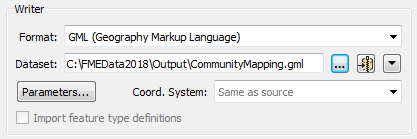

# Generate Workspace

Workbench’s intuitive interface makes it easy to set up and run a simple format-to-format ('quick') translation.

## The Start Tab ##
The Start Tab in FME Workbench includes different ways to create or open a workspace. The simplest method is Generate Workspace:

## Generate Workspace Dialog ##
The Generate Workspace dialog condenses all the choices to be made into a single dialog box. It has fields for defining the format and location of both the data to be read, and the data to be written.

Red coloring in an FME dialog indicates mandatory fields. Users must enter data in these fields to continue. In most dialogs, the OK button is deactivated until the mandatory fields are complete.

### Format and Dataset Selection ###
A key requirement is the format of the source data. All format selection fields in FME are both a pull-down menu and a text entry field.

The text entry field allows you to type a format name directly. It has an autocomplete function that selects close matches as you type.

The drop-down list shows some of the most commonly used formats, so many favorite formats are instantly available:

Click 'More Formats' and a table opens showing **all** of the formats supported by FME.

The source dataset is another key requirement. Dataset selection fields are a text entry field, but with a browse button to open an explorer-like dialog for file selection.

Similarly, the Writer format and dataset are defined in this dialog:

## Feature Types Dialog ##
Clicking OK on the Generate Workspace dialog causes FME to generate the defined workspace. However, whenever a source dataset contains multiple layers, the user is first prompted to select which are to be translated.

This is achieved through the Select Feature Types dialog. In FME, ***feature type*** is another term for *layer*.<!-- change this! --> Only selected layers show in the workspace.

Here, for example, is a Select Feature Types dialog where the user has chosen to include all available layers in the workspace.

# Exercise

<!-- Adapted from DesktopBasic\Basics-Ex2-Complete.fmw -->



<!-- Change to CSV to Excel or something -->

{{ template.exercise(1,
               "Basic Workspace Creation",
               "Zoning Data (MapInfo TAB)",
               "Create a workspace to translate zoning data in MapInfo TAB format to GeoJSON (Geographic JavaScript Object Notation)",
               "Basic workspace creation with FME Workbench",
               "None",
               "C:\FMEData2018\Workspaces\DesktopBasic\Basics-Ex2-Complete.fmw")
}}

<!-- Edit to tabular -->

Congratulations! You have just landed a job as a technical analyst in the GIS department of your local city. Your old schoolteacher, Miss Vector, gave you a reference, so don't let her down!

On your first day, you've been asked to do a simple file format translation.

We’ve outlined all of the actions you need to take, though FME's interface is so intuitive you should be able to carry out the exercise without the need for these step-by-step instructions.

**1) Start FME Workbench**
 If it isn't open already, start FME Workbench by selecting it from the Windows start menu. You’ll find it under Start > FME Desktop 2018.0 > FME Workbench 2018.0.

If Workbench is already open, click on the Start tab above the main canvas.

 **2) Select Generate Workspace**
 In the Create Workspace part of the Start page select the option to Generate (Workspace). Alternatively, you can use the shortcut Ctrl+G.

<!--Repeat of Image 15-->

 **3) Define Translation**
 The Generate Workspace tool opens up a dialog in which to define the translation to be carried out. Fill in the fields in this dialog as follows:

<table style="border: 0px">

<tr>
<td style="font-weight: bold">Reader Format</td>
<td style="">MapInfo TAB (MITAB)</td>
</tr>

<tr>
<td style="font-weight: bold">Reader Dataset</td>
<td style="">C:\FMEData2018\Data\Zoning\Zones.tab</td>
</tr>

<tr>
<td style="font-weight: bold">Writer Format</td>
<td style="">GeoJSON (Geographic JavaScript Object Notation)</td>
</tr>

<tr>
<td style="font-weight: bold">Writer Dataset</td>
<td style="">C:\FMEData2018\Output\Training\Zones.json</td>
</tr>

</table>

The dialog will look like this:

Remember, you can set a format by typing its name, by selecting it from the drop-down list, or by choosing “More Formats” and selecting the format from the full table of formats. For now, ignore the Workflow Options and leave the default of 'Static Schema.'

 **4) Generate and Examine Workspace**
 Click OK to close the Generate Workspace dialog. A new workspace will be generated into the FME Workbench canvas:

The list of attributes is exposed by clicking the arrow icon on each object.

 **5) Run Workspace**
 Run the workspace by clicking the run button on the toolbar, or by using Run > Run Translation on the menubar. The workspace runs and the log file reports a successful translation:

 **6) Locate Output**
 Locate the destination data in Windows Explorer to prove that it's been written as expected (don't forget the Open Containing Folder button from Exercise 1). In the next section, we’ll cover how to inspect the dataset visually to ensure that it is correct.

 **7) Save Workspace**
 Save the workspace. We'll be using it in a later exercise. Remember there is a toolbar save button, and on the menu, there is File &gt; Save As.

{{ template.tip(content="When a translation is run immediately without adjustment it's known as a Quick Translation. Because FME is a 'semantic' translator, with an enhanced data model, the output from a quick translation is as close to the source data in structure and meaning as possible, given the capabilities of the destination format.") }}
