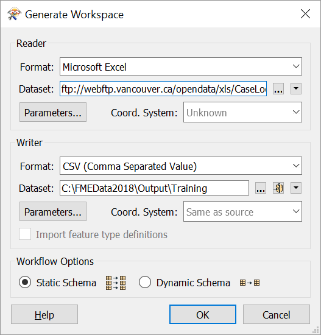

# Exercise 2.1

<!-- Adapted from DesktopBasic\Basics-Ex2-Complete.fmw -->



{{ template.exercise(2.1,
               "Basic Workspace Creation",
               "3-1-1 case location details (<code>.xls</code> hosted on FTP)",
               "Create a workspace to translate <code>.xls</code> to <code>.csv</code>",
               "Basic workspace creation with FME Workbench",
               "None",
               "C:\FMEData2018\Workspaces\DesktopBasic\Basics-Ex2-Complete.fmw")
}}

<iframe width="770" height="433" src="https://www.youtube.com/embed/?listType=playlist&list=PLFxZDg3GNCguPKqew9ZvqCNZCZOoiwtC5&index=0" frameborder="0"
 allow="autoplay; encrypted-media" allowfullscreen></iframe>
_Video covering generating a workspace_

Congratulations! You have just landed a job as a technical analyst in the Digital and Contact Centre Services department of your local city. You will be working to manage and analyze the data they collect from their 3-1-1 Contact Centre. [3-1-1](https://en.wikipedia.org/wiki/3-1-1) is a local phone number used widely across cities in the United States and Canada for citizens to call in and request services. Most cities also collect this data online now as well.

On your first day, you've been asked to do a simple file format translation. The 3–1–1 case location details data is currently stored as `.xls` files, one for each month of each year since 2009. These files are stored on the city [FTP server](https://en.wikipedia.org/wiki/File_Transfer_Protocol). In order to host this public data in a format anyone can access, your manager wants you to translate the 12 `.xls` files into a single `.csv` file covering the entire year.

We’ve outlined all of the actions you need to take, though FME's interface is so intuitive you should be able to carry out the exercise without the need for these step-by-step instructions.

## 1) Start FME Workbench

If it is not open already, start FME Workbench by selecting it from the Windows start menu. You’ll find it under Start > FME Desktop 2018.1 > FME Workbench 2018.1.

If Workbench is already open, click on the Start tab above the main canvas.

## 2) Select Generate Workspace

In the Create Workspace part of the Start page select the option to Generate (Workspace). Alternatively, you can use the shortcut <kbd>Ctrl</kbd>+<kbd>G</kbd>.

<!--Repeat of Image 15-->

## 3) Define Translation

The Generate Workspace tool opens up a dialog in which to define the translation to be carried out. Fill in the fields in this dialog as follows:

<table style="border: 0px">

  <tr>
    <td style="font-weight: bold">Reader Format</td>
    <td style="">Microsoft Excel</td>
  </tr>

  <tr>
    <td style="font-weight: bold">Reader Dataset</td>
    <td style=""><a href="ftp://webftp.vancouver.ca/opendata/xls/CaseLocationsDetails_2017_XLS.zip">ftp://webftp.vancouver.ca/opendata/xls/CaseLocationsDetails_2017_XLS.zip</a> <i>Note:</i> You can also access the data locally at C:\FMEData2018\Resources\311\CaseLocationsDetails_2017_XLS.zip</td>
  </tr>

  <tr>
    <td style="font-weight: bold">Writer Format</td>
    <td style="">CSV (Comma Separated Value)</td>
  </tr>

  <tr>
    <td style="font-weight: bold">Writer Dataset</td>
    <td style="">C:\FMEData2018\Output\Training\</td>
  </tr>

</table>

The dialog will look like this:

Remember, you can set a format by typing its name, by selecting it from the drop-down list, or by choosing “More Formats” and selecting the format from the full table of formats. Note that the writer needs only a folder and not a specific file name.

You may click the Parameters buttons in the Generate Workspace dialog to check the reader/writer parameters, but none of them need changing in this exercise. For now, you can also ignore the Coordinate System setting and the Workflow Options.

## 4) Generate and Examine Workspace

Click OK to close the Generate Workspace dialog. A new workspace will be generated into the FME Workbench canvas:

The list of attributes is exposed by clicking the arrow icon on each object.

## 5) Run Workspace

Run the workspace by clicking the run button on the toolbar, or by using Run > Run Translation on the menubar. The workspace runs and the log file reports a successful translation:

## 6) Locate Output

Locate the destination data in Windows Explorer to prove that it's been written as expected (do not forget the Open Containing Folder button from Exercise 1):

For now, let's use Notepad to ensure the data looks as we would expect. Right-click on `CA18COV1 - Service Request Loca.csv` and choose Open With > Notepad. If you look at the top row, you should see the attribute names we saw under the writer feature type:

`Year,Month,Day,Hour,Minute,Department,Division,Case_Type,Hundred_Block,Street_Name,Local_Area`

In the next section, we’ll cover how to inspect the data using FME Data Inspector.

## 7) Save Workspace

Save the workspace. We will be using it in a later exercise. Remember there is a toolbar save button, and on the menu, there is File &gt; Save As.



When a translation is run immediately without adjustment it's known as a "Quick Translation." Because FME is a 'semantic' translator, with an enhanced data model, the output from a quick translation is as close to the source data in structure and meaning as possible, given the capabilities of the destination format.





<ul>
  <li>Generate an FME workspace</li>
  <li>Run an FME workspace</li>
</ul>


