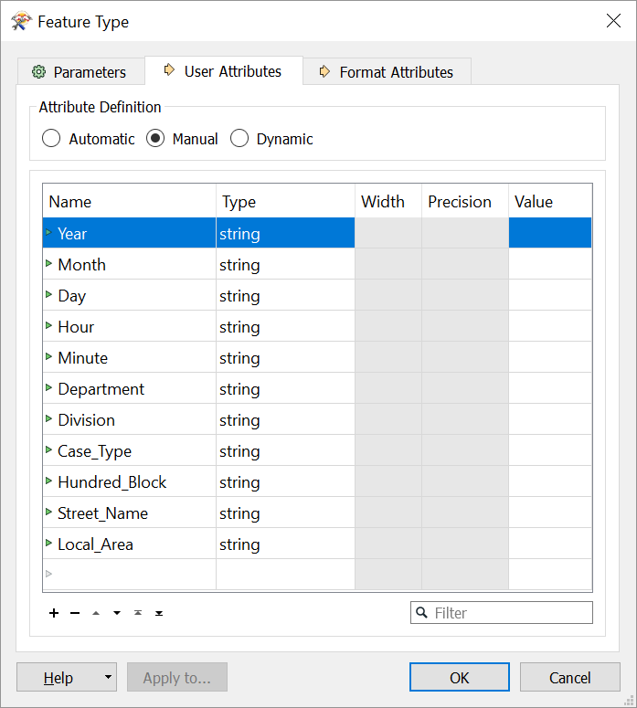
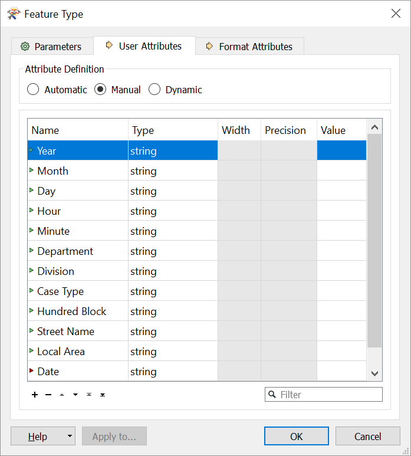
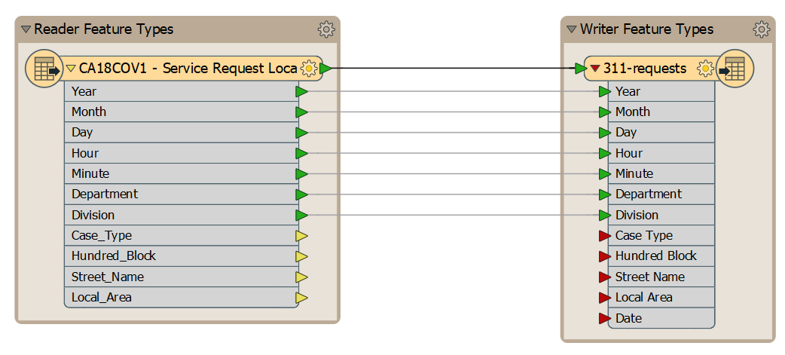
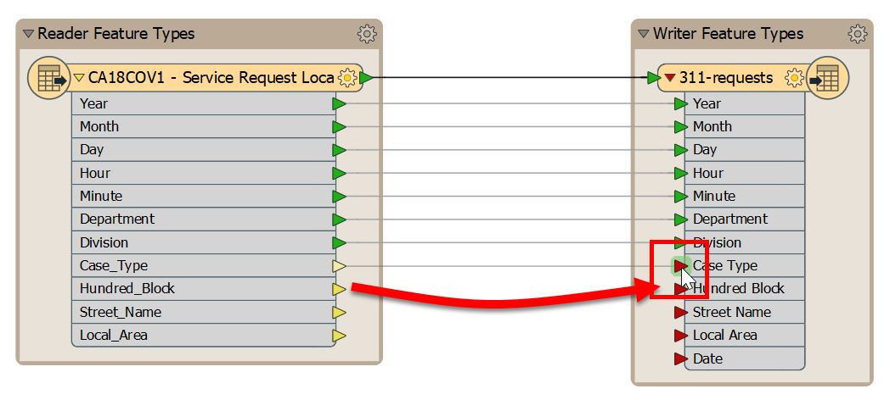
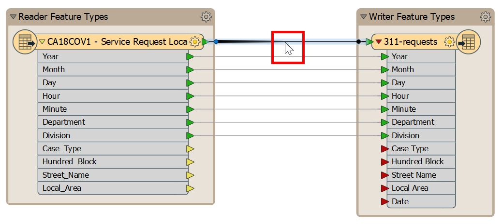
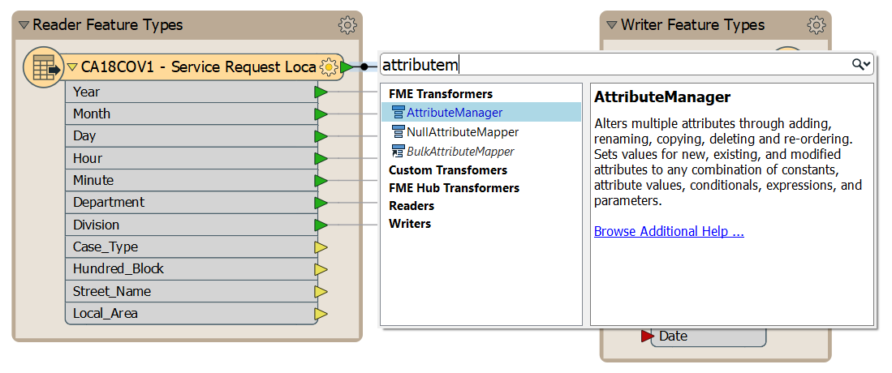
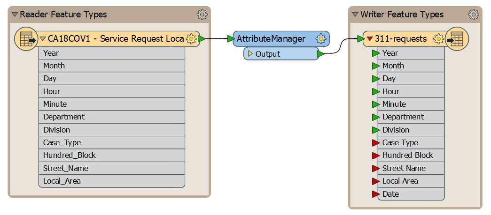
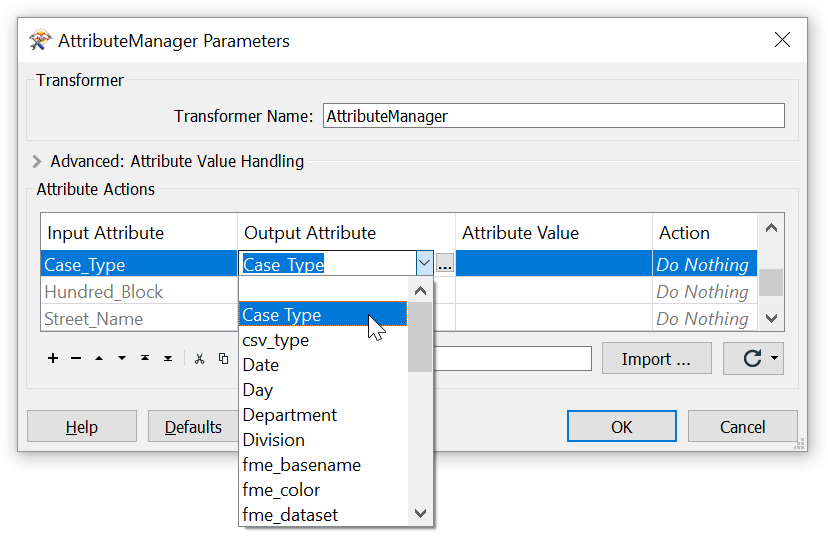
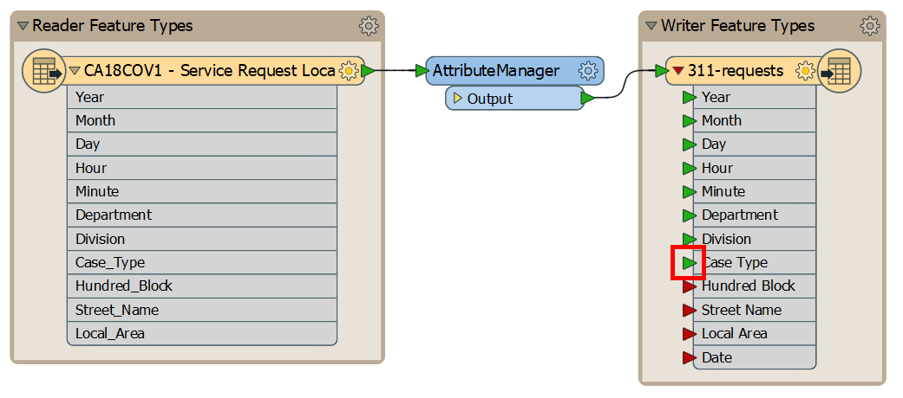



{{ template.exercise(2.3,
               "Schema Editing and Mapping",
               "3-1-1 case location details (XLS hosted on FTP)",
               "Edit attribute names and remove attributes",
               "Schema editing and schema mapping",
               "C:\\FMEData2018\\Workspaces\\IntroToDesktop\\Ex2.3-Begin.fmw",
               "C:\\FMEData2018\\Workspaces\\IntroToDesktop\\Ex2.3-Complete.fmw")
}}

<iframe width="770" height="433" src="https://www.youtube.com/embed/?listType=playlist&list=PLFxZDg3GNCguPKqew9ZvqCNZCZOoiwtC5&index=1" frameborder="0" allow="autoplay; encrypted-media" allowfullscreen></iframe>
_Video covering schema editing and mapping. This video will be updated to match this exercise for the FME 2019.0 release._

Now that you created a workspace to translate the 3-1-1 data to CSV, the 3-1-1 department has requested that you remove the underscores from the attribute names and add a `Date` attribute. We can use a transformer to make these changes to the schema.

<!-- update path -->

# 1) Start Workbench

Start Workbench (if necessary) and open the workspace from Exercise 1. Alternatively you can open C:\FMEData2018\Workspaces\IntroToDesktop\Ex2.3-Begin.fmw.

# 2) Rename Feature Type

Currently, the destination schema matches the source. However, the end user of the data has requested parts of the schema be changed.

Inspect the writer feature type parameters by double-clicking it or clicking its cogwheel. Click in the field labelled CSV File Name (remember this label is format-specific and in CSV we deal with tables) and change the name from "CA18COV1 - Service Request Loca" to "311-requests":

Now when the workspace is run, the output will be named 311-requests.csv.

# 3) Update Attributes

Inspect the user attributes by clicking on the User Attributes tab. They will look like this:

Let's get rid of those underscores in the attribute names and add a new attribute, called `Date`, that we will supply values to later. Carry out the following actions:

|Name|Action|
|-|-|
|`Case_Type`|Rename attribute to `Case Type`|
|`Hundred_Block`|Rename attribute to `Hundred Block`|
|`Street_Name`|Rename attribute to `Street Name`|
|`Local_Area`|Rename attribute to `Local Area`|
|`Date`|Create attribute `Date` of Type `string`|

You can rename attributes by clicking in the Name cell and making your edit. You can add an attribute by clicking in the blank Name cell at the bottom of the table and entering a new attribute name. Alternatively, you can use the `+` button to add a new row.  You can give it the Type `string` by clicking the drop-down menu under Type and selecting `string`.

Once you have made these changes to the writer schema, click Ok. The attribute list should now look like this:

However, you might notice that the triangles next to the attribute names we edited and created on the writer feature type have changed color to red! We call these triangles **ports**. When they are on the left side of an object they are called **input ports**, while triangles on the right side are called **output ports**. You can notice the attributes we edited have changed color to yellow.



Colored ports are used to visually aid schema mapping and indicate the following:

<ul>
  <li>Green &#9654;: this attribute is connected.</li>
  <li>Yellow &#9654;: this reader feature type attribute is not mapped to any writer feature type; therefore, this attribute will not be in the output.</li>
  <li>Red &#9654;: this writer feature type attribute is not connected; while it exists in the schema, it will not receive any data and therefore will not have any values in the written data.</li>
</ul>



# 4) Save the Workspace

Save the workspace – it will be completed in further examples. It should now look like this:

# 5) Add a Transformer for Schema Mapping

It is possible to carry out schema mapping manually by drawing connections between ports. For example, you can click and drag between the yellow triangle next to `Case_Type` on your reader feature type and the red triangle next to `Case Type` on your writer feature type:

However, let's use a **transformer** instead, which is a more systematic and reproducible way to handle attributes. Transformers are objects we add to the canvas to modify our data during the translation. FME has over 400 transformers; we will cover them in more detail in the next unit. For now, we will be using the [AttributeManager](http://docs.safe.com/fme/html/FME_Desktop_Documentation/FME_Transformers/Transformers/attributemanager.htm).

To add a transformer, click on the feature connection (dark black line) from reader to writer feature type:

Start to type the phrase "AttributeManager." This method is one way to place a transformer in the workspace and is called Quick Add. As you type, FME searches for a matching transformer. When the list is short enough for you to see the AttributeManager, select it from the dialog (double-click on it, or hit Enter):

Doing so will place an AttributeManager transformer:



For a great tip on adding transformers, see #5 in our list of <strong><a href="http://blog.safe.com/2014/10/fmeevangelist128/">The Top Ten FME Tips of All Time!</a></strong>



# 6) Set Parameters

View the AttributeManager parameters by double-clicking it. It will look like this:

Notice that all of the attributes on the stream in which it is connected will automatically appear in the dialog.

Where the Input Attribute field is set to `Case_Type`, click in the Output Attribute field. Click on the button for the drop-down list and in there choose `Case Type` as the new attribute name to use:

In response, the Action field will change to read *Rename*.



`Case Type` appears in the list because it already exists on the writer schema. If we had done this step before editing the writer schema, we would have had to manually enter the new attribute name in this dialog.



Click OK to close the dialog. Now in the Workbench canvas window, you will see the `Case Type` attribute is flagged with a green arrow, to confirm that a value is being provided to that attribute.

Repeat this step for the remaining attributes with underscores. After clicking Ok you should see the input ports on the writer feature type all turn green. Note that we do not have a `Date` attribute in our source data; therefore, we will not be mapping that attribute yet.

# 8) Run Workspace and Inspect the Output

Save and run the workspace.

You can inspect the data by either:

1. Using File > Open Dataset in Data Inspector.
2. Clicking your writer feature type to select it and then clicking the Inspect icon.

Looking at the Table View, we can see our schema has been edited to remove the underscores from attribute names and to add a Date attribute (which is empty for now):



<ul>
  <li>Edit the attributes on a writer schema</li>
  <li>Edit the output layer name on a writer schema</li>
  <li>Add transformers to a workspace</li>
  <li>Carry out schema mapping with the AttributeManager transformer</li>
</ul>


