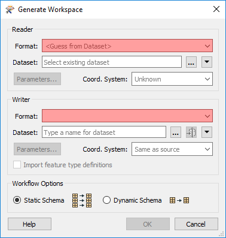
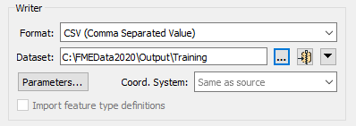
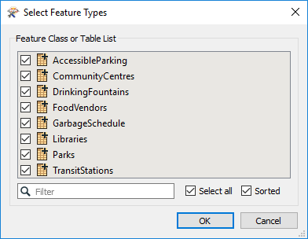

# Generate Workspace

Workbench’s intuitive interface makes it easy to set up and run a simple format-to-format ('quick') translation.

## The Start Tab

The Start Tab in FME Workbench includes different ways to create or open a workspace. The simplest method is Generate Workspace:

You can also generate a workspace through File > Generate Workspace.





Generate Workspace is used to quickly set up a workflow to convert files from a single format. If you have multiple input formats, you can build on a generated workspace or start with a blank canvas. For this lesson, we will start out using one file; we will cover using multiple datasets and formats later in the course.



## Generate Workspace Dialog

The Generate Workspace dialog condenses all the choices into a single dialog box. It has fields for defining the format and location of both the data to be read, and the data to be written.

Red coloring in an FME dialog indicates mandatory fields. Users must enter data in these fields to continue. In most dialogs, the OK button is not activated until the mandatory fields are complete.

### Format and Dataset Selection

A key requirement is the format of the source data. All format selection fields let you type to search formats, or use a pull-down menu to browse.

You can type format names to search available formats. Additionally, the drop-down list shows some of the most commonly used formats, so many favorite formats are instantly available:

Click 'More Formats' and a table opens showing **all** of the formats supported by FME.

The source dataset is another key requirement. Dataset selection fields are a text entry field, but with a browse button to open an explorer-like dialog for file selection.

Similarly, this dialog defines the Writer format and dataset:

## Feature Types Dialog

Clicking OK on the Generate Workspace dialog causes FME to generate the defined workspace. However, whenever a source dataset contains multiple feature types, the user is first prompted to select which data to translate.

You choose the feature types to include through the Select Feature Types dialog. As mentioned [earlier](/1.getting-started/1.03.fme-components.md), ***feature type*** is another term for *layer*, *table*, *sheet*, *feature class*, and *object class*. For example, each layer in a DWG file, or each table in an Oracle database, is defined as a feature type in FME. Only selected feature types appear in the workspace. This dialog gives you control over which groups of data you want to use from your source.

Here, for example, is a Select Feature Types dialog where the user has chosen to include all available layers in the workspace:

