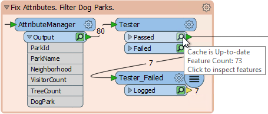

# Feature Caching #
In previous versions of FME, it was possible to run a workspace using Run with Full Inspection.

Full Inspection meant the data was saved at each step of the workspace and so was available for immediate inspection.

In FME 2018 the functionality around this tool changed, and so the name was changed too, to Run with Feature Caching:

 

With this option active, FME generates caches at every step of the translation when the workspace is run:

The caches are indicated by the small icons on each object.

---

## Inspecting Cached Data ##
Sometimes it's important to be able to inspect data at any step of the translation. Adding an Inspector transformer at every step would be tiresome, so instead the Data Caching option can be used.

Cached data can be inspected by simply clicking on the icon on a particular object.

---

## Saving Cached Data ##
Because workspaces can be worked on over several sessions, and because you might want to transfer a workspace with caches to another user, saving a workspace as a template also gives the option to save the data caches:

That way any workspace created from the template automatically gains access to the caches from the previous run.

---

<!--Tip Section--> 

<table style="border-spacing: 0px">
<tr>
<td style="vertical-align:middle;background-color:darkorange;border: 2px solid darkorange">
<i class="fa fa-info-circle fa-lg fa-pull-left fa-fw" style="color:white;padding-right: 12px;vertical-align:text-top"></i>
TIP
</td>
</tr>

<tr>
<td style="border: 1px solid darkorange">

It's certainly quicker to set up "Run with Data Caching" than to manually add Inspector transformers. However, be aware that caching data obviously causes the translation to be slower, and to use system resources such as disk space. 
  Data caching is very useful while developing a workspace, but should be turned off before putting a workspace into production.

</td>
</tr>
</table>