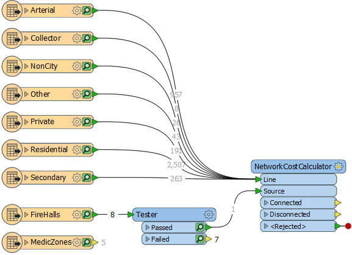
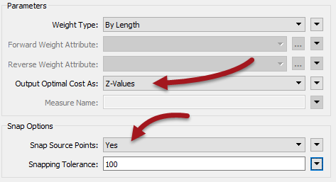
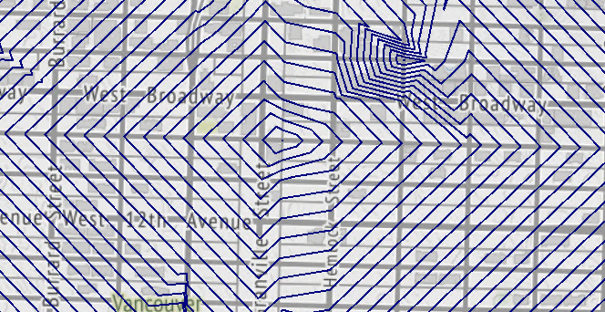

<!--Exercise Section-->

<table style="border-spacing: 0px;border-collapse: collapse;font-family:serif">
<tr>
<td width=25% style="vertical-align:middle;background-color:darkorange;border: 2px solid darkorange">
<i class="fa fa-cogs fa-lg fa-pull-left fa-fw" style="color:white;padding-right: 12px;vertical-align:text-top"></i>
Exercise
</td>
<td style="border: 2px solid darkorange;background-color:darkorange;color:white">
Caching and Partial Runs
</td>
</tr>

<tr>
<td style="border: 1px solid darkorange; font-weight: bold">Data</td>
<td style="border: 1px solid darkorange">Roads (AutoCAD DWG) Firehalls and Zones (GML)</td>
</tr>

<tr>
<td style="border: 1px solid darkorange; font-weight: bold">Overall Goal</td>
<td style="border: 1px solid darkorange">Create time and distance isolines with the NetworkCostCalculator</td>
</tr>

<tr>
<td style="border: 1px solid darkorange; font-weight: bold">Demonstrates</td>
<td style="border: 1px solid darkorange">Data caching and partial runs</td>
</tr>

<tr>
<td style="border: 1px solid darkorange; font-weight: bold">Start Workspace</td>
<td style="border: 1px solid darkorange">None</td>
</tr>

<tr>
<td style="border: 1px solid darkorange; font-weight: bold">End Workspace</td>
<td style="border: 1px solid darkorange">C:\FMEData2018\Workspaces\UpgradingTo2018\Caching-Ex1-Complete.fmwt</td>
</tr>

</table>

To assist in planning emergency services for the city, you have been tasked with assessing emergency response times by creating a dataset of isochrones - contour lines depicting travel time from each firehall - for medical emergencies.

 **1) Add Firehall Reader**
 Start FME Workbench. Select Readers &gt; Add Reader from the menubar. Set the parameters as follows:

<table style="border: 0px">

<tr>
<td style="font-weight: bold">Reader Format</td>
<td style="">GML (Geography Markup Language)</td>
</tr>

<tr>
<td style="font-weight: bold">Reader Dataset</td>
<td style="">C:\FMEData2018\Data\Emergency\FireHallsWithZones.gml</td>
</tr>

</table>

When prompted, select the FireHalls and MedicZones feature types to add to the workspace:

 **2) Add Roads Reader**
 Once more select Readers &gt; Add Reader from the menubar. This time set the parameters as follows:

<table style="border: 0px">

<tr>
<td style="font-weight: bold">Reader Format</td>
<td style="">Autodesk AutoCAD DWG/DXF</td>
</tr>

<tr>
<td style="font-weight: bold">Reader Dataset</td>
<td style="">C:\FMEData2018\Data\Transportation\CompleteRoads.dwg</td>
</tr>

</table>

When prompted, select all of the feature types to add to the workspace (i.e. we want all road types) leaving out only layer "0".

 **3) Run Workspace**
 Ensure feature caching is turned on (Run &gt; Run with Feature Caching) and run the workspace. The data will be read and cached. This means:

- The data is now ready for use by later stages of the workspace
	- When we run the whole workspace, FME won't have to re-read the data
- Our pre-translation inspection can be done here
	- We don't have to read it separately in the Data Inspector

Select all of the feature types in the workspace, right-click one of them, and choose Inspect Cached Features (shortcut Ctrl+I):

Now we can inspect the data to see what we are dealing with.

 **4) Add Tester**
 To start with we'll work on a single fire hall, Fire Hall number 4. So add a Tester transformer connected to the FireHalls feature type. Set it up to filter out other fire halls. The simplest way is to check for (and keep) features that end in the number 4:

Click on the Tester and press the Run From This button (shortcut F6). The Tester transformer will run using the cache of data from the feature type it is connected to.

Click on the green cache icon for the Passed output port. The Data Inspector will open and show a single fire hall feature. It should be hall number 4.

 **5) Add NetworkCostCalculator**
 Now we'll add a NewworkCostCalculator transformer. The best way of doing this is to select all of the road feature types and then use Quick Add by typing NCC and selecting that transformer. This way the transformer will be added and all road feature types connected automatically.

Then connect Tester:Passed to the Source input port:

Rearrange the objects as necessary so you avoid overlapping connections.

 **6) Add NetworkCostCalculator**
 Inspect the NetworkCostCalculator parameters. Set Output Optimal Cost As to "Z-Values". Set Snap Source Points to "Yes" and set a Snapping Tolerance of 100:

These parameters will output the costs as Z values on each network line, and will snap the source fire hall to the network if it doesn't sit exactly upon it.

Run the NetworkCostCalculator by clicking it and choosing Run To This. 

---

<!--Tip Section--> 

<table style="border-spacing: 0px">
<tr>
<td style="vertical-align:middle;background-color:darkorange;border: 2px solid darkorange">
<i class="fa fa-info-circle fa-lg fa-pull-left fa-fw" style="color:white;padding-right: 12px;vertical-align:text-top"></i>
TIP
</td>
</tr>

<tr>
<td style="border: 1px solid darkorange">

Because we currently have all the data cached, and there are no transformers after this, it doesn't yet matter if we choose Run From This or Run To This. Both achieve the same result with the same performance.

</td>
</tr>
</table>

---

Inspect the Connected output cache. If you query a road feature you'll see that it has Z values on each vertex. The Z value represents the road distance to the fire hall.

 **6) Add NetworkCostCalculator**
 To visualize these results, add a ContourGenerator transformer connected to the NetworkCostCalculator:Connected output port. The ContourGenerator port to connect is Points/Lines:

Open the ContourGenerator parameters dialog. Set the Surface Tolerance to 10 and the Output Contour Interval to 50. Run the ContourGenerator transformer and inspect the Contours output cache:

The output is a set of Isodistance lines showing the distance (by road) from the chosen firehall.

 **7) Add ExpressionEvaluator**
 To create Isochrones (lines of equal travel time) we need to specify the speed at which a vehicle can travel. Obviously this varies depending on the type of road, terrain, weather, and intersection crossings; but a quick search shows that the average speed of a fire truck in a city is 55kph (35mph).

So, add an ExpressionEvaluator transformer to the workspace, between the AutoCAD Roads feature types and the NetworkCostCalculator transformer Line port. The quickest way to do this is to click on the green Line arrow and type the name of the ExpressionEvaluator. That way the transformer will be inserted in all of the connections simultaneously: 

Notice how the caches "downstream" from the new transformer change to yellow. They are stale because they no longer represent the results the workspace would generate.

 **8) Set Up ExpressionEvaluator**
 Inspect the parameters for the ExpressionEvaluator. Set up an expression to calculate an attribute called TravelTime. The expression should be:

<pre>
@Length()/916.666666
</pre>

- @Length() is an FME function that measures the length of each road link. 

- 916.66666 comes from (speed * (metres-per-km / seconds-per-minute)) which is (55*(1000/60))

 **9) Adjust NetworkCostCalculator**
 Now inspect the parameters for the NetworkCostCalculator again. 

Change the Weight Type parameter from "By Length" to "By Two Attributes". Select TravelTime as the attribute for both the forward and reverse weight:

 **9) Adjust ContourGenerator**
 Now inspect the parameters for the ContourGenerator again. 

Change the Surface Tolerance to 1 and the Output Contour Interval to 1 (i.e. each contour will represent 1 minute of travel time).

Now we must re-run the workspace. You can choose to either:

- Run From This on the ExpressionEvaluator
- Run To This on the ContourGenerator
- Run From This on the ContourGenerator

The same sections of workspace will highlight as you hover over the first two options. The third option will only highlight the ContourGenerator itself, and when chosen will warn that prior transformers need to be included as they don't yet have valid caches.

Inspect the new ContourGenerator output cache:

The result will be a series of isochrones representing travel times for emergency vehicles from fire hall number 4.

 **10) Save as Template**
 We'll continue this exercise at the end of the next chapter. In case you close and re-open the workspace in the meantime, we'll save it as a template. That way we can keep the caches.

So select Save &gt; Save As Template from the menubar. When prompted enter a template name. Be sure to check the option to Include Feature Caches:

Now when we re-open the workspace using this template, the data will already be cached and ready to use.

---

<!--Exercise Congratulations Section--> 

<table style="border-spacing: 0px">
<tr>
<td style="vertical-align:middle;background-color:darkorange;border: 2px solid darkorange">
<i class="fa fa-thumbs-o-up fa-lg fa-pull-left fa-fw" style="color:white;padding-right: 12px;vertical-align:text-top"></i>
CONGRATULATIONS
</td>
</tr>

<tr>
<td style="border: 1px solid darkorange">

By completing this exercise you have learned how to:
 
<ul><li>Turn on Feature Caching</li>
<li>Inspect all cached data in a workspace</li>
<li>Carry out a partial run using Run From Here and Run To Here</li>
<li>Decide when Run To Here or Run From Here is most appropriate</li>
<li>Save a template file with Feature Caches included</li></ul>

</td>
</tr>
</table>