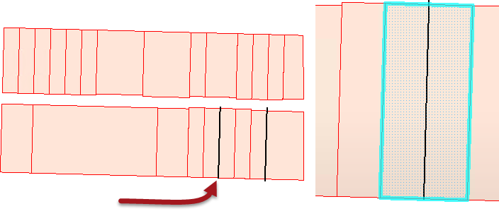
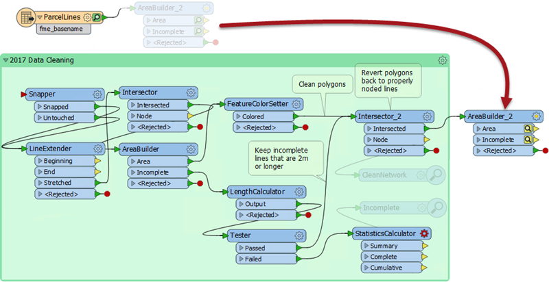

<!--Exercise Section-->

<table style="border-spacing: 0px;border-collapse: collapse;font-family:serif">
<tr>
<td width=25% style="vertical-align:middle;background-color:darkorange;border: 2px solid darkorange">
<i class="fa fa-cogs fa-lg fa-pull-left fa-fw" style="color:white;padding-right: 12px;vertical-align:text-top"></i>
Exercise
</td>
<td style="border: 2px solid darkorange;background-color:darkorange;color:white">
Tolerance and Data Cleaning
</td>
</tr>

<tr>
<td style="border: 1px solid darkorange; font-weight: bold">Data</td>
<td style="border: 1px solid darkorange">Property Boundaries (MicroStation DGN)</td>
</tr>

<tr>
<td style="border: 1px solid darkorange; font-weight: bold">Overall Goal</td>
<td style="border: 1px solid darkorange">Clean line data in order to build property polygons</td>
</tr>

<tr>
<td style="border: 1px solid darkorange; font-weight: bold">Demonstrates</td>
<td style="border: 1px solid darkorange">Intersection, Data Cleaning, and Tolerance</td>
</tr>

<tr>
<td style="border: 1px solid darkorange; font-weight: bold">Start Workspace</td>
<td style="border: 1px solid darkorange">C:\FMEData2018\Workspaces\UpgradingTo2018\Tolerance-Ex1-Begin.fmwt</td>
</tr>

<tr>
<td style="border: 1px solid darkorange; font-weight: bold">End Workspace</td>
<td style="border: 1px solid darkorange">C:\FMEData2018\Workspaces\UpgradingTo2018\Tolerance-Ex1-Complete.fmwt</td>
</tr>

</table>

For a small exercise, you've been asked to turn a set of linework (representing property boundaries) into polygon features. This is easily done with the AreaBuilder. However... there may be some data cleaning requirements that aren't as simple.

 **1) Start Workbench**
 Start FME Workbench and open the starting workspace template.

The workspace includes a reader to read a set of MicroStation DGN features. It also includes a bookmarked set of transformers that were previously used to clean data in FME2017:

It's so old that they even include Inspector transformers! How quaint!

 **2) Add AreaBuilder**
 Firstly let's ignore that bookmarked section and simply add an AreaBuilder transformer connected to the reader feature type (ParcelLines):

Turn on feature caching and run that part of the workspace. Inspect both AreaBuilder caches:

Notice that there are several "unused" features. Where a feature is unused it did not create the proper boundary and the area covers two (or more) properties.

 **3) Move AreaBuilder Transformer**
 We now know the data won't build proper polygons without some cleaning. So disconnect the AreaBuilder transformer and move it to the end of the workspace, connected in place of the CleanNetwork Inspector from the bookmark:  

Delete the other Inspector transformer too, connect the source data to the Snapper transformer in the bookmark, and run the workspace.

Inspect the output. There will be perfectly formed polygons and no Incomplete features.

So we've finished the project. Except... surely there is a better way in 2018?

 **4) Delete Bookmark and Transformers**
 Let's start out by deleting the 2017 bookmark and all its contents, plus the new AreaBuilder transformer, so that all we're left with is the reader feature type. That's just to clear the workspace of clutter.

 **5) Add Intersector and AreaBuilder transformers**
 Place an Intersector transformer (it has the new Tolerance parameter and so may help us) plus a new AreaBuilder transformer:

Inspect the Intersector's parameters. Make sure the tolerance parameter is set to Automatic and re-run the workspace. Inspect the output:

There are some Incomplete features but not as many bad areas. The Intersector has obviously done some good. However, the tolerance required is just too much for FME to handle automatically.

 **6) Set Manual Tolerance**
 Inspect the Intersector parameters again and this time set the Tolerance parameter to a custom value of 0.2. Re-run the workspace. The results are better, but not quite complete.

Set the tolerance parameter to 0.3 and try again.

This time the area features build correctly. Any Incomplete features are small overlaps and can be ignored.

So we have replicated the results of the 2017 workspace by replacing all of the bookmark contents with a simple Intersector transformer! 

---

<!--Exercise Congratulations Section--> 

<table style="border-spacing: 0px">
<tr>
<td style="vertical-align:middle;background-color:darkorange;border: 2px solid darkorange">
<i class="fa fa-thumbs-o-up fa-lg fa-pull-left fa-fw" style="color:white;padding-right: 12px;vertical-align:text-top"></i>
CONGRATULATIONS
</td>
</tr>

<tr>
<td style="border: 1px solid darkorange">

By completing this exercise you have learned how to:
 
<ul><li>Apply an Automatic tolerance on the Intersector transformer</li>
<li>Apply a Custom tolerance on the Intersector transformer</li></ul>

</td>
</tr>
</table>