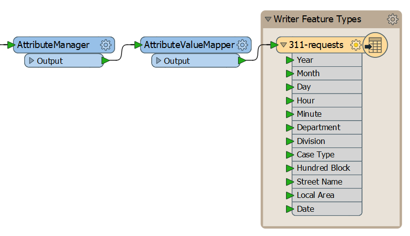



{{ template.exercise("3.2b",
               "Locating Transformers",
               "3-1-1 case location details (XLS hosted on FTP)",
               "Find a transformer to deal with inconsistent data",
               "Using Transformer Gallery and Quick Add",
               "C:\\FMEData2018\\Workspaces\\IntroToDesktop\\Ex3.2-Begin.fmw",
               "C:\\FMEData2018\\Workspaces\\IntroToDesktop\\Ex3.2-Complete.fmw")
}}

Did you find a transformer that worked?

# Answer

We can address this issue with the [AttributeValueMapper](https://docs.safe.com/fme/html/FME_Desktop_Documentation/FME_Transformers/Transformers/attributevaluemapper.htm).

# 1) Start Workbench

Start Workbench (if necessary) and open the workspace from Exercise 3.1. Alternatively you can open C:\\FMEData2018\\Workspaces\\IntroToDesktop\\Ex3.2-Begin.fmw.

# 2) Add an AttributeValueMapper

Add an AttributeValueMapper to the canvas between the AttributeManager and the writer feature type.

Once it is added, double-click it to open its parameters. This transformer allows you to supply a series of Source Values and Destination Values. The source values in the incoming data are replaced by any matching destination values, or otherwise receive a default value. Fill in the parameters like this:

|Parameter|Value|
|-|-|
|Source Attribute|`Local Area`|
|Destination Attribute|`Local Area`|
|Default Value|`Local Area`|
|Mapping Direction|Forward (Source to Destination)|

|Source Value|Destination Value|
|-|-|
|Arbutus Ridge|Arbutus-Ridge|
|Dunbar Southlands|Dunbar-Southlands|

We will replace any values with a space to those with a dash - this fits the [City of Vancouver specification](https://data.vancouver.ca/datacatalogue/localAreaBoundary.htm).

Note that by providing an attribute to Default Value, if `Local Area` for a feature doesn't equal one of the Source Values, it will simply keep the value it already had.

Your dialog should look like this:

# Other Solutions

You might have found another way to solve this problem. Here are a few possibilities:

- An [AttributeManager](https://docs.safe.com/fme/html/FME_Desktop_Documentation/FME_Transformers/Transformers/attributemanager.htm) with [Conditional Values](https://docs.safe.com/fme/html/FME_Desktop_Documentation/FME_Workbench/!Transformer_Parameters/Parameter_Condition_Definition_Dialog.htm)
- An [AttributeCreator](https://docs.safe.com/fme/html/FME_Desktop_Documentation/FME_Transformers/Transformers/attributecreator.htm) with [Conditional Values](https://docs.safe.com/fme/html/FME_Desktop_Documentation/FME_Workbench/!Transformer_Parameters/Parameter_Condition_Definition_Dialog.htm)
- A [TestFilter](https://docs.safe.com/fme/html/FME_Desktop_Documentation/FME_Transformers/Transformers/testfilter.htm) and [AttributeCreators](https://docs.safe.com/fme/html/FME_Desktop_Documentation/FME_Transformers/Transformers/attributecreator.htm)
- [Testers](https://docs.safe.com/fme/html/FME_Desktop_Documentation/FME_Transformers/Transformers/tester.htm) and [AttributeCreators](https://docs.safe.com/fme/html/FME_Desktop_Documentation/FME_Transformers/Transformers/attributecreator.htm)
- Two consecutive [StringReplacers](https://docs.safe.com/fme/html/FME_Desktop_Documentation/FME_Transformers/Transformers/stringreplacer.htm)

Did you find another way? Congratulations! Please let us know at [train@safe.com](mailto:train@safe.com).



<ul>
  <li>Search for a transformer using the Transformer Gallery (in Workbench and online), the FME Transformer Reference Guide, and/or Quick Add.</li>
  <li>Use a AttributeValueMapper to fix inconsistent data values</li>
</ul>


