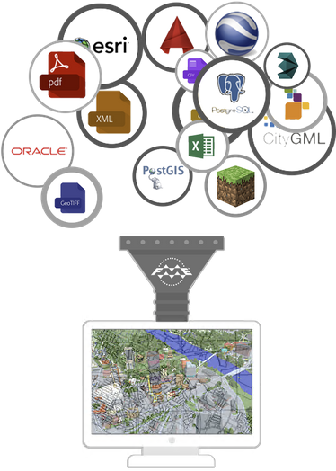
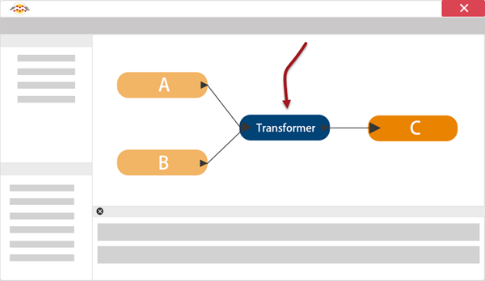

# FME Transformations

<i class="fa fa-clock-o "></i> 30 minutes

## Learning Objectives

After completing this unit, you will be able to:
- Explain what transformers do in FME.
- Discuss common transformer categories.
- Locate and place transformers using Quick Add.
- Set transformer parameters.

# Data Transformation

You have already learned how to *translate* data in FME. In this unit, you will learn how to *transform* data to suit your needs.

# What is Data Transformation?

**Data Transformation** is FME's ability to manipulate data. Whenever you analyze, restructure, alter, or edit data, you are transforming it. The transformation step occurs during the process of format translation. Data is read, transformed, and then written to the chosen format.

## Data Transformation Possibilities

Data transformation can alter the structure or content of data, or both together. Transforming the **structure** of the data could be called ‘reorganization.' This process includes the ability to merge data (as in the image above), divide data, re-order data, and define custom data structures. Transforming the structure of a dataset is carried out by manipulating its schema.

Transforming the **content** of the data could be called ‘revision.' Manipulating a feature's geometry or calculating new attribute values is the best example of how FME can transform content.

As a whole, transformation lets you take the data you have and turn it into the data you want.
