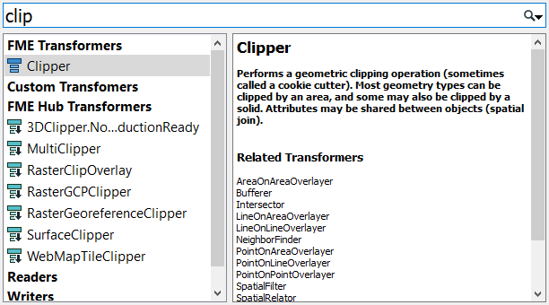
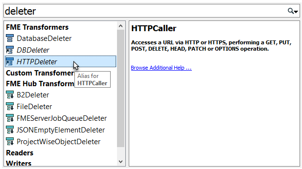
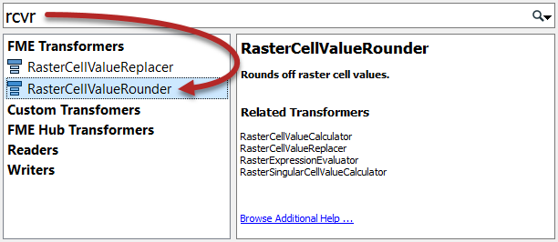
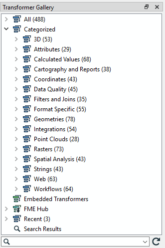
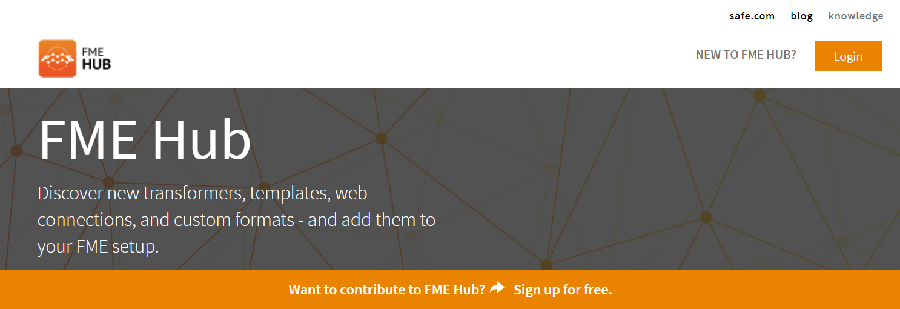

# Locating Transformers

Even experienced FME users find the full list of transformers a daunting sight. With over five hundred (500) transformers, FME possesses a lot of functionality; probably a lot more than a new user realizes and much of which would be very useful to them. This section helps you find the transformer you need, even if you didn’t know you needed it.

Although the transformer list can look a bit overwhelming, do not panic! The reality is that most users focus on 20-30 transformers that are relevant to their day-to-day workflow. You do not need to know every single transformer to use FME effectively.

## Quick Add

One of the easiest ways to look for the transformer you need is to click a blank part of the canvas and type relevant keywords. This action will open the Quick Add menu, allowing you to search for transformers.

Search terms can also be full or partial words:

By default, Quick Add does not look in transformer descriptions, so the search term must be the actual name of a transformer:

However, Quick Add will search in the transformer descriptions if you press the <kbd>Tab</kbd> key with the dialog open:

Quick Add results include aliases - for example, alternate names or renamed transformers - and also include transformers found in the FME Hub:

Finally, you can use CamelCase to search for transformer names, which is particularly useful for transformers with long names, e.g., "rcvr" for the RasterCellValueRounder:

## Transformer Gallery

You can also look for transformers in the transformer gallery, which exists both as a window in Workbench and [online](https://www.safe.com/transformers/). There are several ways to locate transformers using the Gallery.

### Transformer Categories

Transformer categories are a good starting point from which to explore the transformer list. Transformers are grouped in categories to help find a transformer relevant to the problem at hand.

Although all of them are important, the most commonly used transformers are in these categories:

- **Attributes**: Operations for attribute/list management
- **Calculated Values**: Operations that return a calculated value
- **Filters and Joins**: Operations for dividing and merging data flows
- **Geometries**: Operations that create geometry or transform it to a different geometry type
- **Spatial Analysis**: Operations that return the result of a spatial analysis
- **Strings**: Operations that manipulate string contents, including dates

Click on the expand button to show all transformers within a particular category.

### Sorting Transformers

The [online Transformer Gallery](https://www.safe.com/transformers/) has the added benefit of allowing one to sort transformers by their popularity (Sort By &gt; Most Used):

It also allows one to view related transformers. Clicking on a transformer takes you to its page. Underneath the transformer description is a related transformers section:

## The FME Hub

The [FME Hub](https://hub.safe.com/) is a facility for sharing FME functionality such as custom transformers, web connections, and formats:

Transformers from the hub are shown in Quick Add with a green color and a small, downwards-pointing arrow, to denote that they will be downloaded if selected.





The FME Workbench Help tool displays information about transformers. Click on a transformer and press the F1 key to open the help dialog. This tool is linked to FME Workbench so that a transformer selected (in the gallery or on the canvas) triggers content to display in the Help tool.

Another useful - and printable - piece of documentation is the <strong><a href="http://cdn.safe.com/resources/fme/FME-Transformer-Reference-Guide.pdf">FME Transformer Reference Guide</a></strong>.


