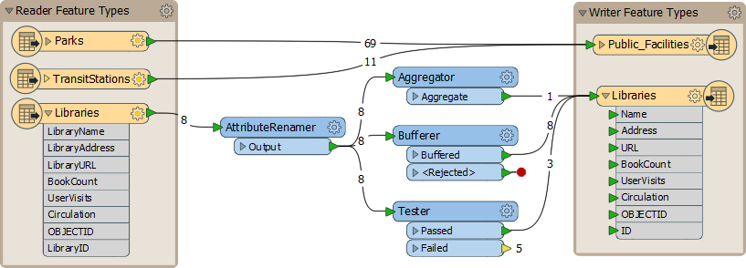
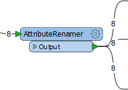

# The Workflow

<!-- How data moves across canvas, looping -->

# Transformers in Series

Much like a set of components in an electrical circuit, a series of Workbench transformers can be connected to have a cumulative effect on a set of features.

## Chaining Transformers

Even with the large number of transformers available in FME, users frequently need a combination - or chain of transformers - instead of a single one.

A string of transformers that graphically represent an overall workflow is a crucial concept of FME:

In this example, a DuplicateFilter transformer removes duplicate polygon features. A Dissolver transformer merges each remaining (unique) polygon with its neighbor where there is a common boundary. Finally, each merged area gains an ID number from the Counter transformer.

# Transformers in Parallel

A ***stream*** is a flow of data represented by connections in the workspace. A key concept in FME is the ability to have multiple parallel streams within a workspace.

## Multiple Streams

Multiple streams are useful when a user needs to process the same data but in many different ways. A workspace author can turn one stream into several, or combine several streams of data into one, as required:

Here an author is creating three data streams, each of which is processed separately then combined back into a single stream.

## Creating Multiple Streams

Creating multiple data streams can occur in several ways. Sometimes a transformer with multiple output ports (a Tester transformer is a good illustration of this) will divide (or filter) data with several possible output streams:

Here data is divided into two streams, one of which is not connected to anything.

Additionally, a full stream of data can be duplicated by simply making multiple connections out of a single output port. This method creates a set of data for each connection:

Here FME reads eight features but, because there are multiple connections, creates multiple copies of the data.

## Bringing Together Multiple Streams

When multiple streams connect to the same input port, no merging takes place. The data merely is accumulated into a single stream. This operation is often called a *union*.

Here, three streams of data converge into a writer feature type:

No merging takes place; the data accumulates into 12 distinct features in the output dataset. Think of it as three pipes of water emptying into a single container.

To carry out actual merging of data requires a specific transformer such as the [FeatureMerger](http://docs.safe.com/fme/html/FME_Desktop_Documentation/FME_Transformers/Transformers/featuremerger.htm) or [FeatureJoiner](http://docs.safe.com/fme/html/FME_Desktop_Documentation/FME_Transformers/Transformers/featurejoiner.htm).
