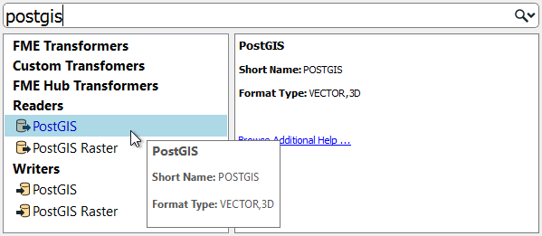
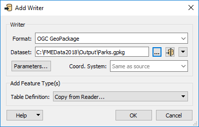
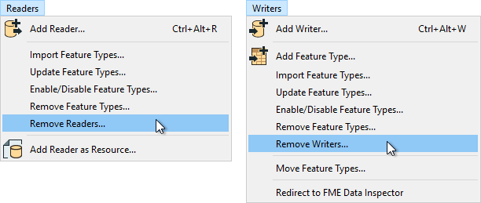
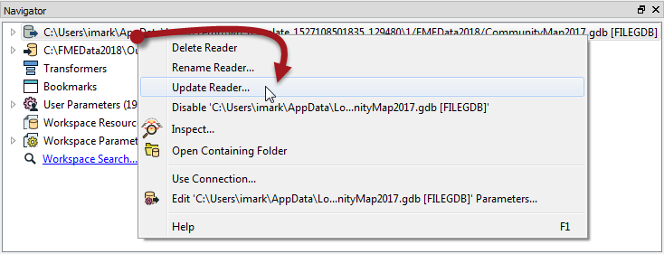
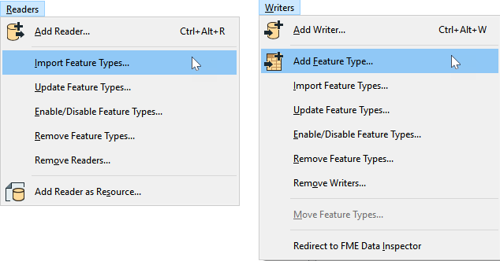

# Multiple Readers and Writers

<!-- Originaly included multiple feature types here also, but that functionality isn't in the exercise and doesn't feel fundamental to me, so I removed it. -->

## Multiple Readers and Writers

An FME workspace is not limited to any particular number of readers or writers; it can have any number of readers and writers, use any number of formats, and does not need to contain an equal number of readers and writers.

For example, the Navigator window shows this workspace contains two readers and three writers, of different data types and formats!





It's important to note that readers and writers don’t appear as objects on the Workbench canvas. Their feature types (layers) do, but readers and writers do not.

Instead, they are represented by entries in the Navigator window, as in the above screenshot.



### Adding Readers and Writers

Additional readers or writers are added to a translation using the Quick Add menu:

...Or by selecting Readers &gt; Add Reader (Writers &gt; Add Writer) from the menubar:

This action opens a dialog, similar to the Generate Workspace dialog, in which you can define the parameters for the new reader or writer:

You can add as many readers and writers as you require in this way.



A reader can also be added by dragging a dataset from a file system explorer and dropping it onto the Workbench canvas.



### Removing a Reader or Writer

If a reader or writer is no longer required, then it can be removed using options on the menubar:

Alternatively, it's possible to right-click a reader/writer in the Navigator window and choose the Delete option.

---

### Updating a Reader or Writer

Readers and writers can be updated so that older workspaces have the speed and functionality available in a newer version of FME. You can update a transformer by right-clicking the reader/writer in the Navigator window and choosing the Update option:

For readers, this tool provides the option to either update the reader or to also update the list of read feature types. This way the workspace can be updated if the source data changes. Another way to update feature types is Reader &gt; Update Feature Types on the menubar.

## Multiple Feature Types

Adding new readers and writers lets you read or write a new file. However, sometimes you want to read or write data to a different layer or table within an existing dataset. You can accomplish this by adding feature types. Remember, feature types belong to a reader or a writer.

You can add a feature type to an existing reader or writer by picking Readers > Import Feature Types or Writers > Add Feature Type:

Adding a reader feature type lets you read a new layer or table from the dataset of an existing reader; adding a writer feature type lets you write a new layer or table in the dataset of an existing writer.
