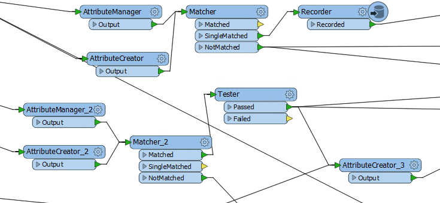
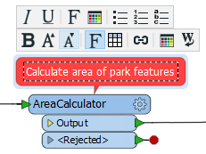
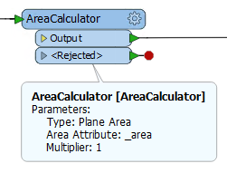
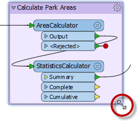
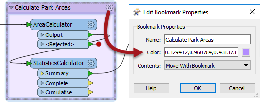

# Best Practice

If a workspace runs to completion and produces the output you want, it can’t be bad, can it? Well, yes it can. It's not enough just to put together a functioning workspace; it's also vital to use FME in a manner that is both efficient and scalable.

## What is Best Practice?
In general terms Best Practice means the best way of doing something; in other words, carrying out a task effectively and efficiently.

Despite the word 'best,' we're not presuming the ideas here will meet every need and occasion. The best description of this concept I've heard – and one that fits well here – is:

> “a very good practice to consider in this situation based on past experience and analysis”

## Style
> *“A good looking, well-organized workspace gives the customer the feeling that you have done quality work.”*

Style is perhaps the most obvious component of FME Best Practice. You can tell at a glance when a workspace is well-styled and when it is not. As the quote above implies, a well-designed workspace demonstrates competence.

But style is more than just looks; a properly designed workspace provides many benefits as it is further developed and edited in the future.

### An FME Workspace Style Guide
A good style of design makes it easier to navigate and understand an existing workspace. This is important when workspaces might need to be edited by other users, or when you intend to make edits yourself at a later date.

Specifically, a good style can help a user to…

- Distinctly define different sections or components of a workspace
- Quickly navigate to a specified section or particular transformer
- Pass a workspace on to another user for editing
- Rename workspaces and content with a more explanatory title

### Example of Poor Design
You need proof? Well, would you want to be given the task of editing this workspace? Can you even tell what this section does or - more importantly - why?

## Annotating Workspaces
Annotation is a key method for a clear and comprehensible design.

Annotation helps other users understand what is supposed to be happening in the translation and also helps the creator when returning to a workspace after a long interval (take it from me that this is especially important!)

Two different types of annotation can be applied to a workspace.

---

### User Annotation
User annotation is a comment created by the user. It can be connected to a workspace object (transformer or feature type), can be connected to a workspace connection, or can float freely within the workspace.

To create attached user annotation, right-click a workspace object and select Add Annotation, or use the shortcut Ctrl+K when the object is selected.

To create floating user annotation, right-click the canvas and select Insert Annotation, or press Ctrl+K when nothing is selected.

When you place an annotation you have the opportunity to change the font style, font size, and background color; plus you can also add hyperlinks, bullet points, and tables.

### Summary Annotation
Summary annotation is an FME-generated comment that provides information about any object within the workspace. This item can be a source or destination feature type, or a transformer.

Summary annotation is always colored blue to distinguish it from other annotation. It's always connected to the item to which it relates and cannot be detached.

The nice thing about Summary Annotation is that it automatically updates in response to changes. That makes it very useful for checking transformer parameters (or reader/writer schemas) at a quick glance. It's particularly useful in situations where the parameters are set through a wizard and are more awkward to check (for example, the SchemaMapper or FMEServerJobSubmitter transformers).



{{ template.tip("

A good idea is to use summary annotation to show <strong>what</strong> actions are taking place; but use user annotation to clarify <strong>why</strong> an action is being carried out.
  You can convert a summary annotation to a user (attached) annotation by using this context menu option:
  
  This allows you to extract the information from a summary annotation, but edit it as you would a user annotation. Note that a converted summary annotation no longer updates automatically!

") }}

## Bookmarks
A bookmark, like its real-world namesake, is a means of putting a marker down for easy access.

With FME the bookmark covers an area of the workspace that is usually carrying out a specific task, so a user can pick it out of a broader set of transformers and move to it with relative ease.

### Why use Bookmarks?
Bookmarks play an important role in a well-styled workspace for a number of reasons, including these.

- Design: As a way to subdivide a workspace and manage those sections
- Access: As a marker for quick access to a specific section of a workspace
- Editing: As a means to move groups of transformers at a time
- Performance: As a means to improve workspace performance when caching data

### Adding a Bookmark
To add a bookmark, click the Bookmark icon on the toolbar.

Whereas a traditional bookmark marks just a single page in a book, the FME bookmark can cover a wide area of the canvas. A single workspace can be divided into different sections by applying multiple bookmarks.

{{ template.tip("

If any objects on the workspace canvas are selected when a bookmark is created, the bookmark is automatically expanded to include those items.

") }}

### Resizing and Editing a Bookmark
To resize a bookmark hover over a corner or edge and then drag the cursor to change the bookmark size or shape.

### Bookmark Properties
Click the cogwheel icon on a bookmark header to open the bookmark properties dialog:

Here you can change both the name and color of the bookmark and decide about whether contents will move with it (more on that later).

{{ template.tip("

The context (right-click) menu for a bookmark reveals options to select all objects within the bookmark, or to disable all of those objects, making it useful for testing purposes:
  

") }}

# Exercise

Adding bookmarks to workspace?
