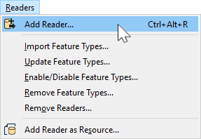



{{ template.exercise(4.1,
               "Multiple Readers, Writers, and Feature Types",
               "3-1-1 case location details (XLS hosted on FTP)",
               "Add additional readers and writers Join features using the FeatureJoiner",
               "Creating more complex FME workflows",
               "C:\\FMEData2019\\Workspaces\\IntroToDesktop\\Ex4.1-Begin.fmw",
               "C:\\FMEData2019\\Workspaces\\IntroToDesktop\\Ex4.1-Complete.fmw")
}}

We have already added the FeatureJoiner, but now we need to add the data to be joined. This task requires adding two readers and one writer to our workspace, which we will do in this exercise.

# 1) Start Workbench

Start Workbench (if necessary) and open the workspace from Exercise 3.3. Alternatively, you can open C:\\FMEData2019\\Workspaces\\IntroToDesktop\\Ex4.1-Begin.fmw.

# 2) Add an Excel Reader

The planning department has sent you their summary data in a Excel file. Click Readers > Add Reader:

 <!-- create -->

Then fill the Add Writer dialog out:

<table style="border: 0px">

  <tr>
    <td style="font-weight: bold">Reader Format</td>
    <td style="">Excel</td>
  </tr>

  <tr>
    <td style="font-weight: bold">Dataset</td>
    <td style="">C:\FMEData2019\Resources\311\311-summary.csv</td>
  </tr>

  <tr>
    <td style="font-weight: bold">Sheet Definition</td>
    <td style="">Automatic</td>
  </tr>

</table>

Your dialog should look like this:

 <!-- create -->

# 3) Inspect your Excel Data

Click your Excel feature type to select it and click Run Just This:

IMAGE

Then click the Inspect Cache icon to view it in Visual Preview. You can see the data contains a table with the number of cases by City department, with each feature corresponding to a different local planning area:

IMAGE

# 4) Add a KML Reader

The Planning Department sent you a KML file containing a map of the City of Vancouver local planning areas. KML data is used with Google Earth and is an XML-based spatial data format.

You can use this to join the data included in the summary table. We can add it to our workspace by adding a KML reader.

Here is another way to add a reader or writer: click on a blank space on the canvas and type KML. You can use the mouse or <kbd>&#x2191;</kbd> and <kbd>&#x2193;</kbd> to browse the Quick Add menu. You should see KML listed as an option under Readers:

Double-click it or press <kbd>Enter</kbd> to add an KML reader. Use the following parameters:

<table style="border: 0px">

  <tr>
    <td style="font-weight: bold">Reader Format</td>
    <td style="">KML</td>
  </tr>

  <tr>
    <td style="font-weight: bold">Reader Dataset</td>
    <td style="">C:\FMEData2019\Data\Boundaries\LocalAreas.kml</td>
  </tr>

</table>

Your dialog should look like this:

 <!-- ADD -->

Click OK.

# 5) Add a KML Writer

---

Click Writers > Add Writer:

Then fill the Add Writer dialog out:

<table style="border: 0px">

  <tr>
    <td style="font-weight: bold">Format</td>
    <td style="">Microsoft Excel</td>
  </tr>

  <tr>
    <td style="font-weight: bold">Dataset</td>
    <td style="">C:\FMEData2019\Output\Training\311-requests-summary.xlsx</td>
  </tr>

  <tr>
    <td style="font-weight: bold">Sheet Definition</td>
    <td style="">Automatic</td>
  </tr>

</table>

Your dialog should look like this:

IMAGE

# 6) Set Up FeatureJoiner

Let's connect our FeatureJoiner to the feature types. Connect the **local_areas_region** reader feature type to the **Left** input port. Connect the **CSV** reader feature type to the **Right** input port.

Double-click the FeatureJoiner to open its parameters.

Fill them in like this:

|Parameter|Value|
|-|-|
|Join Mode|Inner|
|Attribute Conflict Resolution|Use Left|
|Geometry Handling|Use Left|
|Left|`Name`|
|Right|`Local Area`|
|Comparison Mode|Automatic|

When finished, your parameters should look like this:

IMAGE

Click OK and use Run To This on the FeatureJoiner type to join your data.

# 7) Inspect the FeatureJoiner Cache

Let's inspect the cache to ensure our data has joined properly. Click on the green inspect cache icon on the **Joined** output port of the FeatureJoiner.

In the Data Inspector, you should see this in the Table View:

IMAGE

You can see that the FeatureJoiner has successfully added the attributes from the summary table to the polygons from the KML data.

# 8) Save your Workspace

Don't forgot to save your workspace regularly.

# 9) View Your KML Map

Click on the KML feature type and click on the Open Containing Folder button to open C:\FMEData2019\Output\Training\. You should see `311-local-areas.kml`. Open it with [Google Earth](https://www.google.com/earth/) to view your data. You can click on a planning area to open a bubble with the summary data.

IMAGE

Perfect! The planning department can use this report to allocate resources for the next year.



FME has the ability to style your written data. To learn how to style KML, check out this <a href="https://knowledge.safe.com/articles/1081/basic-kml-example-kmlstyler-tab-to-kml.html">tutorial</a>.





The summary data in 311-summary.xlsx can be created with three transformers from the features we currently have in the workspace, but we don't have time to do so in this introductory course.  If you want to try yourself, try starting out with the <a href="https://www.safe.com/transformers/attribute-pivoter/">AttributePivoter</a> and reading about exposing attributes. The solution is available in C:\\FMEData2019\\Workspaces\\IntroToDesktop\\Ex4.1-Complete-Advanced.fmw





<ul>
  <li>Work with multiple writers</li>
  <li>Generate a report using HTMLReportGenerator</li>
</ul>


