

{{ template.exercise(4.1,
               "Multiple Readers, Writers, and Feature Types",
               "3-1-1 case location details (XLS hosted on the web)",
               "Add additional readers and writers Join features using the FeatureJoiner",
               "Creating more complex FME workflows",
               "C:\\FMEData2019\\Workspaces\\IntroToDesktop\\Ex4.1-Begin.fmw",
               "C:\\FMEData2019\\Workspaces\\IntroToDesktop\\Ex4.1-Complete.fmw")
}}

We have already added the FeatureJoiner, but now we need to add the data to be joined. This task requires adding two readers and one writer to our workspace, which we will do in this exercise.

**1) Start FME Workbench**

Start FME Workbench (if necessary) and open the workspace from Exercise 3.3. Alternatively, you can open C:\\FMEData2019\\Workspaces\\IntroToDesktop\\Ex4.1-Begin.fmw.

**2) Add a CSV Reader**

The planning department has sent you their summary data in a CSV file. Click Readers > Add Reader:

Then fill the Add Writer dialog out, but **do not click OK**:

<table style="border: 0px">

  <tr>
    <td style="font-weight: bold">Reader Format</td>
    <td style="">CSV (Comma Separated Value)</td>
  </tr>

  <tr>
    <td style="font-weight: bold">Dataset</td>
    <td style="">C:\FMEData2019\Resources\311\311-summary.csv</td>
  </tr>

</table>

Your dialog should look like this:

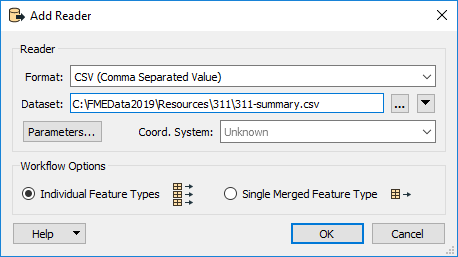

From what we've covered so far, it would appear these parameters would work. However, in this case we need to set the reader parameters to control how our CSV is read. Click the Parameters button:

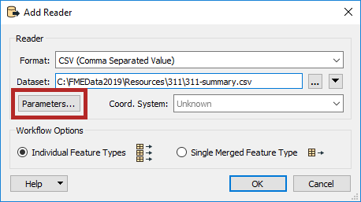

If you look at the Preview section of this dialog, you'll notice that our CSV is not being read correctly, with most data in one column:

Each column should be a different city department, and each cell should contain a count of the number of 3-1-1 calls for that local area and department. The data is not being read properly because the Delimiter Character is set to Auto. Based on the file contents, FME is guessing that the delimiter is a space character instead of a comma. We can fix this by changing the delimiter; click the dropdown Delimiter Character and change it to a comma:

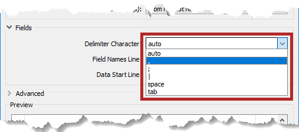

Now the preview should look correct, with the data properly spread between columns:

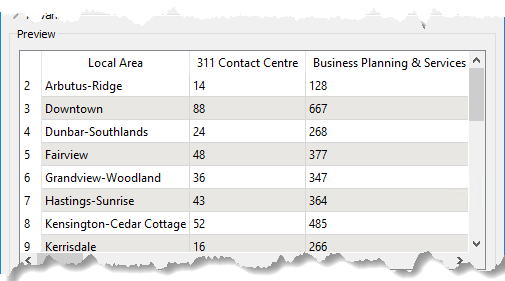

Click OK and then OK again.

**3) Add a KML Reader**

The Planning Department sent you a KML file containing a map of the City of Vancouver local planning areas. KML data is used with Google Earth and is an XML-based spatial data format.

You can use this to join the data included in the summary table. We can add it to our workspace by adding a KML reader.

Here is another way to add a reader or writer: click on a blank space on the canvas and type KML. You can use the mouse or <kbd>&#x2191;</kbd> and <kbd>&#x2193;</kbd> to browse the Quick Add menu. You should see KML listed as an option under Readers:

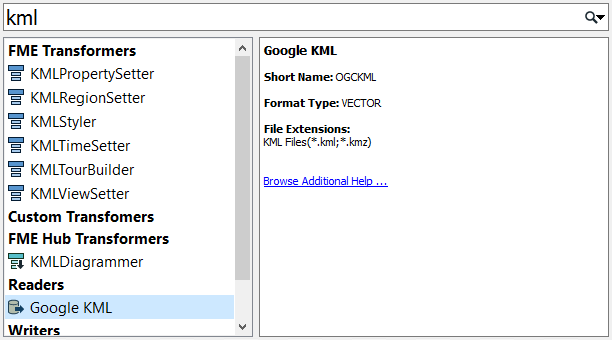

Double-click it or press <kbd>Enter</kbd> to add an KML reader. Use the following parameters:

<table style="border: 0px">

  <tr>
    <td style="font-weight: bold">Reader Format</td>
    <td style="">Google KML</td>
  </tr>

  <tr>
    <td style="font-weight: bold">Reader Dataset</td>
    <td style="">C:\FMEData2019\Data\Boundaries\LocalAreas.kml</td>
  </tr>

</table>

Your dialog should look like this:

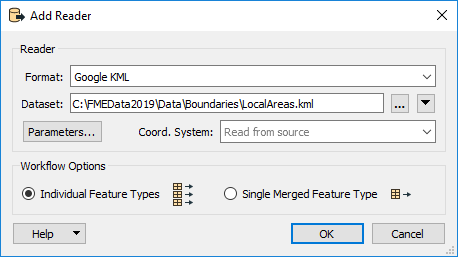

Click OK.

You will see the Select Feature Types dialog. Click Select all to unselect all feature types, and then select local_areas_region:

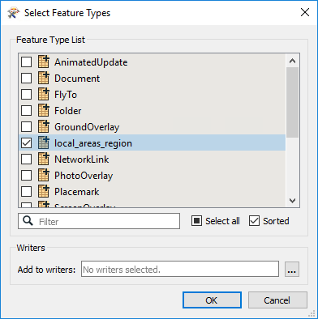

The rest of the features types are extra KML data we do not need for this workspace. Click OK. The **local_areas_region** feature type will be added to the workspace. Move it above the CSV reader feature type:

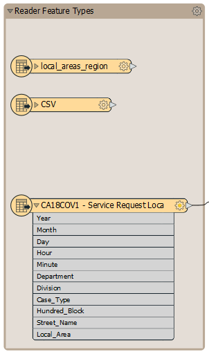

As shown in the image above, you can resize the Reader Feature Types bookmark to contain the new feature types by clicking and dragging on any corner of the bookmark. This action will keep the workspace organized. If you forget how to resize bookmarks, please refer back to <a href="../2.translations/2.03.ex2.1.html#5-examine-bookmarks" target="_blank">Exercise 2.1</a>.

**4) Add a KML Writer**

Click Writers > Add Writer:

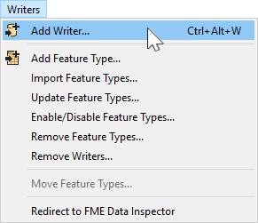

Then fill out the Add Writer dialog:

<table style="border: 0px">

  <tr>
    <td style="font-weight: bold">Format</td>
    <td style="">Google KML</td>
  </tr>

  <tr>
    <td style="font-weight: bold">Dataset</td>
    <td style="">C:\FMEData2019\Output\Training\311-local-areas.kml</td>
  </tr>

  <tr>
    <td style="font-weight: bold">Feature Type Definition</td>
    <td style="">Automatic</td>
  </tr>

</table>

Your dialog should look like the image below. Note that Feature Type Definition is changed. We won't discuss this in introductory training, but refer to [the documentation](https://docs.safe.com/fme/html/FME_Desktop_Documentation/FME_Workbench/Workbench/Adding_Writers.htm?Highlight=add%20writer) for more information:

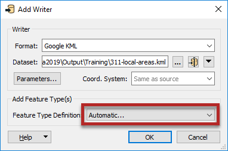

Once you add the writer, you'll be prompted to give it a name. Type in 311-local-areas:

Click OK. Move the writer feature type into the Writer Feature Types bookmark above **311-requests**:

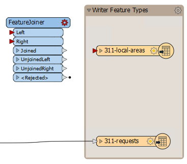

**5) Set Up FeatureJoiner**

Let's connect our FeatureJoiner to the feature types. Connect the **local_areas_region** reader feature type to the **Left** input port by clicking on the feature type output port and dragging to the transformer input port. Connect the **CSV** reader feature type to the **Right** input port:

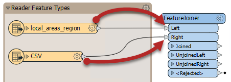

Double-click the FeatureJoiner to open its parameters. Fill them in like this:

|Parameter|Value|
|-|-|
|Join Mode|Inner|
|Attribute Conflict Resolution|Use Left|
|Geometry Handling|Use Left|
|Left|`Name`|
|Right|`Local Area`|
|Comparison Mode|Automatic|

With this setup the FeatureJoiner will do an SQL-style [inner join](https://en.wikipedia.org/wiki/Join_&#40;SQL&#41;#Inner_join") using the features from the Left port and those from the Right based on their shared attribute of the local area name (`Name` and `Local Area` respectively).

When finished, your parameters should look like this:

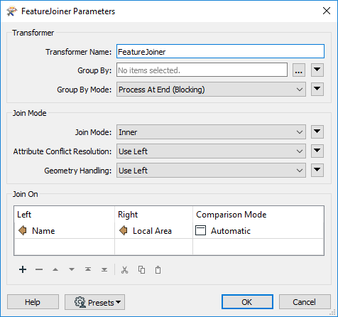

Click OK and use Run To This on the FeatureJoiner type to join your data:

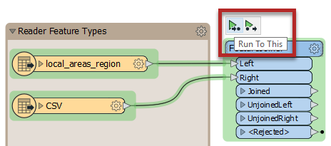

This section of the workspace will run successfully, however, you will receive an Unexpected Input window:

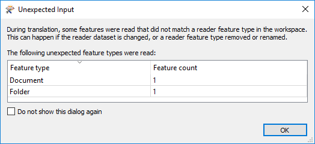

This window appears because FME expects KML features to have a Document and Folder feature type defining metadata about the KML file. We chose not to import those feature types, so FME is just making sure we know they aren't being used. Click OK to ignore the warning.

**6) Inspect the FeatureJoiner Cache**

Let's inspect the cache to ensure our data has joined properly. Ensure the FeatureJoiner is selected so the data appears in the Visual Preview window.

In the Data Inspector, you should see that the FeatureJoiner has successfully added the attributes from the summary table to the polygons from the KML data:

**7) Connect the Writer Feature Type and Run Workspace**

Click and drag from the Feature Joiner's Joined output port to the **311-local-areas** feature type to connect the joined features to your writer:

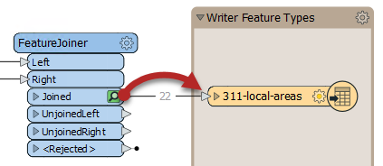

Once connected. Select **311-local-areas** and click Run To This to write out the data:

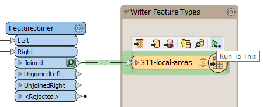

**8) View Your KML Map**

Click on the KML feature type and click on the Open Containing Folder button to open C:\FMEData2019\Output\Training\. You should see **311-local-areas.kml** and **311-requests.csv**. Congratulations, you've now created the full workspace you first saw in Exercise 1.1!

Double-click the **311-local-areas.kml** file to open it with [Google Earth Pro](https://www.google.com/earth/versions/).

You can click each local area to see a bubble with a summary of the number of 3-1-1 calls by city department:

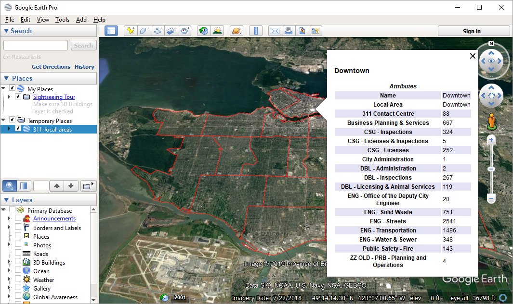

Perfect! The planning department can use this report to allocate resources for the next year.



FME has the ability to style your written data. To learn how to style KML, check out this <a href="https://knowledge.safe.com/articles/1081/basic-kml-example-kmlstyler-tab-to-kml.html">tutorial</a>.





The summary data in <strong>311-summary.csv</strong> was created with three transformers after the StringReplacer_2, but we don't have time to show these steps in this introductory course.  If you want to try yourself, try starting out with the <a href="https://www.safe.com/transformers/attribute-pivoter/">AttributePivoter</a> and reading about <a href="http://docs.safe.com/fme/2019.0/html/FME_Desktop_Documentation/FME_Transformers/Transformers/attributeexposer.htm">exposing attributes</a>. The solution is available in C:\FMEData2019\Workspaces\IntroToDesktop\Ex4.1-Complete-Advanced.fmw.





<ul>
  <li>Work with multiple readers and writers</li>
  <li>Join features using a FeatureJoiner</li>
  <li>Inspect results in a native application, in this case Google Earth Pro</li>
</ul>


