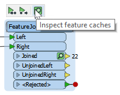



{{ template.exercise(4.2,
               "Debugging with Feature Caching and Partial Runs",
               "3-1-1 case location details (<code>.xls</code> hosted on FTP)",
               "Use partial runs to debug a workspace Join data using the FeatureJoiner Style a KML",
               "Incremental development and best practice",
               "None",
               "None")
}}

To get the summarized 3-1-1 data into our KML data, we have to join the data streams. We will use the FeatureJoiner transformer to do that. Then we'll use partial runs to test our workspace incrementally. Finally, we'll style our KML using some format-specific transformers.

# 1) Add a FeatureJoiner

Now that we have polygons of the local areas and a table summarizing the cases by local area, we can join our data. A join operation connects two tables with a common key, in this case, `Local Area`.

There are [many ways to join features](https://knowledge.safe.com/articles/34619/working-with-database-transformers-1.html) in FME. Here we will use the [FeatureJoiner](http://docs.safe.com/fme/html/FME_Desktop_Documentation/FME_Transformers/Transformers/featurejoiner.htm), which conducts a simple join.

Add a FeatureJoiner to the canvas using Quick Add by clicking a blank space, typing its name, and double-clicking or pressing <kbd>Enter</kbd> to add it:

Connect the output port of the HTMLReportGenerator_2 to the Right input port of the FeatureJoiner. Then reroute the feature connection going into the local_areas_region KML writer featuer type into the FeatureJoiner Left input port. To drag a connection, mouse over the connection line until it has blue outline, then click and drag to move it. Your cursor should snap to the port you want to connect to:

This section of your canvas should look like this:

# 2) Set FeatureJoiner Parameters

Once the FeatureJoiner appears on the canvas, double-click it to open its parameters.

For Join Mode, we will use Inner. This parameter uses [SQL-type joins, without writing an SQL statement](http://docs.safe.com/fme/html/FME_Desktop_Documentation/FME_Transformers/Transformers/featurejoiner.htm). An inner join will keep only matching features; in this case, it does not matter which we choose, because every local area polygon will have an incoming matching feature.

In the Join On section, we can select the common key to use to join our features. Fill it out like this:

|Left|Right|Comparison Mode|
|-|-|
|`Name`|`Local Area`|Automatic|

Your dialog should look like this:

Click Ok.

# 3) Use Partial Runs to Test

We can use partial runs to see if our join is working as anticipated. Click the FeatureJoiner to select it, then click the Run to This button. Once the translation has run, click the green magnifying glass icon on Joined to inspect the results of the join:

In Data Inspector you should see the HTML table data joined to each local area polygon, under the `html_content` attribute:

You can expand the contents of a multi-line attribute by clicking the gray ellipsis button next to the cell to view the value in a new window:

This window shows the full value of `html_content` for that local area. When we add this to our KML features, it will display as rendered HTML.

Next, connect the Joined port to your KML writer feature type:

Then, click the local_areas_region writer feature type and select Run to This. Once the translation has run, click the Open Containing Folder button. Open `LocalAreas.kml` in Google Earth. You can click on the local area polygons and view a table summarizing the 3-1-1 requests in that area:

However, there are still some undesired attributes in the bubble.

# 4) Supply HTML to Balloons with the KMLPropertySetter

We want to only display our `html_content` table in the KML bubbles. We can use a KMLPropertySetter to do this. Add one to your canvas between the AttributeCreator and the KML writer feature type:

Double-click it to open its parameters. Make the following changes:

<table style="border: 0px">

  <tr>
    <td style="font-weight: bold">Content Type</td>
    <td style="">HTML</td>
  </tr>

  <tr>
    <td style="font-weight: bold">Content</td>
    <td style="">`html_content`</td>
  </tr>

  <tr>
    <td style="font-weight: bold">Include Attribute Table</td>
    <td style="">No</td>
  </tr>

</table>

Your dialog should look like this:

These settings set the bubble's content to HTML supplied by the `html_content` attribute from our HTMLReportGenerator_2. Turning the Attribute Table off ensures other attribute values do not appear and clutter the bubble.

To view our edits to the written KML file, click the KML writer feature type and select Run To This. Once the translation is complete, click the Open Containing Folder icon and then open `LocalAreas.kml` in Google Earth. You should now see filled polygons, and the bubbles should only show the name of the local area and the HTML table:

Well done! We've met all the requirements from the planning department. The CSVs and KML are ready to deliver. In further training, you could learn how to style the KML output, put this workspace on the web using [FME Server](https://www.safe.com/fme/fme-server/), and schedule it to run automatically once a week, once a day, or every time the Excel file is updated. You could even use the HTML and KML output to create a live web dashboard. However, for now, let's make sure this workspace follows FME best practice, the topic of our last exercise.



<ul>
  <li>Use feature caching</li>
  <li>Use partial runs</li>
  <li>Conduct a join using the FeatureJoiner</li>
  <li>Customize KML output using format attributes, the KMLPropertySetter, and the KMLStyler</li>
</ul>


