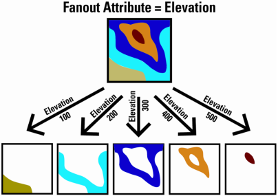

# Fanouts #

Fanouts are one of the most powerful pieces of functionality within FME, capable of producing impressive results with very little effort.

## What is a Fanout? ##

A **fanout** is a tool applied to a writer in FME. They are a way for the workspace author to write data divided into groups of features in the output dataset. 

The groups are defined by either the value of a single attribute or a string constructed from a combination of attributes and fixed strings.

For example, here an author is “fanning-out” a set of data into multiple outputs depending on a feature’s elevation attribute:

Because a fanout occurs as the data is being written, it does not require multiple flows of data inside the workspace. Therefore this technique makes it easy to create groups with minimal impact on the workspace canvas.

Another major benefit of a fanout is the high degree of flexibility – and freedom from fixed-layer schemas – in return for minimal effort.

There are two types of fanout: **Feature Type Fanout** and **Dataset Fanout**.