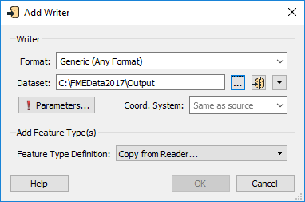
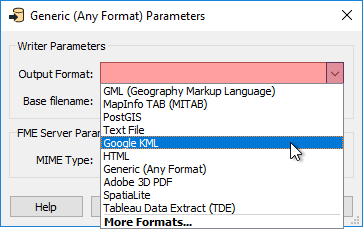
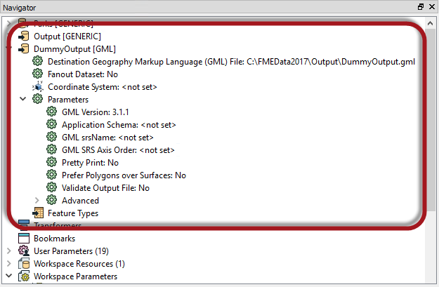

## The Generic Writer ##

A Generic Writer is used in the same way as any other writer; by specifying the format in the Add Reader (or Generate Workspace) dialog:

There the destination dataset is specified as a folder. FME does not know the format to be written yet and so will not know whether it is file-based or folder-based. 

The format required to be written can be specified by the author through a parameter when the writer is added:

...by the author in the Navigator window, or the end-user can specify it at run time using an automatically created user parameter:

That way a single writer can be made to write any format of data, the format being chosen by the end-user at runtime.

---

<table style="border-spacing: 0px">
<tr>
<td style="vertical-align:middle;background-color:darkorange;border: 2px solid darkorange">
<i class="fa fa-quote-left fa-lg fa-pull-left fa-fw" style="color:white;padding-right: 12px;vertical-align:text-top"></i>
Sister Intuitive says…
</td>
</tr>

<tr>
<td style="border: 1px solid darkorange">

It’s important to remember that FME sometimes transforms output data to fit the definitions and rules of the destination format. Therefore, the same Generic Writer may produce slightly different results for different data formats.

</td>
</tr>
</table>

---

### Generic Writer Feature Types ###

Feature Types are less of an issue for the Generic Writer (than the Generic Reader) because they are already pre-defined in the workspace. 

The main limitation will be if you wish to have both a Generic Reader and Generic Writer, with the reader accepting any layers and the writer writing ones to match.

In that scenario, you could use a feature type fanout with the Generic Writer, based on the format attribute fme_feature_type. Then the destination dataset will have the same layers as the source – even if that varies from translation to translation!

---

### Generic Writer Parameters ###

Like the Generic Reader, the Generic Writer has only one or two parameters of its own (output format being one of them). To apply a particular format parameter you need to add a dummy writer of the same format.

The dummy writer does not need to have any feature types defined, or any data sent to it; in fact it should not as this would only slow the translation.

Here, for example, the author added a dummy GML writer (with no feature types) in order to use the parameters for GML writing with a Generic format writer.

---

<table style="border-spacing: 0px">
<tr>
<td style="vertical-align:middle;background-color:darkorange;border: 2px solid darkorange">
<i class="fa fa-quote-left fa-lg fa-pull-left fa-fw" style="color:white;padding-right: 12px;vertical-align:text-top"></i>
Sister Intuitive says…
</td>
</tr>

<tr>
<td style="border: 1px solid darkorange">

Generic Readers and Writers by nature only deal with a flexible format, but can also be set up to be flexible with layers using a Merge Filter and/or Fanout.
  However, each dataset being read must have the same attribute schema, and each dataset being written will end up with the same attribute schema. This part is not flexible.
  Flexible attribute schemas require the use of either Automatic Attribute Definitions or a Dynamic Translation.

</td>
</tr>
</table>

---

<table style="border-spacing: 0px">
<tr>
<td style="vertical-align:middle;background-color:darkorange;border: 2px solid darkorange">
<i class="fa fa-quote-left fa-lg fa-pull-left fa-fw" style="color:white;padding-right: 12px;vertical-align:text-top"></i>
Miss Vector says…
</td>
</tr>

<tr>
<td style="border: 1px solid darkorange">

Now tell me which of these statements about Generic Reading/Writing are true?
  <a href="http://52.73.3.37/fmedatastreaming/Manual/QAResponse2017.fmw?chapter=14&question=2&answer=1&DestDataset_TEXTLINE=C%3A%5CFMEOutput%5CQAResponse.html">1. Because you select an output <strong>folder</strong>, the Generic Writer won't write to a <strong>file</strong> format like AutoCAD DWG</a>
 <a href="http://52.73.3.37/fmedatastreaming/Manual/QAResponse2017.fmw?chapter=14&question=2&answer=2&DestDataset_TEXTLINE=C%3A%5CFMEOutput%5CQAResponse.html">2. If the feature types of the chosen format are limited to a single geometry, the Generic Writer will drop all features except a single geometry type</a>
 <a href="http://52.73.3.37/fmedatastreaming/Manual/QAResponse2017.fmw?chapter=14&question=2&answer=3&DestDataset_TEXTLINE=C%3A%5CFMEOutput%5CQAResponse.html">3. The Generic Writer does not support either type of Fanout</a>
 <a href="http://52.73.3.37/fmedatastreaming/Manual/QAResponse2017.fmw?chapter=14&question=2&answer=4&DestDataset_TEXTLINE=C%3A%5CFMEOutput%5CQAResponse.html">4. The ParameterFetcher transformer can be used to retrieve the format of data being Read/Written in order to route features in a specific way through the workspace</a>

</td>
</tr>
</table>