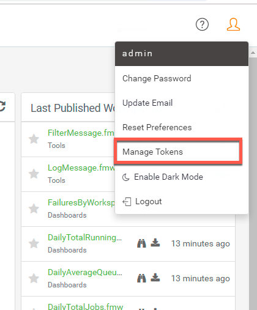
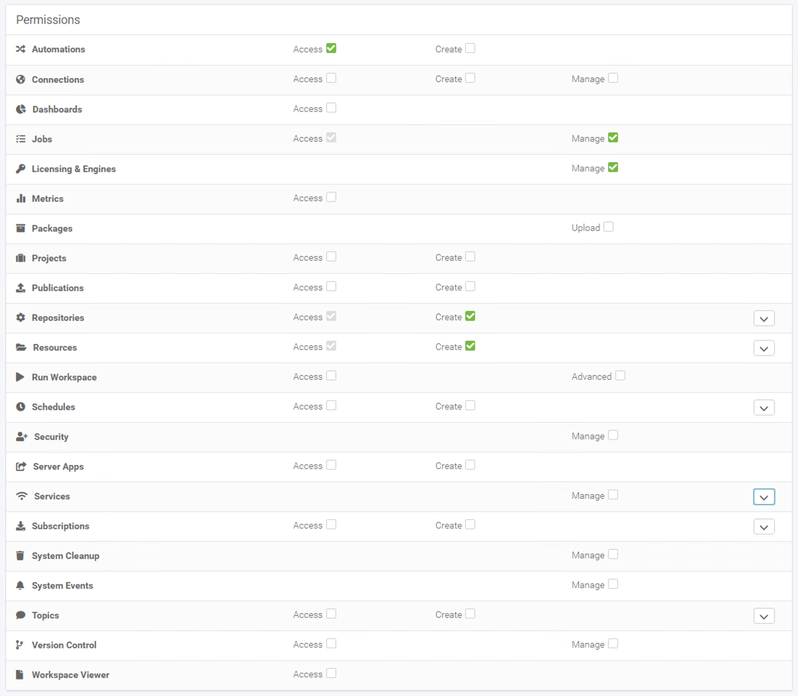

<table style="border-spacing: 0px;border-collapse: collapse;font-family:serif">
<tr>
<td width=25% style="vertical-align:middle;background-color:darkorange;border: 2px solid darkorange">
<i class="fa fa-cogs fa-lg fa-pull-left fa-fw" style="color:white;padding-right: 12px;vertical-align:text-top"></i>
Exercise 1
</td>
<td style="border: 2px solid darkorange;background-color:darkorange;color:white">
Create a new token
</td>
</tr>

<tr>
<td style="border: 1px solid darkorange; font-weight: bold">Data</td>
<td style="border: 1px solid darkorange">None</td>
</tr>

<tr>
<td style="border: 1px solid darkorange; font-weight: bold">Overall Goal</td>
<td style="border: 1px solid darkorange">To teach users how to create a new token and set the permissions for the token.</td>
</tr>

<tr>
<td style="border: 1px solid darkorange; font-weight: bold">Demonstrates</td>
<td style="border: 1px solid darkorange">How to create a new token</td>
</tr>

</table>

This exercise is meant to teach users how to create a new token with limited permissions. When developing with the REST API it is advised to use a token with only the permissions needed for the application. Some tokens can be dangerous if exposed. By creating an account with limited permissions we are limiting risk if the token is exposed.

 **1) Open FME Server**

Our first step will be to visit FME Server. We can do this by going to:

    <yourServerHost>/fmeserver
If you are using a training computer go to: localhost/fmeserver

If you  are using a training computer login as the admin using these credentials:

<b>Username:</b> admin
 
<b>Password:</b> admin

<!--Warning Section-->

<table style="border-spacing: 0px">
<tr>
<td style="vertical-align:middle;background-color:darkorange;border: 2px solid darkorange">
<i class="fa fa-exclamation-triangle fa-lg fa-pull-left fa-fw" style="color:white;padding-right: 12px;vertical-align:text-top"></i>
WARNING
</td>
</tr>

<tr>
<td style="border: 1px solid darkorange">

On some training machines FME Server will not automatically work. If once you log in, you see an error message:
 <b> "Could not connect to FME Core.
Please ensure that it is running." </b>
  Please open Task Manager, find all PostgresSQL tasks, select End task for each PostgresSQL task you see. Then restart your FME Server. You may restart your FME Server by finding FME Server 2019.0 in the Windows Start Menu. Then, select Restart FME Server. After FME Server has restarted, try logging in again.  

</td>
</tr>
</table>

 **2) Go to the Token Management page**

Now, we are going to navigate to the Token Management page. We are going to select the user icon in the top right of FME Server. Once, the icon is selected find Manage Tokens.

 **3) Create a new token**

Click the New button at the top right-hand corner of the page.

When prompted, create a new token with the following parameters:

- **Token Name:** Rest API Training Course
- **Description:** Token to be used during the Rest API Training Course
- **Expiration Date:** choose a logical date
- **Enabled:** ON
- **All Permissions:** OFF

 **4) Scroll down and assign permissions**

When assigning permissions for your future users visit [Managing Security Tokens](http://docs.safe.com/fme/2019.0/html/FME_Server_Documentation/WebUI/Manage-Token.htm) to view the full documentation.

Now assign the following permissions:

<table>

<tr>
<th>Permission</th>
<th>Level of Permission</th>
<th>Description of Permission</th>
</tr>

<tr>
<td>Automations</td>
<td>Create</td>
<td>Can create Automations</td>
</tr>

<tr>
<td>Dashboards</td>
<td>Access</td>
<td>Access the Dashboards page.</td>
</tr>

<tr>
<td>Engines & Licensing</td>
<td>Manage</td>
<td>Configure engines and licensing, except job queues (Also, requires Manage permission in Jobs).</td>
</tr>

<tr>
<td>Jobs</td>
<td>Manage</td>
<td>  Access and manage the jobs of all users. You can, cancel any job that is currently running, remove the history of jobs that were previously run, and manage Job Queues. (Also requires Manage permission in Engines & Licensing.)</td>
</tr>

<tr>
<td>Repositories</td>
<td>Create</td>
<td>Access the Repositories page and create repositories. </td>
</tr>

<tr>
<td>Individual Repositories   <b>click the down arrow on the right-hand corner of the Repositories permissions to show the Individual Repositories permissions. </td>
<td>Samples = Download, Read, Run</td>
<td>Can download workspaces and other repository items from FME Server into Workbench. Can view repository information. Can run repository workspaces from FME Server. </td>
</tr>

<tr>
<td>Resources</td>
<td>Create</td>
<td>Access the Resources page and create new resources.</td>
</tr>

<tr>
<td>Individual Resources   <b>click the down arrow on the right-hand corner of the Resources permissions to show the Individual Resources permissions. </td>
<td>
Data = Access, List, Write, Upload, and Remove

Temp= Access, List, Write, Upload, and Remove
</td>
<td>Can access, read and download a file. Can list the folders and files of a resource. Can write to files, upload files, and delete files. </td>
</tr>

<tr>
<td>Run Workspace</td>
<td>Advanced</td>
<td>Can access the Run Workspace page and access Job Directives when running workspaces.</td>
</tr>

<tr>
<td>Workspace Viewer</td>
<td>Access</td>
<td> Can access the Workspace Viewer.
</td>
</tr>

</table>

**If you are creating a web application the permissions for the token should be limited to a specific repository.**

The settings should look like this:

The individual Repositories should look like this:

The individual Resources should look like this:

 **5) Click OK to create the new Token**

 **6) Download the Token**

Once the token has been created. You'll see a page with your token visible. This is the only time you'll be able see the Token in FME Server. Click download to download the token.  

Click OK.

 **7) Save this file to the Desktop**

Open the Downloads folder and move the fmetoken-Rest API Training Course to the Desktop.

<!--Exercise Congratulations Section-->

<table style="border-spacing: 0px">
<tr>
<td style="vertical-align:middle;background-color:darkorange;border: 2px solid darkorange">
<i class="fa fa-thumbs-o-up fa-lg fa-pull-left fa-fw" style="color:white;padding-right: 12px;vertical-align:text-top"></i>
CONGRATULATIONS
</td>
</tr>

<tr>
<td style="border: 1px solid darkorange">

By completing this exercise you have learned how to:
 
<ul><li> Create a new token
<li> Assign specific permissions to that token

</td>
</tr>
</table>
