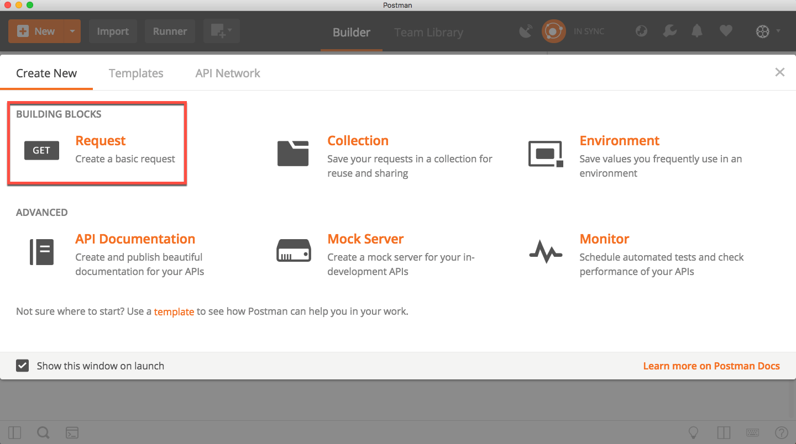

<table style="border-spacing: 0px;border-collapse: collapse;font-family:serif">
<tr>
<td width=25% style="vertical-align:middle;background-color:darkorange;border: 2px solid darkorange">
<i class="fa fa-cogs fa-lg fa-pull-left fa-fw" style="color:white;padding-right: 12px;vertical-align:text-top"></i>
Exercise 2
</td>
<td style="border: 2px solid darkorange;background-color:darkorange;color:white">
Using Postman to Make an HTTP Request
</td>
</tr>

<tr>
<td style="border: 1px solid darkorange; font-weight: bold">Data</td>
<td style="border: 1px solid darkorange">None</td>
</tr>

<tr>
<td style="border: 1px solid darkorange; font-weight: bold">Overall Goal</td>
<td style="border: 1px solid darkorange">Retrieves information from the Server Using the REST API</td>
</tr>

<tr>
<td style="border: 1px solid darkorange; font-weight: bold">Demonstrates</td>
<td style="border: 1px solid darkorange">The healthcheck call from the REST API</td>
</tr>

</table>

This exercise demonstrates how to make a call to the FME Server using the REST API. Postman is a REST Client Tool. REST Client Tools allow a user to enter in a Request URL and receive messages directly from the server. This exercise demonstrates the healthcheck call which will check if the FME Server is up and running properly.   

We are about to make the following call in Postman.

    GET http://<yourServerHost>/fmerest/v3/healthcheck?textResponse=false

This call requires no authorization and should run immediately. Notice
that there is a string query parameter in this call. This call will
automatically return a JSON response; however, you may override this by
setting the text response to true. This will return a text response
instead of JSON.

 **1) Download Postman- If you are not already using a virtual machine**

The first step is to download Postman. Simply click this link
[https://www.getpostman.com/apps](https://www.getpostman.com/apps)
and download the app. It is available on Windows, Linux, and Mac.

 **2) Open Postman**

Welcome to Postman! We are now ready to make our first call to your FME
Server using the URL above. Once you open Postman you should see this page.

 **3) Click on Request.**

 **4) Fill in the request and click Save.**

From here, we receive a page to save our request. This is used if you
would like to save the call to use it in the future. Typically, the name
of the call would be much more descriptive. However, for the purposes of
this demonstration, make up something creative, such as “MyFirstCall”. For this
call, you can create a new collection for training purposes.

To create a new training collection click +Create Folder. Then name and save your collection.

 **5) Copy the URL into the toolbar.**

Copy the URL into the toolbar and hit send! Notice, we are using the GET
HTTP Method for this call. To understand what this method means, please
review the table in Section 1.2.

<!--GET Table-->

<table class="tg">
  <tr>
    <th class="tg-ej3l">GET</th>
    <th class="tg-ufe5">http://&lt;yourServerHost&#62;/fmerest/v3/healthcheck?textResponse=false</th>
  </tr>
</table>

  *Please note, you will need to replace yourServerHost with localhost if you are working on a training machine*

 **6) Review the response from Postman.**

Review your call. This is the response you receive.

Click the Headers section to see a more detailed view of the call.

**Important Notes:**

- The response is in JSON. This is found in the header Response Header Content-Type.

- In the top right-hand corner, you should see Status: 200 OK. This indicates it has successfully interacted with the server. This call required no authorization. However, most calls to the server do require authorization. The next step will be to make a call that does require authorization from the server.

<!--Exercise Congratulations Section-->

<table style="border-spacing: 0px">
<tr>
<td style="vertical-align:middle;background-color:darkorange;border: 2px solid darkorange">
<i class="fa fa-thumbs-o-up fa-lg fa-pull-left fa-fw" style="color:white;padding-right: 12px;vertical-align:text-top"></i>
CONGRATULATIONS
</td>
</tr>

<tr>
<td style="border: 1px solid darkorange">

By completing this exercise you have learned how to:
 
<ul><li>Set up and use Postman</li>
<li>Create a call in Postman</li>
</ul>

</td>
</tr>
</table>
