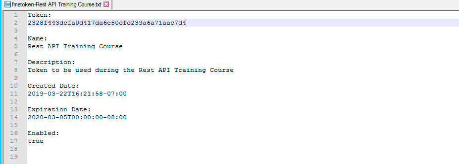
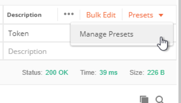

<table style="border-spacing: 0px;border-collapse: collapse;font-family:serif">
<tr>
<td width=25% style="vertical-align:middle;background-color:darkorange;border: 2px solid darkorange">
<i class="fa fa-cogs fa-lg fa-pull-left fa-fw" style="color:white;padding-right: 12px;vertical-align:text-top"></i>
Exercise 3
</td>
<td style="border: 2px solid darkorange;background-color:darkorange;color:white">
Authorization and the REST API
</td>
</tr>

<tr>
<td style="border: 1px solid darkorange; font-weight: bold">Data</td>
<td style="border: 1px solid darkorange">None</td>
</tr>

<tr>
<td style="border: 1px solid darkorange; font-weight: bold">Overall Goal</td>
<td style="border: 1px solid darkorange">To show how to properly authorize a call in the REST API</td>
</tr>

<tr>
<td style="border: 1px solid darkorange; font-weight: bold">Demonstrates</td>
<td style="border: 1px solid darkorange">The info call</td>
</tr>

</table>

 

This shows how to create an authorized call in the FME Server REST API. Authorization is an essential component in the REST API. Most calls do require authorization as a way to verify that the user may access information from the server. Authorization in the FME Server REST API is handled with tokens. This will be demonstrated and further explained below.

 **1) Create the Call Below**

<!--GET Table-->

<table class="tg" style="table-layout: fixed; width: 100%">
  <tr>
    <th class="tg-ej3l">GET</th>
    <th class="tg-ufe5" style="word-wrap: break-word">https://localhost:8443/fmerest/v3/info</th>
  </tr>
</table>

Copy and Paste this URL into the Toolbar in Postman and then click send!

*This call will require a token. This next part of the demonstration will show you what happens when you make an unauthorized call to the server.*

You should receive a message that says 401 Unauthorized. This is because
we have not used a token to authorize the call. The
next part of the guide will go over how to make a request on the server
using a token.

 **2) Get A Token**

Get the token created in [exercise 1](./FMESERVER_RESTAPI1Overview/1.5.UserCreation.md). The token information should be saved on your desktop. Open up the file fmetoken-Rest API Training Course and copy the token from the file.

 **3) Use the Token in a Call**

Now that we have a token we may use it in the request. Next to "GET"
paste the following URL into Postman. Replace "yourTOKEN" with the token
you have received from the server.

<!--GET Table-->

<table class="tg" style="table-layout: fixed; width: 100%">
  <tr>
    <th class="tg-ej3l">GET</th>
    <th class="tg-ufe5" style="word-wrap: break-word">https://localhost:8443/fmerest/v3/info?fmetoken=&lt;yourTOKEN></th>
  </tr>
</table>

You should receive the 200 response code from FME Server. Please
note, this is not the preferred method of authorization. By putting the
token into the URL it is visible and will be less secure.

 **4) Use the Token in a Call Using the Preferred Method**

The preferred method is to use the Authorization Header. To find where
to place the Authorization Header, look underneath to the URL find the
Headers section. In here, under key write Authorization. Then set the
value to fmetoken token=&lt;yourTOKEN>. The URL should be:

<!--GET Table-->

<table class="tg" style="table-layout: fixed; width: 100%">
  <tr>
    <th class="tg-ej3l">GET</th>
    <th class="tg-ufe5" style="word-wrap: break-word">https://localhost:8443/fmerest/v3/info</th>
  </tr>
</table>

<table style="border-spacing: 1px;border-collapse: collapse;font-family:serif">

<tr>
<td style="border: 1px solid black; font-weight: bold">KEY</td>
<td style="border: 1px solid black; font-weight: bold">VALUE</td>
</tr>

<tr>
<td style="border: 1px solid black">Authorization</td>
<td style="border: 1px solid black">fmetoken token=&lt;yourTOKEN></td>
</tr>

</table>

Now try running the call by clicking the Send button.

 **5) Review the Response**

Once you click Send, you will see this response in Postman. This call returns the build and version.

In this section, we went through the basics of making an authorized call to FME Server. Now, we can add a Preset so that our authorization header is saved within Postman and can be used in further calls.

 **6) Access the Presets section to add a preset**

On the right-hand side of the screen, there is a section to create a Preset. Presets allow a user to save this authorization information for the future.

 **7) Create a new preset**

Click add to add the preset.

Fill in the values to create the new preset:
- **Header Preset Name:** Token
- **Key:** Authorization
- **Value:** fmetoken token=&lt;yourTOKEN>
- **Description:** Token Expires&lt;yourTokenExpiry>

 

To use this Header Preset in future calls simply type token in the key section and select the preset. Then your header will automatically fill with the preset.

---

**Other Authorization Option**

You may also use the standard authorization within Postman. However, this course will use the token in the header.

 

---

<!--Exercise Congratulations Section-->

<table style="border-spacing: 0px">
<tr>
<td style="vertical-align:middle;background-color:darkorange;border: 2px solid darkorange">
<i class="fa fa-thumbs-o-up fa-lg fa-pull-left fa-fw" style="color:white;padding-right: 12px;vertical-align:text-top"></i>
CONGRATULATIONS
</td>
</tr>

<tr>
<td style="border: 1px solid darkorange">

By completing this exercise you have learned how to:
 
<ul><li>Use a call with authorization in Postman</li>
<li>Create a Postman preset to save the token for later calls</li>

</li>

</td>
</tr>
</table>
