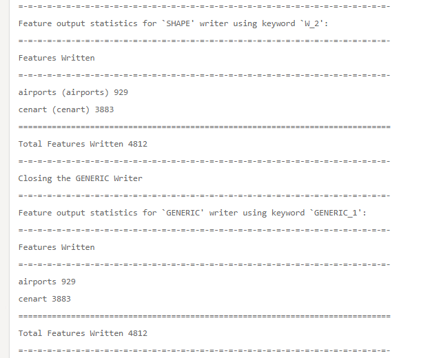

<table style="border-spacing: 0px;border-collapse: collapse;font-family:serif">
<tr>
<td width=25% style="vertical-align:middle;background-color:darkorange;border: 2px solid darkorange">
<i class="fa fa-cogs fa-lg fa-pull-left fa-fw" style="color:white;padding-right: 12px;vertical-align:text-top"></i>
Exercise 5
</td>
<td style="border: 2px solid darkorange;background-color:darkorange;color:white">
Running a Job Asynchronously
</td>
</tr>

<tr>
<td style="border: 1px solid darkorange; font-weight: bold">Data</td>
<td style="border: 1px solid darkorange">None</td>
</tr>

<tr>
<td style="border: 1px solid darkorange; font-weight: bold">Overall Goal</td>
<td style="border: 1px solid darkorange">To run a job asynchronously using the FME Server REST API</td>
</tr>

<tr>
<td style="border: 1px solid darkorange; font-weight: bold">Demonstrates</td>
<td style="border: 1px solid darkorange">How to use the submit call</td>
</tr>

</table>

This exercise demonstrates the submit call, which is used to run a job asynchronously on FME Server. To find more information on the Submit call visit your FME Server REST API page and look for the transformations section or visit the [Rest API Transformations](https://docs.safe.com/fme/html/FME_REST/apidoc/v3/index.html#!/transformations) documentation.  

If you run a job asynchronously you do not have to wait for the job to be completed before making the next call. When you run a job asynchronously you will receive the job ID back from FME Server. You may use this job ID to call FME Server again to get the status of the job.

We will run the exact same call, but instead of Transact, we will change the URL to Submit. By, submitting you will submit the job for processing.

 **1) Paste the URL below into Postman**

Click the plus sign to open a new tab in Postman. Copy the URL below and paste it into Postman.

 
<!--Post Table-->

<table class="tg" style="table-layout: fixed; width: 100%">
  <tr>
    <th class="tg-ao4k">POST</th>
    <th class="tg-a080" style="word-wrap: break-word">https://localhost:8443/fmerest/v3/transformations/submit/Samples/austinDownload.fmw</th>
  </tr>
</table>

 **2) Enter in the Headers**

Fill in the Headers in Postman:

- **Content-Type:** application/json

- **Accept:** application/json

- **Authorization:** fmetoken token= &lt;yourTOKEN>

To enter in the token we can use the preset created previously. In the key-value, type the word token and the preset created will appear.

To enter in the headers required for this call. Click on the Headers tag as demonstrated below.  

 **3) Enter in the Body**

Next, we need to enter the body of the call. Click on the body section of the call and click on the raw button and paste in the body provided. *In Postman you will need to use the keyboard shortcuts to copy and paste.*

  Body:

        {
          "publishedParameters": [
            {
              "name": "MAXY",
              "value": "42"
            },
            {
              "name": "THEMES",
              "value": [
                "airports",
                "cenart"
              ]
            }
          ]
        }

 **Click Send**

 **4) Review the Response**

The response from the call should be:

Please note that you may receive a different number back from the FME
Server. This is okay, it is just the job ID.

 **5) Find the Job in your FME Server**

Open your FME Server, then click on the left-hand menu of the Server where it says Jobs. Click the Job ID that matches the number you received from . Note that the translation might still be running, even though you already received a response. This is because this job is running asynchronously. Click the Job ID to see its full status.

Then, find the Log. If you scroll to almost the bottom of the page, you can see a summary of the features written.

Here, you can investigate if the job was successfully completed and what parameters were used. Here, we can see the correct features were written.

---

<!--Exercise Congratulations Section-->

<table style="border-spacing: 0px">
<tr>
<td style="vertical-align:middle;background-color:darkorange;border: 2px solid darkorange">
<i class="fa fa-thumbs-o-up fa-lg fa-pull-left fa-fw" style="color:white;padding-right: 12px;vertical-align:text-top"></i>
CONGRATULATIONS
</td>
</tr>

<tr>
<td style="border: 1px solid darkorange">

By completing this exercise you have learned how to:
 
<ul><li>Create a call that runs a job asynchronously</li>
<li>Check the Job Log to see if the job was run correctly and with the right parameters</li>
</li>

</td>
</tr>
</table>
