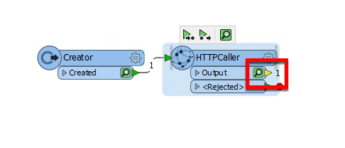
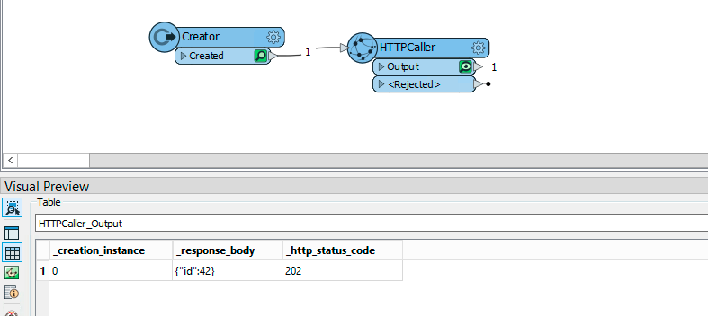
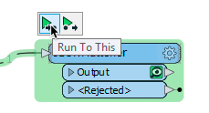
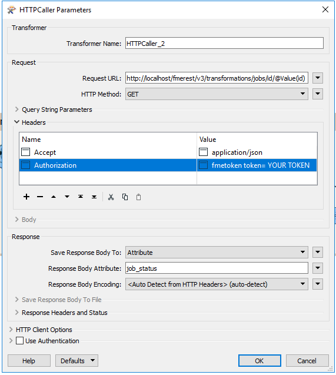

<table style="border-spacing: 0px;border-collapse: collapse;font-family:serif">
<tr>
<td width=25% style="vertical-align:middle;background-color:darkorange;border: 2px solid darkorChaange">
<i class="fa fa-cogs fa-lg fa-pull-left fa-fw" style="color:white;padding-right: 12px;vertical-align:text-top"></i>
Exercise 8 
</td>
<td style="border: 2px solid darkorange;background-color:darkorange;color:white">
Using REST API Commands in a Workspace Exercise
</td>
</tr>

<tr>
<td style="border: 1px solid darkorange; font-weight: bold">Data</td>
<td style="border: 1px solid darkorange">None</td>
</tr>

<tr>
<td style="border: 1px solid darkorange; font-weight: bold">Overall Goal</td>
<td style="border: 1px solid darkorange"> To use the REST API in a workspace </td>
</tr>

<tr>
<td style="border: 1px solid darkorange; font-weight: bold">Demonstrates</td>
<td style="border: 1px solid darkorange">How to use the HTTP Caller to access the FME Server</td>
</tr>
<tr>
<td style="border: 1px solid darkorange; font-weight: bold">Starting Workspace</td>
<td style="border: 1px solid darkorange">None</td>
</tr>
<td style="border: 1px solid darkorange; font-weight: bold">Ending Workspace</td>
<td style="border: 1px solid darkorange">C:\FMEData2019\Resources\RESTAPI\Chapter4Exercise8\Chapter4Exercise8.Complete.fmw</td>
</tr>

</table>

We are creating a very simple workspace that triggers
multiple workspaces in the FME Server. In this workspace, we are going
to step up a workspace to run asynchronously, wait for a response, if
the response is positive the next workspace will run. So let's begin!

 **1) Create a new workspace in Workbench and add a Creator Transformer to the canvas**  

Open a new FME workspace and then add a Creator transformer to the canvas. Keeping the default settings are okay. The Creator creates a single feature which will initiate the HTTPCaller.

 **2) Add an HTTPCaller to the canvas**  
Next, add the HTTPCaller. Use the Request URL to write a submit command. You may use the call below or test it out with another workspace.

There are a few different ways to authorization with FME Server in the HTTPCaller:

1. Use the token in the URL as a query string parameter
2. Use the token in the authorization header
3. Check use authentication and set to basic authentication and enter your username and password
4. Check use authentication and set up an FME Server Web Connection

---

<!--Warning Section-->

<table style="border-spacing: 0px">
<tr>
<td style="vertical-align:middle;background-color:darkorange;border: 2px solid darkorange">
<i class="fa fa-exclamation-triangle fa-lg fa-pull-left fa-fw" style="color:white;padding-right: 12px;vertical-align:text-top"></i>
Note
</td>
</tr>

<tr>
<td style="border: 1px solid darkorange">

At the beginning of the course, we discussed the difference between authentication and authorization. This was referring to the response codes sent from the FME Server. There is a difference between an authentication error and authorization error. However, within the HTTP Caller authenticating or authorizing your call can be used interchangeably.  

</td>
</tr>
</table>

---

**Please note that all calls in this section will require authorization.**

 Now, we will fill out the Request and Headers sections. The layout in the HTTPCaller is very simple because all the areas to fill are clearly labeled.

Please note this is an example call which can be found in the [Rest API POST](https://docs.safe.com/fme/html/FME_REST/apidoc/v3/index.html#!/transformations/submit_post_22) documentation.

First, paste the Request URL in. Then, change the HTTP Method to Post. Update the Headers.

<!--Post Table-->

<table class="tg" style="table-layout: fixed; width: 100%">
  <tr>
    <th class="tg-ao4k">POST</th>
    <th class="tg-a080" style="word-wrap: break-word">http://&lt;yourServerHost>/fmerest/v3/transformations/submit/Samples/austinDownload.fmw</th>
  </tr>
</table>

**Headers:**

- **Accept:** application/json

- **Authorization:** fmetoken token=&lt;yourToken>

Now, find the **Upload Body** section of the HTTPCaller and
click on the drop-down menu. Click on Open Text Editor and paste the upload body into the call.

    {
      "publishedParameters": [
        {
          "name": "MAXY",
          "value": "42"
        },
        {
          "name": "THEMES",
          "value": [
            "airports",
            "cenart"
          ]
        }
      ]
    }

Next, find the **Content Type** section and specify JSON (application/json). The body should look like this:

 **3) Check the Output From the HTTPCaller**

<table style="border-spacing: 0px">
<tr>
<td style="vertical-align:middle;background-color:darkorange;border: 2px solid darkorange">
<i class="fa fa-bolt fa-lg fa-pull-left fa-fw" style="color:white;padding-right: 12px;vertical-align:text-top"></i>
Feature Caching
</td>
</tr>

<tr>
<td style="border: 1px solid darkorange">

In this exercise, we are using Feature Caching. Feature Caching is a tool that allows a user to inspect the output of every transformer in their workspace after it has run. It also allows for partial runs of a workspace. This means you do not have to start at the beginning of a workspace and run to the end. You may choose where the run begins and ends. For more information on feature caching, please read the Safe Blog post on <a href="https://blog.safe.com/2018/05/caching-data-fme-evangelist174/">Feature Caching</a>

</td>
</tr>
</table>

 We are now going to run with workspace with Feature Caching Turned on. This should be automatically turned on. However, you can check that it is selected by clicking Run in the top toolbar and select Run with Feature Caching.

After, the workspace has completed, select the magnifying glass to inspect the output of our last call.

This will open up Visual Preview, here we can view the response_body of the last call to the FME Server. This will contain the job id of the last call.

---

<table style="border-spacing: 0px">
<tr>
<td style="vertical-align:middle;background-color:darkorange;border: 2px solid darkorange">
<i class="fa fa-bolt fa-lg fa-pull-left fa-fw" style="color:white;padding-right: 12px;vertical-align:text-top"></i>
New to 2019.0 Visual Preview
</td>
</tr>

<tr>
<td style="border: 1px solid darkorange">

Visual Preview is new to FME Desktop 2019.0! Visual Preview is an embedded version of the FME Data Inspector. For more information on visual preview, please read the documentation page <a href="http://docs.safe.com/fme/2019.0/html/FME_Desktop_Documentation/FME_Workbench/Workbench/Visual-Preview.htm">Visual Preview.</a>

</td>
</tr>
</table>

---

<table style="border-spacing: 0px">
<tr>
<td style="vertical-align:middle;background-color:darkorange;border: 2px solid darkorange">
<i class="fa fa-quote-left fa-lg fa-pull-left fa-fw" style="color:white;padding-right: 12px;vertical-align:text-top"></i>
Ricky RESTless says...
</td>
</tr>

<tr>
<td style="border: 1px solid darkorange">

While the FME Server REST API does not limit the number of calls you can make. Other APIs may set a limit on the number of calls you can make for free. Feature Caching is a super handy tool in this case. You may inspect the output and adjust your workspace without making additional calls to the server.

</td>
</tr>
</table>

---

 **4) Add a JSONFlattener to the canvas**

Now you can add the JSONFlattener to the canvas. The JSONFlattener allows you to select a part of the JSON to expose, in our case we should expose the job id, so we can use it for the next call.

The parameters should look like this:

**JSON Document:** *_response_body*

**Recursively Flatten Objects/Arrays:** yes

**Attributes to Expose:** id

**List Attribute for JSON Parsing Errors** *_json_error*

 **5) Select the JSONFlattener and Click Run To This**

We want to review the JSONFlattener and ensure that it is producing an attribute with just the Job ID.

Once, we rerun the workspace, we can select the Data Inspector symbol to review the output.
 

Click the magnifying glass to review the results.

Here we can see that the new attribute was successfully created.

*** Get Job Status Overview ***

The goal is this next section is to send a call out to FME Server to check if the previous job was successful. If the call is successful, then we can run a new job. However, this workspace runs so quickly that the FME Server would not have time to process the previous job before the new call is made. So in this section, we will be creating a custom transformer that will continually get the job status until the job has completed.

 **6) Add an HTTPCaller**

We will add a **HTTPCaller** and attach it to the JSONFlattener. It is easiest to copy the original HTTPCaller and then modify the parameters. In the HTTPCaller, click on the drop-down menu next to the Request URL and click open Text Editor. Paste the request and for the id double-click on this icon  from the FME Feature Attributes side panel. Your call should look like this:

<!--GET Table-->

<table class="tg" style="table-layout: fixed; width: 100%">
  <tr>
    <th class="tg-ej3l">GET</th>
    <th class="tg-ufe5" style="word-wrap: break-word">http://&lt;yourServerHost&#62;/fmerest/v3/transformations/jobs/id/@Value(id)</th>
  </tr>
</table>

**Headers:**

- **Accept:** application/json

- **Authorization:** fmetoken token=&lt;yourToken>

Now for the response in the HTTPCaller, we are going to change the Response Body Attribute to job_status. So your HTTPCaller should look like this:

 **7) Check the Output From the HTTPCaller**

Now, select Run in the top toolbar and select Rerun Entire workspace. You can also hit Shift+F5 to Rerun the entire workspace. From here we can click on the magnifying glass to view the response in Visual Preview.

As you can see from the above image, the response is quite long in its raw form.

However, at the very end, we can see the status. Here you should see "status":"PULLED."

So know we need to extract that section of the response to test whether the call was successful. For that, we need another JSONFlattener.

 **8) Add a JSONFlattener**

 Back in FME Workbench, add another JSONFlattener. So, for the
input parameters under JSON Document, we are going to select
job\_status. Then under attributes to expose write status.

 **9) Add a Tester**

Now we are going to add a **Tester** to determine if the workspace is pulled or run. If the status is "PULLED" then the job has not been run yet. For the job to be completed status must not equal PULLED.

The Tester should be named Tester_JobNotPulled. By changing the name of a transformer it allows a user to quickly understand what the Tester is testing for.  

- The **left value** should be the Attribute Value status.

- The **operator** is !=. This means not equal.

- The **right value** is PULLED.

The Tester is testing if the job status is not pulled. If it is pulled it will be sent to the Failed port. If it is not pulled it will go to the Passed port.

  The tester should be set up like this:

If the status is PULLED, then the job has not been run, and we need to rerun the call to check the status. To do this, we need to make a custom transformer with a looper.

 **10) Create a custom transformer**

Select HTTPCaller_2, JSONFlattener_2, and JobNotPulled, right click and select Create Custom Transformer.

Enter in the following details:

- **Name:** JobStatusTester
- **Category:** Web
- **Overview:** This transformer will continue to check if the job has been passed from the PULLED stage.

Click OK. The custom transformer should look like this:

 **11) Add a Looper Transformer**

Right click on the canvas and select Insert Transformer Loop. You will receive a dialog that says: Select Input to Loop to. The default will say Loop to: HTTPCaller_2_Input.

This means that is will loop the HTTPCaller_2 which will check the job id again. Connect this loop to the JobNotPulled failed output.  

Run the workspace!

Once we have run the workspace we should see something like this:

The custom transformer has to run 57 times before it passes the last tester. However, the total translation is only 3.8 seconds.

<!--Tip Section-->

<table style="border-spacing: 0px">
<tr>
<td style="vertical-align:middle;background-color:darkorange;border: 2px solid darkorange">
<i class="fa fa-info-circle fa-lg fa-pull-left fa-fw" style="color:white;padding-right: 12px;vertical-align:text-top"></i>
TIP
</td>
</tr>

<tr>
<td style="border: 1px solid darkorange">

This loop is checking in on the FME Server as fast as possible. While the transformer ran 57 times, if this was a slower job it could hit the FME Server thousands of times. This is where the Decelerator could come in handy. The Decelerator would slow down the custom transformer so it will make less calls to the FME Server.

</td>
</tr>
</table>

 **12) Add an Output to the Custom Transformer.**  

Right-click and select Insert Transformer Output and attach it to Tester_JobNotPulled passed. *Now, we can switch back to the main canvas.*   

 **13) Add a Tester**

Now we are going to add a **Tester** to determine if the workspace was successfully run.

The Tester should be named Tester_Successfully_Run. By changing the name of a transformer it allows a user to quickly understand what the Tester is testing for.  

- The **left value** should be the Attribute Value status.

- The **operator** is =.

- The **right value** is SUCCESS.

This is testing if the status of the job is equal to success.

The tester should be set up like this:

If the status is SUCCESS, then the job was successfully run on the FME Server, and the next workspace will be triggered.

 **14) Add another HTTPCaller**

Finally, use a third HTTPCaller to run a new job synchronously.
To do this use the same call that we had previously used, this is the Transact Call.

<!--Post Table-->

<table class="tg" style="table-layout: fixed; width: 100%">
  <tr>
    <th class="tg-ao4k">POST</th>
    <th class="tg-a080" style="word-wrap: break-word">http://&lt;yourServerHost>/fmerest/v3/transformations/transact/Samples/austinDownload.fmw</th>
  </tr>
</table>

**Headers:**

- **Accept:** application/json

- **Authorization:** fmetoken token= &lt;yourServerHost>  

**Upload Body:**

      {
        "publishedParameters": [
          {
            "name": "MAXY",
            "value": "42"
          },
          {
            "name": "THEMES",
            "value": [
              "airports",
              "cenart"
            ]
          }
        ]
      }

**Content Type:** application/json

While this is not the most practical example because we are running the
same workspace twice, but in two different ways, it demonstrates how FME
can be used. It demonstrates the capabilities of running one workspace
and using the response to determine the next action.

The final workspace should look like this:

---

<!--Exercise Congratulations Section-->

<table style="border-spacing: 0px">
<tr>
<td style="vertical-align:middle;background-color:darkorange;border: 2px solid darkorange">
<i class="fa fa-thumbs-o-up fa-lg fa-pull-left fa-fw" style="color:white;padding-right: 12px;vertical-align:text-top"></i>
CONGRATULATIONS
</td>
</tr>

<tr>
<td style="border: 1px solid darkorange">

By completing this exercise you have learned how to:
 
<ul>
  <li>Use the HTTPCaller transformer to use the FME Server REST API in a workspace</li>
  <li>Create a custom transformer that continually checks the FME Server to see if a job has been completed</li>
  <li>Use the FME Server REST API to run multiple jobs in a row</li>
</ul>

</td>
</tr>
</table>

---
