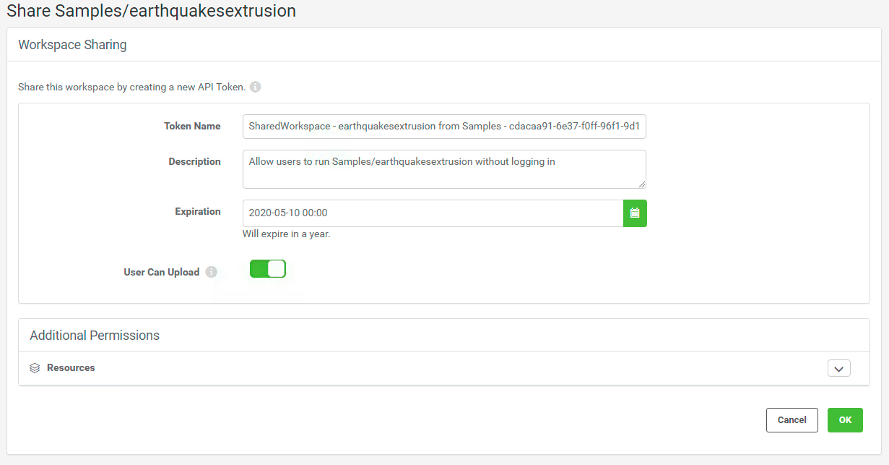

## Chapter 5 - Web Services, Webhook URLs, and the REST API 

<table style="border-spacing: 0px">
<tr>
<td style="vertical-align:middle;background-color:darkorange;border: 2px solid darkorange">
<i class="fa fa-bolt fa-lg fa-pull-left fa-fw" style="color:white;padding-right: 12px;vertical-align:text-top"></i>
New to 2019!
</td>
</tr>

<tr>
<td style="border: 1px solid darkorange">

Sharing workspaces has never been easier than in FME Server 2019.0. We have added Webhook URLs and FME Server Apps. FME Server Apps allow a user to run a workspace without having to log into FME Server. Webhook URLs can be used in a third party application. We will discuss how to use Web Service URLs in the second section of this course.

</td>
</tr>
</table>

A Webhook URL looks similar to the REST API Request URL; however, it
exists outside of the REST API. A Webhook URL should be used instead of a REST call if you are intending on using the Data Streaming or Data Download Service. A job submitted by a REST call will not have access to these services.

 To find an example of the Webhook URL, log
into FME Server and locate a workspace.

Open the advanced tab and scroll down until you find the heading Other Ways to Run this Workspace. Select Create a Webhook.

Once you have selected that link, you will be asked to create a new API Token to run that workspace.

In this area you can change the Token Name, Description, and when the Token will expire.

Select OK to create the token.

The page that opens will show two examples of how to run this workspace using the Webhook URL. One with the authorization in the header and another with the authorization directly in the URL. Click the link under Authorization with Query String to run the workspace.

Like the REST API, the Webhook URL can run a job synchronously and
asynchronously. The job will automatically run synchronously.

To run the
job asynchronously enter an email in the section that says Email results
to. By doing this the Web Service URL will automatically be updated to run
asynchronously. Once the job has completed an email will be sent.

Just like in the REST API there are parameters you may change in the
Webhook URL.

The following table was copied from the following manual on the Data
Download Service. For full documentation see the [Data Download Service](https://docs.safe.com/fme/html/FME_Server_Documentation/Content/ReferenceManual/service_datadownload.htm?Highlight=direct%20url) documentation.

**Web Service URL Request Parameters**

<table>

<tr>
<th>Name</th>
<th>Value</th>
<th>Description</th>
</tr>

<tr>
<td>opt_responseformat</td>
<td>xml or json

Default: xml
</td>
<td>The language of the response. The text must be in lowercase </td>
</tr>

<tr>
<td>opt_geturl</td>
<td>The URL to a dataset</td>
<td>The URL of the source dataset to be used for transformation</td>
</tr>

<tr>
<td>opt_showresult</td>
<td>true or false</td>
<td>Whether the XML/JSON responses include the FME transformation result. The default value is true if this parameter is not present.
</td>
</tr>

<tr>
<td>opt_servicemode</td>
<td>sync or async or schedule</td>
<td>Toggles between synchronous and asynchronous modes of the service. When jobs are submitted asynchronously (async), the response of submission success or failure is returned immediately. When set to synchronous (sync), the response is not returned until the job completes.

Or, schedules a data download request to run at a specified start time (one-time only). If a schedule is specified, see below for additional parameters.</td>
</tr>

<tr>
<td>opt_requesteremail</td>
<td>Comma separated email addresses</td>
<td>Addresses to which the notification e-mail messages are sent.</td>
</tr>

</table>

The Webhook URL and REST API can be combined together in an application
to utilize the best components of both. An example is in the [Easy Translator](http://demos.fmeserver.com/easytranslator/index.html) demo.

Files are uploaded with the REST API; however, the job is run using a Webhook URL.

This is a section of code for the dataUpload function from the FME REST API JavaScript Library. Please note it is not the full function but should provide some context to how the calls look like in a JavaScript function.  

    dataUpload : function(repository, workspace, files, jsid, callback) {
              var url = buildURL('{{svr}}/fmedataupload/' + repository + '/' + workspace);
              var token = getConfig('token');
              url = url + '?token=' + token;
              ajax(url, callback, 'POST', params);

The URL is built with the with the call we see in the REST API, then the token is added to the end of the URL. The URL is submitted with the POST method.

Luckily, this call and almost all of the calls within the FME Server REST API exist within the REST API JavaScript library, so the user does not have to write the functions. A user can successfully create an application by simply calling the functions already created.

The Webhook URL used in a JavaScript function would look like this:

    var submitUrl = BuildForm.host + '/fmedatadownload/' + BuildForm.repository + '/' +  BuildForm.workspaceName + '?SourceDataset_GENERIC=' + files;
              submitUrl = submitUrl + '&SourceFormat=' + sourceFormat;
              submitUrl = submitUrl + '&DestinationFormat=' + destFormat;
              submitUrl = submitUrl + '&COORDSYS_Dest=' + outputCoordSys + '&opt_responseformat=json';

Here the Webhook URL is built, then the user would click the DirectURL to activate it.
