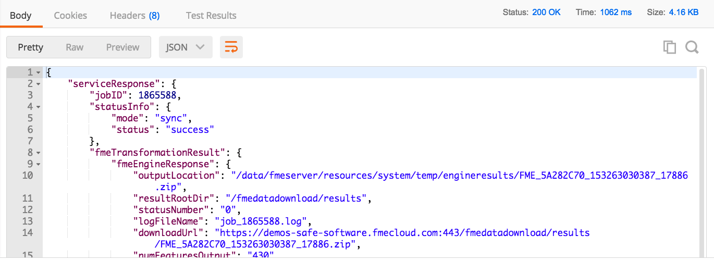

<table style="border-spacing: 0px;border-collapse: collapse;font-family:serif">
<tr>
<td width=25% style="vertical-align:middle;background-color:darkorange;border: 2px solid darkorange">
<i class="fa fa-cogs fa-lg fa-pull-left fa-fw" style="color:white;padding-right: 12px;vertical-align:text-top"></i>
Exercise 9 
</td>
<td style="border: 2px solid darkorange;background-color:darkorange;color:white">
Introduction to using Web Service URLs
</td>
</tr>

<tr>
<td style="border: 1px solid darkorange; font-weight: bold">Data</td>
<td style="border: 1px solid darkorange">None</td>
</tr>

<tr>
<td style="border: 1px solid darkorange; font-weight: bold">Overall Goal</td>
<td style="border: 1px solid darkorange"> To use and understand Web Service URLs </td>
</tr>

<tr>
<td style="border: 1px solid darkorange; font-weight: bold">Demonstrates</td>
<td style="border: 1px solid darkorange"> How to enter a Web Service URL in Postman </td>
</tr>

</table>

At the beginning of the tutorial, we discussed a web application that
allows a user to select an area in Vancouver and receive data back from
the Server with public transit information. We now have all the
necessary information to use the query as a call to the FME Server. The
URL in this example is a Web Service URL.

### Setting up the Query

  **1) Open the URL**

Visit http://demos.fmeserver.com/datadistribution-webmap/index.html?map=arcgis

  **2) Draw a polygon**

Click Draw Polygon, and then draw a polygon within the Vancouver area. Double click to end your drawing and close your polygon.

  **3) Select Parameters**

On **Layers to Download** select Bus Routes and Bus Stops

**Output Coordinate System** should be set to WGS84 Lat/Longs [LL-WGS84]

**Output Format** should be set to Adobe Geospatial PDF

  **4) Copy the query from the from the web application.**

Highlight the query that was automatically generated and copy it. If you are having issues you may copy the query down below:

    https://demos-safe-software.fmecloud.com/fmedatadownload/Demos/DataDownloadService.fmw?opt_servicemode=sync&opt_responseformat=json&GEOM=POLYGON((-123.19385223388672 49.124194030761714,-123.20209197998047 49.3652066040039,-122.7372329711914 49.39473236083984,-122.7482192993164 49.1125210571289,-123.19385223388672 49.124194030761714))&THEMES=BusRoutes&THEMES=BusStops&COORDSYS=EPSG:4326&GENERIC_FORMAT=PDF2D

### Using the Query in Postman

  **5) Paste the URL into Postman**

Paste the full URL into Postman, the query belongs in the top bar that says "Enter request URL". This call will not require any header or body as all the information needed is in the URL. Set the HTTP Method to GET.

  **6) Submit the call**

Click send!

###  Understanding the Response

  **7) Review the Response in the bottom of Postman**

This call is pretty advanced so you will receive a big chunk of JSON. This JSON would be interpreted by the Web Application and it would send back the correct data to the user.

  **8) Review the Headers**

You can explore the headers you receive back from the call. By hovering over the bold text Postman provides a description of the response header.

The following shows the headers that this call returns.

By hovering over the header it will provide a description of the
response header.

### Generating Code Snippets

Postman has the ability to generate code snippets from previous
requests. These snippets can be useful when developing your own web
application.

  **9) Generate Code Snippets**

On the page where you submitted your request click on the code button by
the cookies.

There are various languages that Postman can generate, but for this
shows JavaScript.

---

<!--Exercise Congratulations Section-->

<table style="border-spacing: 0px">
<tr>
<td style="vertical-align:middle;background-color:darkorange;border: 2px solid darkorange">
<i class="fa fa-thumbs-o-up fa-lg fa-pull-left fa-fw" style="color:white;padding-right: 12px;vertical-align:text-top"></i>
CONGRATULATIONS
</td>
</tr>

<tr>
<td style="border: 1px solid darkorange">

By completing this exercise you have learned how to:
 
<ul><li>Submit a Web Service URL using Postman</li>
<li>Generate code snippets using Postman</li>

</td>
</tr>
</table>
