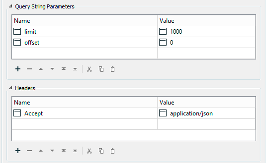
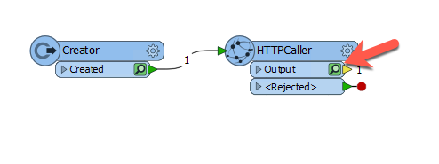
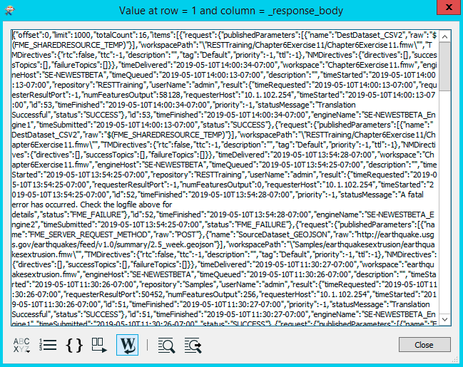
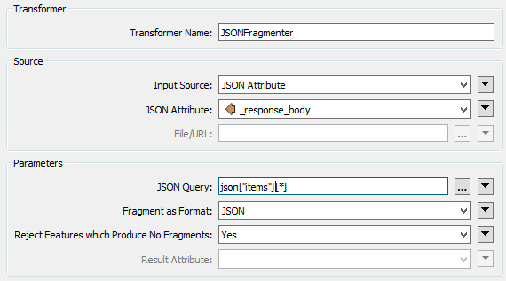
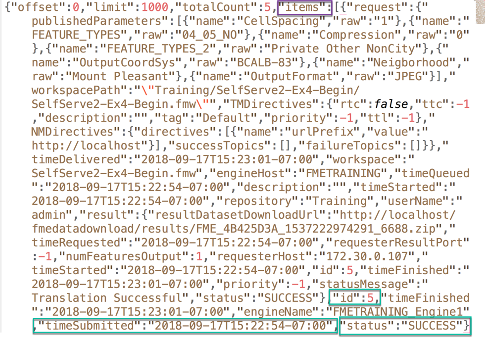
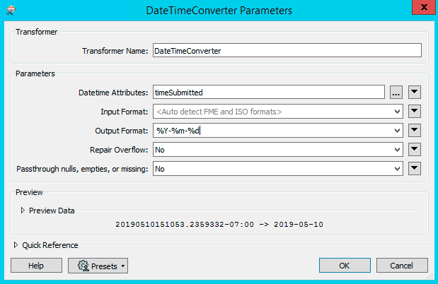
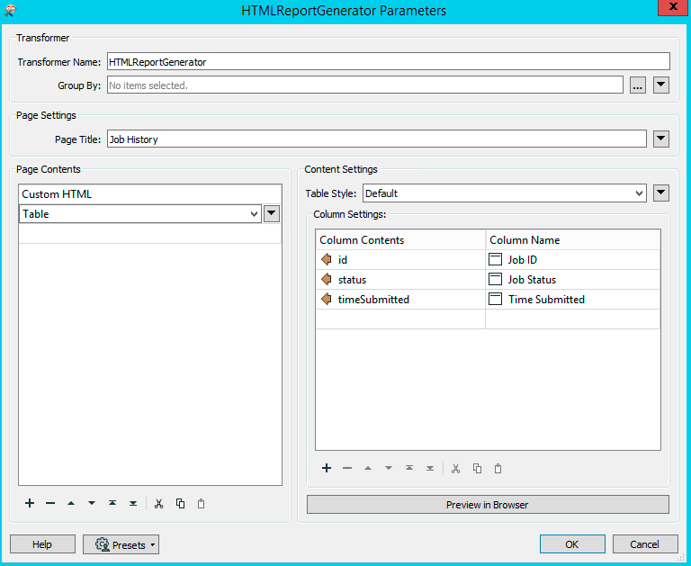
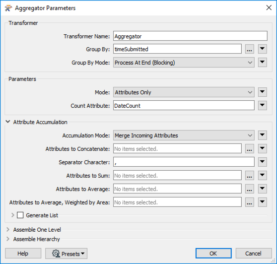
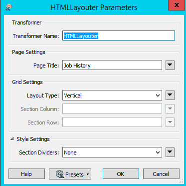
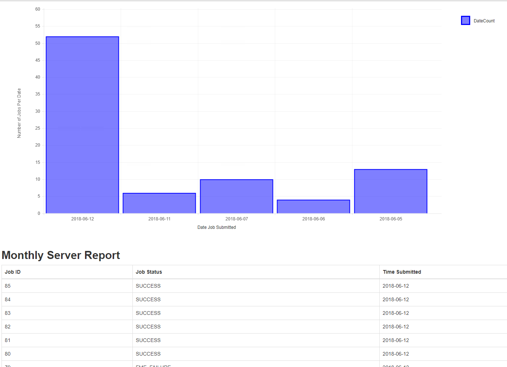

<table style="border-spacing: 0px;border-collapse: collapse;font-family:serif">
<tr>
<td width=25% style="vertical-align:middle;background-color:darkorange;border: 2px solid darkorange">
<i class="fa fa-cogs fa-lg fa-pull-left fa-fw" style="color:white;padding-right: 12px;vertical-align:text-top"></i>
Exercise 8 
</td>
<td style="border: 2px solid darkorange;background-color:darkorange;color:white">
 Create a Workspace to Retrieve Job History Results
</td>
</tr>

<tr>
<td style="border: 1px solid darkorange; font-weight: bold">Data</td>
<td style="border: 1px solid darkorange">None</td>
</tr>

<tr>
<td style="border: 1px solid darkorange; font-weight: bold">Overall Goal</td>
<td style="border: 1px solid darkorange"> To Create a Workspace that can retrieve the last 1000 jobs and display it in an HTML. </td>
</tr>

<tr>
<td style="border: 1px solid darkorange; font-weight: bold">Demonstrates</td>
<td style="border: 1px solid darkorange"> How to use the Get Jobs call in a workspace </td>
</tr>
<tr>
<td style="border: 1px solid darkorange; font-weight: bold">Workspace</td>
<td style="border: 1px solid darkorange"> C:\FMEData2019\Resources\RESTAPI\Chapter7Exercise14.Complete</td>
</tr>

</table>

For this exercise, we are going to create a workspace that retrieves the
job history from your FME Server and creates an HTML file with the
results. The first workspace we will create retrieves the latest 1000
jobs from FME Server. Then the results are formatted into a table
with the results and beneath this, there will be a chart with the number
of results by date.

#### Use the HTTPCaller to Get Jobs and then Format the Attributes

 **1) Add a Creator**

In a blank FME Workspace add a Creator transformer. It is okay to accept the default parameters.

 **2) Add the HTTPCaller**

Add the HTTPCaller and set the parameters as listed below:

<!--GET Table-->

<table class="tg" style="table-layout: fixed; width: 100%">
  <tr>
    <th class="tg-ej3l">GET</th>
    <th class="tg-ufe5" style="word-wrap: break-word">http://&lt;yourServerHost&#62;/fmerest/v3/transformations/jobs/completed</th>
  </tr>
</table>

Next, fill in the Query String Parameters.

<table style="border-spacing: 1px;border-collapse: collapse;">

<tr>
<td style="border: 1px solid black; font-weight: bold">Name</td>
<td style="border: 1px solid black; font-weight: bold">Value</td>
</tr>

<tr>
<td style="border: 1px solid black">limit</td>
<td style="border: 1px solid black">1000</td>
</tr>

<tr>
<td style="border: 1px solid black">offset</td>
<td style="border: 1px solid black">0</td>
</tr>

</table>

Then, under Headers fill in the Accept Header.

<table style="border-spacing: 1px;border-collapse: collapse;">

<tr>
<td style="border: 1px solid black; font-weight: bold">Name</td>
<td style="border: 1px solid black; font-weight: bold">Value</td>
</tr>

<tr>
<td style="border: 1px solid black">Accept</td>
<td style="border: 1px solid black">application/json</td>
</tr>

</table>

Check the box next to Use Authentication. Then select Basic as the Authentication mode and use the admin/admin username and password. You can also set the Authentication Method to Web Connection and then use the FME Server connection that was created in a previous exercise.

 **3) Run with Feature Caching**

Now, we can save the workspace and then run with Feature Caching. Once, the workspace has run select the magnifying glass on the HTTPCaller. The results will appear in the Visual Preview tab.

 Select the response_body in Visual Preview. This response_body contains the entire job obtained by the API.

We need to parse the response to get the information we want into attributes we can use. For this exercise, we are going to keep the id, timeSubmitted, and status. We want to find the id, timeSubmitted, and status in the JSON returned from FME Server.  

 **4) Add a JSONFragmenter**

We are going to use the JSONFragmenter to parse the  attributes.

The JSON Attribute is the response body which is produced from the previous call.

JSON queries should start with json and then the category where the attributes are stored. This may take some trial and error at first.

<!--Tip Section-->

<table style="border-spacing: 0px">
<tr>
<td style="vertical-align:middle;background-color:darkorange;border: 2px solid darkorange">
<i class="fa fa-info-circle fa-lg fa-pull-left fa-fw" style="color:white;padding-right: 12px;vertical-align:text-top"></i>
TIP
</td>
</tr>

<tr>
<td style="border: 1px solid darkorange">

The FeatureReader can also be used to parse JSON. In the HTTPCaller you can choose to write the JSON to a file and then read it back in using the FeatureReader. The FeatureReader when set to read in JSON has the option to scan the schema and create a JSON query. More information about this can be found in the  <a href="https://knowledge.safe.com/articles/39188/tutorial-getting-started-with-json.html">Tutorial: Getting Started with JSON.</a>

</td>
</tr>
</table>

For the JSON Query, we want to find all the responses in the items category therefore, we use this statement:

    json\["items"\]\[\*\]

The code block below demonstrates a sample of the JSON that is returned by the call. By using the JSON Query: json\["items"\]\[\*\], we can then use the Flattening to expose the attributes within the code we would like to use.

Next, we need to set up the Flattening Parameters in the JSONFragmenter. Set Flatten Query Result into Attributes to Yes.

Here, we enter the attributes we would like to keep from the query. You should keep the id, timeSubmitted, and status.

 **5) Add an Attribute Keeper**

Next, add the AttributeKeeper. Attach the AttributeKeeper to the JSONFragmenter. Under parameters and Attributes to Keep: select timeSubmitted, id, status.

---

#### Format Dates

 **6) Add the DateTimeConverter**

Add a DateTimeConverter and attach it to the AttributeKeeper. Use the DateTimeConverter to format the dates into the %Y-%m-%d format. The datetime format that is returned from FME Server can be difficult to read. By modifying the Output Format we can make our chart more visually appealing.

The parameters should be filled in as below:

**Datetime Attributes:** timeSubmitted
 
**Input Format:** Auto detect FME and ISO formats
 
**Output Format:** %Y-%m-%d
 
**Repair Overflow:** No
 
**Passthrough nulls, empties, or missing:** No

---

#### Create a Table with the Job History Results

If we compiled a table with the result currently, it would create a table. However, it would not have an order so we use the Sorter transformer.

 **7) Add the Sorter transformer**

The Sorter transformer will be connected to the output port of the DateTimeConverter. Under the Sort By section list the following parameters:

**Attribute:** id

**Alpha/Num:** Numeric

**Order:** Descending

 **8) Add the HTMLReportGenerator**

Add the HTMLReportGenerator and attach it to the Sorter transformer. In the HTML Report Generator, we can add custom HTML or a table with information gained from the FMEServer.  

 Under the Page Contents, add Custom HTML to the HTMLReportGenerator.

First, we want to add Custom HTML to specify the header on our HTML file.

    <h2><strong>Monthly Server Report</strong></h2>

If you had an introduction or any formatting, you could place it here as well.

Next, under page contents, add a Table. Specify the column contents and headings the table will use.

<table style="border-spacing: 1px;border-collapse: collapse;">

<tr>
<td style="border: 1px solid black; font-weight: bold">Column Contents</td>
<td style="border: 1px solid black; font-weight: bold">Column Name</td>
</tr>

<tr>
<td style="border: 1px solid black">id</td>
<td style="border: 1px solid black">Job ID</td>
</tr>

<tr>
<td style="border: 1px solid black">status</td>
<td style="border: 1px solid black">Job Status</td>
</tr>

<tr>
<td style="border: 1px solid black">timeSubmitted</td>
<td style="border: 1px solid black">Time Submitted</td>
</tr>

</table>

To view the table before it is created, click the Preview in Browser button.

Currently the workspace should look like this. Please note that the bookmarks are optional and were added for clarification purposes in the workspace.
 

---

#### Create a Bar Chart with Jobs by Date

 **9) Add the Aggregator transformer**

Add the Aggregator transformer and attach it to the DateTimeConverter.

We need to aggregate all jobs by date to create the bar chart so we need the Aggregator.

Here, we are grouping the results by timeSubmitted which is the date the attributes were submitted. Then under Count Attribute, we create a new Attribute named DateCount.
**Ensure the Accumulation Mode is set to Merge Incoming Attributes**

 **10) Attach the HTMLReportGenerator**

Next, we attach another HTMLReportGenerator. Under Page Contents select Chart (Bar). Then under Content Settings fill in the X and Y labels. The X axis label is Date Job Submitted. The X Tick Label Attribute is timeSubmitted. The Y Axis Label is Number of Jobs per Date. The Data Attribute is DateCount and the Color is 0,0,255. The parameters are set up below:

Currently, the workspace should look like this.

---

#### Format the Layout and Write to HTML

 **11) Add the HTMLLayouter**

Next, add an HTMLLayouter. Attach both the HTMLReportGenerators to the HTMLLayouter.

 **12) Add an HTML Writer**

Finally, add an HTML Writer. It is okay to accept the default values. Save the file to:

C:\FMEData2019\Output\Training\JobHistory.html

The final workspace should look like this.

 **13) View the results!**

Run the workspace and view the results.

*This example demonstrates an FME Server with many completed jobs, if you are using a training computer this graph will be more simplified.*

 
---

<!--Exercise Congratulations Section-->

<table style="border-spacing: 0px">
<tr>
<td style="vertical-align:middle;background-color:darkorange;border: 2px solid darkorange">
<i class="fa fa-thumbs-o-up fa-lg fa-pull-left fa-fw" style="color:white;padding-right: 12px;vertical-align:text-top"></i>
CONGRATULATIONS
</td>
</tr>

<tr>
<td style="border: 1px solid darkorange">

By completing this exercise you have learned how to:
 
<ul><li>Use a workspace to call the FME Server REST API to retrieve jobs</li>
<li>Review the response from FME Server </li>
<li>Use the HTMLReportGenerator to create a report of the results </li>

</td>
</tr>
</table>
