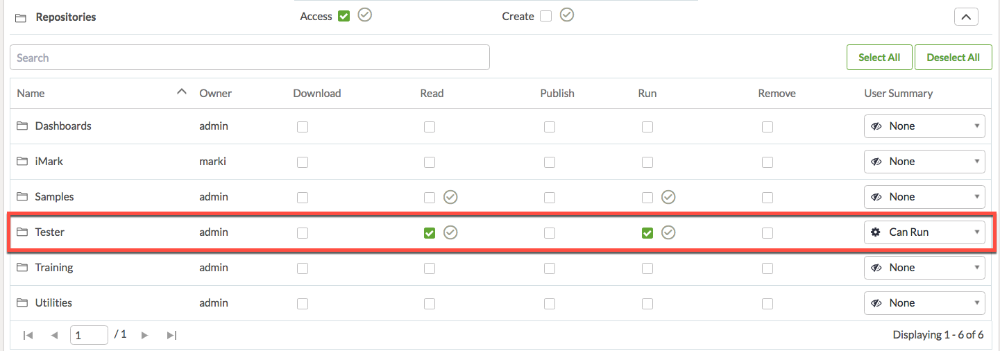

Chapter 8. Best Practices
-------------------------

#### Setting Permissions

The ability of a user to access data on your FME Server is dependent on the permissions granted to the user. When the application uses
functions through the JavaScript API, like Data Download or Data Upload,
the user first has to initialize the application with a token. Each
token is connected to a user. It is a best practice to create a new user
for each application and use that token.

It is important to note, that if your web application uses a
Direct URL, then the permissions are automatically set to the guest
account. The repository that holds the workspace has to have guest
permissions.

To give the repository guest permissions, you will have to access your FME Server. First, look on the left hand panel
of your FME Server. Find Security and then look for Users.

Once on the users page **click guest.**

Scroll down to the permissions and expand the repositories tab. Then
check the read and run permissions.

Now the Direct URL will work.

#### Using the Namespace Variable For the Data Upload Function

The Data Upload function is displayed in Exercise 4. When a user uses
the web application the permissions go through the account that is
authorized in the beginning of the application. Each user will be
anonymous. If two users upload the same file, the files will end up
in the same location and be overwritten. To prevent this, each upload is
given a namespace which is a randomly generated key. When using the Data
Upload function it is best to use the getSession function first. This will be demonstrated later on in the course.

#### Use Direct URLs when needed

Direct URLs are great particularly for Data Streaming. This is because
they will automatically direct the user to the file to be opened on the
computer. Exercises 2 and 3 use Direct URLs and Exercises 1 and
4, use the JavaScript Library.

#### Consistent Naming Conventions

 It's important to keep workspaces organized on the server. Each
workspace or other item should be named so that a user can quickly tell
what workflow it belongs to.

Additionally, when working with a large number of workspaces it is important to publish workspaces with descriptions. These descriptions will help you figure out the purpose of the workspace quickly and easily. You can also view the workspace in the Workspace Viewer for a quick overview.

#### Create a Project

Projects are a way to bundle multiple resources on the Server together
in one area. This is a great way to keep resources together if you ever
migrate servers. Projects are a way to organize multiple resources into a cohesive format. If you have a web application that requires, a specific repository and a resource folder, you can combine these in a project folder. This project folder can be shared and moved to a different server.

#### Further Code Resources

If you are interested in increasing your knowledge of CSS, JavaScript, and HTML there are many online resources. W3Schools https://www.w3schools.com/ and Mozilla Development Networks have some excellent guides https://developer.mozilla.org/en-US/docs/Learn.
