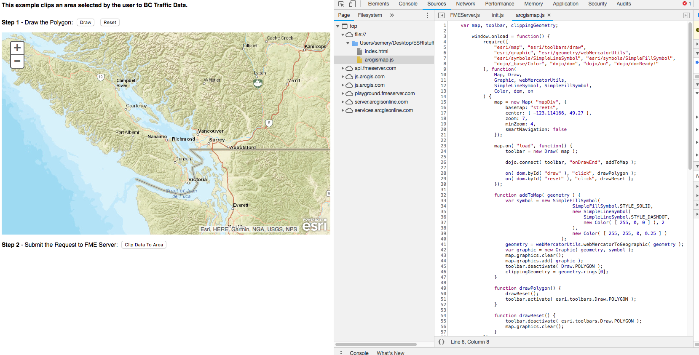
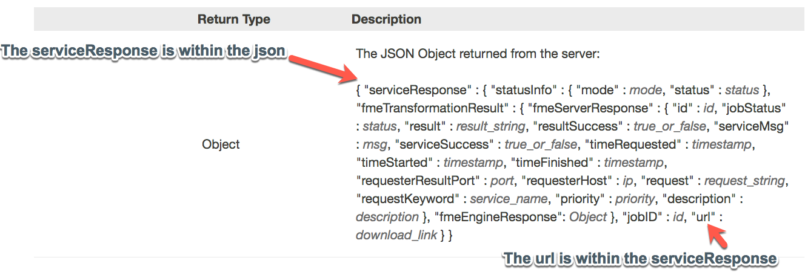
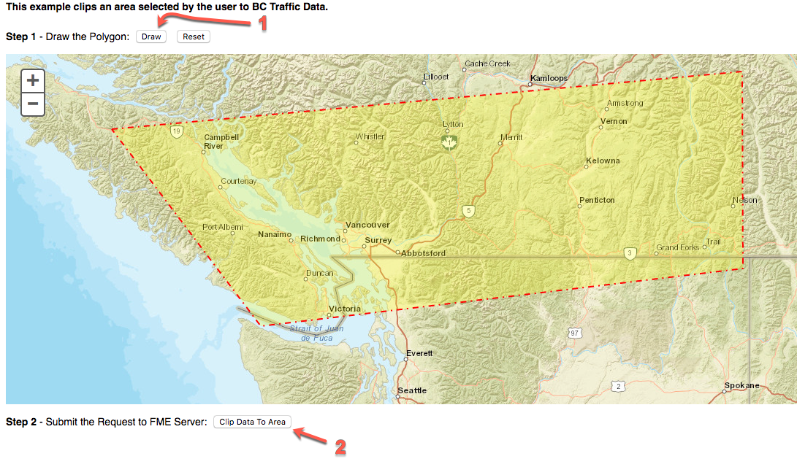
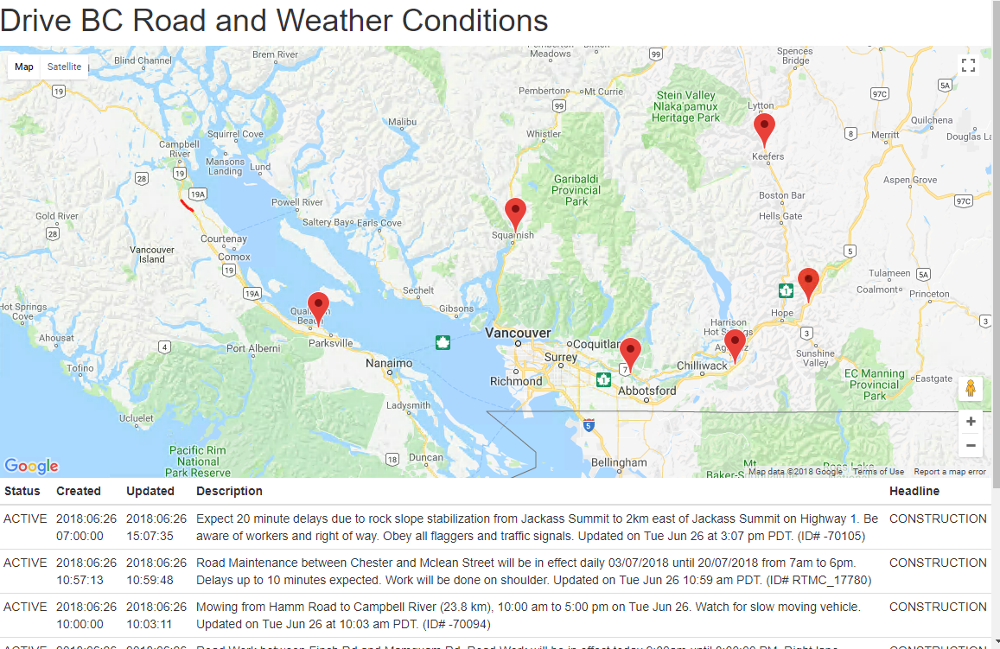

<table style="border-spacing: 0px;border-collapse: collapse;font-family:serif">
<tr>
<td width=25% style="vertical-align:middle;background-color:darkorange;border: 2px solid darkorange">
<i class="fa fa-cogs fa-lg fa-pull-left fa-fw" style="color:white;padding-right: 12px;vertical-align:text-top"></i>
Exercise 16
</td>
<td style="border: 2px solid darkorange;background-color:darkorange;color:white">
 Data Visualization using Esri Maps 
</td>
</tr>

<tr>
<td style="border: 1px solid darkorange; font-weight: bold">Data</td>
<td style="border: 1px solid darkorange">None</td>
</tr>

<tr>
<td style="border: 1px solid darkorange; font-weight: bold">Overall Goal</td>
<td style="border: 1px solid darkorange"> To demonstrate how to integrate a workspace into a Web Application and allow a user to set the parameters in the workspace based on their selection on a map.  </td>
</tr>

<tr>
<td style="border: 1px solid darkorange; font-weight: bold">Demonstrates</td>
<td style="border: 1px solid darkorange"> Esri Maps Integration, the DriveBC API, Data Streaming, and Data Visualization. </td>
</tr>

<tr>
<td style="border: 1px solid darkorange; font-weight: bold">Completed HTML </td>
<td style="border: 1px solid darkorange">C:\FMEData2018\Resources\RESTAPI\mySecondApp\www\completeindex.html  </td>
</tr>

<tr>
<td style="border: 1px solid darkorange; font-weight: bold">Completed Workspace </td>
<td style="border: 1px solid darkorange">C:\FMEData2018\Resources\RESTAPI\mySecondApp\fme\webapp.bcroads.fmw  </td>
</tr>

</table>

#### Set Up the HTML File

This application is split into a few different documents. Many websites store their JavaScript, CSS, and HTML pages separately to promote a cleaner workflow.

**1) Create the index.html document.**

Create an html file and save it as index.html.

**2) Copy and paste the head section of the HTML file in.**

Copy and paste the following code into the index.html file:

    <html>
    <head>
    	<title>ArcGIS Maps Example from FME Server Developer Playground</title>
    	<!-- Styles for example -->
    	<link rel="stylesheet" href="https://playground.fmeserver.com/css/FMEServerExamples.css" type="text/css" />
    	<!-- Include FMEServer.js -->
    	
    	<!-- The following are Required for ArcGIS Maps -->
    	<link rel="stylesheet" href="https://js.arcgis.com/3.8/js/esri/css/esri.css" />
    	
      <!-- Connects to our JavaScript file -->
    	
    </head>
    <!--PLACE FUTURE CODE HERE-->
    </html>

This head section looks very similar to one in the previous exercise. The difference is that the there are a few additional lines of code: 

    <!-- The following are Required for ArcGIS Maps -->
    <link rel="stylesheet" href="https://js.arcgis.com/3.8/js/esri/css/esri.css" />
    

First, we need the code to link to the Esri CSS to our code. The Esri CSS adds the styling components to the map. Then the JavaScript links to a JavaScript library made by Esri.

We also added this line of code:

      <!-- Connects to our JavaScript file -->
      

We will be writing a JavaScript file to make our HTML dynamic. It is a best practice to separate your JavaScript from the HTML to ensure that each file is as clean and easy to follow as possible.

**3) Copy and paste the body into index file**

Next, we paste the body into the index.html file. This section belongs after the place future code here comment:

    <!-- PLACE FUTURE CODE HERE-->  

    <body>
    	<h4>This example clips an area selected by the user to BC Traffic Data.</h4>
    	<form id="exampleForm">
    		<label><b>Step 1</b> - Draw the Polygon: </label>
    		<input id="draw" type="button" value="Draw" />
    		<input id="reset" type="button" value="Reset" /> 
    		

    		<label><b>Step 2</b> - Submit the Request to FME Server: </label>
    		<input type="button" onclick="processClip();" value="Clip Data To Area" />
    	</form>
    </body>

First, we have a very simple heading to explain the purpose of the application. Then we create a form, with buttons to activate different functions in the in the JavaScript.

**4) Review the components of the index.html file**

Go to your web directory and navigate to where you created the file. Right click, on the page and select inspect. You should see this:

The left side has the what the page looks like and the right side has the html file.

As you hover your cursor over the page, it will select different elements on the page and highlight where they exist. It will also display any errors we may have. We currently have errors because we don't have the code required to initialize the map.

To make this page effective we need code to:

  -Initialize the map
  -Draw the Polygon
  -Reset the Polygon
  -Submit the request to the FME Server

We can now start the JavaScript to create these functions!

**5) Create a new JavaScript file**

Now, we can make a new JavaScript file, title it arcgismap.js and save it in the same file as index.html.

**6) Add the code to initialize the map**

Paste the following code into the JavaScript file we just created. Make sure to change your server and token.

    var map, toolbar, clippingGeometry;

      window.onload = function() {
        require([
          "esri/map", "esri/toolbars/draw",
          "esri/graphic", "esri/geometry/webMercatorUtils",
          "esri/symbols/SimpleLineSymbol", "esri/symbols/SimpleFillSymbol",
          "dojo/_base/Color", "dojo/dom", "dojo/on", "dojo/domReady!"
        ], function(
          Map, Draw,
          Graphic, webMercatorUtils,
          SimpleLineSymbol, SimpleFillSymbol,
          Color, dom, on
        ) {
          map = new Map( "mapDiv", {
            basemap: "streets",
            center: [ -123.114166, 49.27 ],
            zoom: 7,
            minZoom: 4,
            smartNavigation: false
          });

          map.on( "load", function() {
            toolbar = new Draw( map );

            dojo.connect( toolbar, "onDrawEnd", addToMap );

            on( dom.byId( "draw" ), "click", drawPolygon );
            on( dom.byId( "reset" ), "click", drawReset );
          });

          function addToMap( geometry ) {
            var symbol = new SimpleFillSymbol(
                        SimpleFillSymbol.STYLE_SOLID,
                        new SimpleLineSymbol(
                          SimpleLineSymbol.STYLE_DASHDOT,
                          new Color( [ 255, 0, 0 ] ), 2
                        ),
                        new Color( [ 255, 255, 0, 0.25 ] )
                      );
            geometry = webMercatorUtils.webMercatorToGeographic( geometry );
            var graphic = new Graphic( geometry, symbol );
            map.graphics.clear();
            map.graphics.add( graphic );
            toolbar.deactivate( Draw.POLYGON );
            clippingGeometry = geometry.rings[0];
          }

          function drawPolygon() {
            drawReset();
            toolbar.activate( esri.toolbars.Draw.POLYGON );
          }

          function drawReset() {
            toolbar.deactivate( esri.toolbars.Draw.POLYGON );
            map.graphics.clear();
          }
        });

        FMEServer.init({
          server : "<yourServerHost>",
          token : "<yourToken"
        });
      };

**6) Refresh the index.html page and test it out**

This code uses the Esri JavaScript API to display a map on the page and activate the drawing and reset functions. If you were to use this code in another application most of it can stay the same. However, you may wish to update the map settings displayed below:

    map = new Map( "mapDiv", {
      basemap: "streets",
      center: [ -123.114166, 49.27 ],
      zoom: 7,
      minZoom: 4,
      smartNavigation: false
    });

Here, you may adjust the center of the map (where the map is located), the zoom, and the minimum zoom.

Or you may change the variable that stores the geometry specified by the user.

       clippingGeometry = geometry.rings[0];

Here we are stating the the first geometry ring will be under clippingGeometry.
If you wish we could display the coordinates to the user with the this line of code:

    alert(JSON.stringify(clippingGeometry));

**7) Add the following functions to the JavaScript file.**

Below the first function we inserted, we need to insert two more. These functions run the Data Download Service and show the results of the what was returned by the FME Server.

    function showResults( json ) {
    			// The following is to write out the full return object
    			// for visualization of the example
    			var hr = document.createElement( "hr" );
    			var div = document.createElement( "div" );

    			// This extracts the download link to the clipped data
    			var download = json.serviceResponse.url;

    			div.innerHTML += "
<a href=\""+download+"\">Download Result</a>";
    			document.body.appendChild( hr );
    			document.body.appendChild( div );
    		}

    		function processClip() {
    			var repository = "RESTTraining";
    			var workspace = "webapp.bcroads.fmw";

    			// Process the clippingGeometry into a WKT Polygon string
    			var geometry = "POLYGON((";

    			for( var i = 0; i < clippingGeometry.length; i++ ) {
    				var lat = clippingGeometry[i][1];
    				var lng = clippingGeometry[i][0];
    				geometry += lng+" "+lat+",";
    			}

    			// Remove trailing , from string
    			geometry = geometry.substr( 0, geometry.length - 1 );
    			geometry += "))";

    			var params = "GEOM="+geometry;

    			// Use the FME Server Data Download Service
    			FMEServer.runDataDownload( repository, workspace, params, showResults );
    		}

First, we have not uploaded the workspace to our server so this will not currently work but let's discuss how we could recreate these functions. Our goal with the processClip function is to use the runDataDownload function. We can find the documentation on how to use this function here: https://playground.fmeserver.com/javascript/data-delivery/arcgis-maps-integration/

 

 To use this function we need the following variables:

 <li> Repository </li>
 <li> Workspace </li>
 <li> Parameters </li>
 <li> Callback </li>

To use this function we would have to include this in our code:

    // Use the FME Server Data Download Service
    FMEServer.runDataDownload( repository, workspace, params, showResults );

Then we can start specifying the variables, the first and easiest are the repository and workspace.

    var repository = "RESTTraining";
    var workspace = "webapp.bcroads.fmw";

Next, we can create the parameter variable. With the workspace we will be creating we need to know all the parameters in advanced to be able to use this call. Therefore, if you were using this call in a real situation it is best to create the workspace first. However, the only parameter in the workspace is GEOM, which will accept Well Known Text (WKT) from our application.

Well Known Text is a format that creates a string that looks like this:

    POLYGON((-123.31968482260129 49.05758039932133,-123.64927466635129 50.269944861577876,-119.33714087728879 50.34712582770931))

In JavaScript we can add bits of strings together to create the full parameter for example we can create a function:

    a="app";
    b="le";
    apple= a+b;

apple will then equal the string "apple".

This can also be done with these statements:

    a= "The REST API is ";
    a += "fun";

The result will be The REST API is fun.

We are going to use this method to create the parameter string needed for this call to run.

First, we start with the declaring that the input will be a Polygon.

    var geometry = "POLYGON((";

Now, we need to input the coordinates of that were selected by the user. Earlier in the program we specified that the clippingGeometry would contain the geometry selected by the user.

We need a function to sort through all the data in the clippingGeometry variable. For this we use a for loop. This loop will end when there is no more data left.

    for( var i = 0; i < clippingGeometry.length; i++ ) {
    				var lat = clippingGeometry[i][1];
    				var lng = clippingGeometry[i][0];
    				geometry += lng+" "+lat+",";
    			}

It's important to note that counts in programming start from 0 instead of 1. The lng, we are assigning the first coordinate read, and then the lat is in the second position. Then the geometry string is added to by this statement:

    geometry += lng+" "+lat+",";

This will leave us with the following statement:

 

 To complete the the geometry string we need to remove the trailing comma and close the parentheses.

     geometry = geometry.substr( 0, geometry.length - 1 );
     geometry += "))";

We have now created the statement for the parameters.

Each parameter you create will have a name associated with it. In our case our parameter name will be GEOM.

    var params = "GEOM="+geometry;

Now finally, we have completed the parameters required to run the DataDownload function. We just need a function to accept the json the DataDownload function produces so we use the showResults function.

Using the documentation again we can review what the JSON will look like from the FME Server:

To find the download link we use the following statement:

    var download = json.serviceResponse.url;

This is stating where the url download link is, it is within the JSON, in the serviceResponse and under URL. You can find this yourself here:  

Now that we have the URL, we can display the URL in a link here: 		

    div.innerHTML += "
<a href=\""+download+"\">Download Result</a>";

We now have an application that will accept coordinates selected by a user then use the DataDownload service to return features in that area. Now we can create a workspace to use.  

#### Create a Workspace

**8) Add a Creator Transformer to the workspace**

**9) Add the GeometryReplacer**

The first step is to get the user input from the web application. If you look at this section of the code, you can see that we are setting that the code is accepting a well known text string from the user input and placing it in parameter called GEOM.

    var params = "GEOM=" + wktString;

So, to bring this information in the workspace we use the
GeometryReplacer. In the GeometryReplacer fill the parameters out below:

The Geometry Encoding is Well Known Text from the Google Map. The
Geometry Source is a user parameter which will created. On the geometry
source click on the dropdown list, find the user parameter, then click
on Create User Parameter.

**10) Add the CoordinateSystemSetter**

At this point in the workspace we have the coordinates into the system
and it has been converted to geometric features. However, there is no
way for FME for to know what the coordinate system is. So we are going
to set it to LL84.

**11) Add the HTTPCaller**

Next, we need to add the HTTPCaller to contact the Drive BC API. This
will be connected to the Creator as well. The Drive BC API is open to
the public so no authorization or authentication is needed. Under
Request URL put:

    http://api.open511.gov.bc.ca/events?format=json&status=ACTIVE

The HTTP Method is GET

The HTTPCaller Parameters should look like this:

**12) Add JSONFragmenter**

The response body will be returned as a long section of JSON. We need to
break this down and expose the attributes needed. All the important
information is stored in the category of events so to gain access to it
under the JSON Query write:

    json["events"][*]

Now we can flatten the JSON to produce the attributes needed for the
table.

*In the Attributes to Expose Section list status, headline,
description, created, and updated.*

The Flattening Parameters should look like this:

**13) Add another JSONFragmenter**

Now we need to expose the Geography component to create features.

There are no Flattening Parameters in this transformer.

**14) Add a GeometryReplacer**

The GeometeryReplacer is an amazing transformer. It can read the JSON
from the Response Body and will automatically create the geometry
associated with it.

**15) Add the CoordinateSystemSetter**

Now we need to set the coordinate system used. The coordinate system is
referenced in URL returned by the call. So we can set it to LL-WGS84
\[EPSG \#4326\].

**16) Add the Clipper Transformer**

Now we are going to use the clipper transformer to clip the area
selected area. The clipper is the area selected by the user and the
clippee is the geometry from the BC Drive API.

**17)Add the NoFeaturesTester**

Start typing NoFeaturesTester in workbench and select the custom transformer. This transformer will test if there was an output or not. If there is no input this means all the features were outside or rejected.

**18) Add the DateTimeConverter**

Add a DateTimeConverter and attach it to the OUTPUT port of the NoFeaturesTester. The DateTimeConverter is used to update the time and date so it is
more readable for the user.

**19) Add the HTMLReportGenerator**

 Add the HTMLReportGenerator and attach it to the DateTimeConverter. Now we are ready to create a webpage with the following information. We
need three sections, a title, a map, and a table.

The title is made with custom HTML

    <h1> Drive BC Road and Weather Conditions </h1>

Next, you may add a Map Component. For now we are going to not fill in the API key.

If you wish to obtain an API key, visit this website, [Google API Key](https://developers.google.com/maps/documentation/javascript/get-api-key#quick-guide-to-getting-a-key)

Next, create a table with the status, created, updated, description,
and headline columns.

**20) Add another HTMLReportGenerator**

Add another HTMLReportGenerator and attach it to the NOINPUT port of the NoFeaturesTester.

Under, Page Contents select the Header.

Under Content Settings write, There are no incidents in the area you selected.  

**19) Add the HTML Writer**

Finally, add in the HTML writer to write to a file of your choice.
Attach the HTML writer to both HTMLReportGenerators.

The full workspace should look like this:

**Upload the Workspace to your Server.**

Publish the workspace to FME Server. Upload under to the RESTTraining repository and save the workspace as webapp.bcroads.fmw. Register the workspace with the Data Download service.

#### Test the Application

Step 1. Draw the Area (double click to close the polygon)

Step 2. Select Clip Data to Area

Step 3. Download the DataDownload

Step 4. Review the File

<!--Exercise Congratulations Section-->

<table style="border-spacing: 0px">
<tr>
<td style="vertical-align:middle;background-color:darkorange;border: 2px solid darkorange">
<i class="fa fa-thumbs-o-up fa-lg fa-pull-left fa-fw" style="color:white;padding-right: 12px;vertical-align:text-top"></i>
CONGRATULATIONS
</td>
</tr>

<tr>
<td style="border: 1px solid darkorange">

By completing this exercise you have learned how to:
 
<ul><li>Use ArcGIS maps to send coordinates to your workspace</li>
<li>Use coordinates from an online resource in your workspace</li>
<li>Use the DataDownload function in the FME Server JavaScript API</li>
<li>Use an external API in a workspace</li>

</li>

</td>
</tr>
</table>
