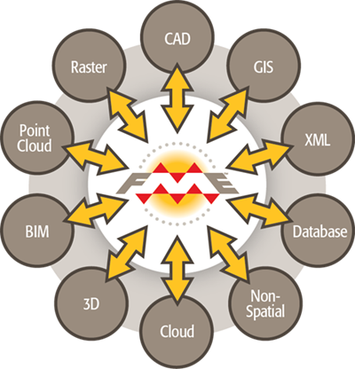

# What is FME?
**FME (the Feature Manipulation Engine)** is a data translation and transformation tool for solving problems of data interoperability, without the need for coding.



## Extract, Transform, and Load
FME is sometimes classed as an **ETL** application. ETL stands for Extract, Transform and Load. It is a data warehousing tool that extracts data from multiple sources (here A and B), transforms it to fit the users’ needs and loads it into a destination (C):

While most ETL tools process only spreadsheet (i.e. tabular) data, FME also has the processing capabilities required to handle spatial data, hence the term **Spatial ETL**.

## How FME Works ##
At the heart of FME is an engine that supports an array of spatial and tabular data types and formats; GIS, CAD, BIM, Point Cloud, XML, Raster, databases, [and many more](https://www.safe.com/integrate/#!).

The capability to support so many data types is made possible by a rich data model that handles all possible geometry and attribute types.

Most importantly, the data translation process is seamless to the user; FME automatically converts between data types as required, and automatically substitutes one attribute or geometry type for another where the destination format does not support it.



<!--Person X Says Section-->

<table style="border-spacing: 0px">
<tr>
<td style="vertical-align:middle;background-color:darkorange;border: 2px solid darkorange">
<i class="fa fa-quote-left fa-lg fa-pull-left fa-fw" style="color:white;padding-right: 12px;vertical-align:text-top"></i>
Miss Vector says...
</td>
</tr>

<tr>
<td style="border: 1px solid darkorange">

Attention students! I'm Miss Vector, FME schoolteacher. I'm here to test you on FME. I hope you don't get these questions wrong!
  Q) ETL is an acronym for...?
  <a href="http://52.73.3.37/fmedatastreaming/Manual/QAResponse2017.fmw?chapter=1&question=1&answer=1&DestDataset_TEXTLINE=C%3A%5CFMEOutput%5CQAResponse.html">1. Extra-Terrestrial Lifeform</a>
 <a href="http://52.73.3.37/fmedatastreaming/Manual/QAResponse2017.fmw?chapter=1&question=1&answer=2&DestDataset_TEXTLINE=C%3A%5CFMEOutput%5CQAResponse.html">2. Extract, Transform, Load</a>
 <a href="http://52.73.3.37/fmedatastreaming/Manual/QAResponse2017.fmw?chapter=1&question=1&answer=3&DestDataset_TEXTLINE=C%3A%5CFMEOutput%5CQAResponse.html">3. Express Toll Lane</a>
 <a href="http://52.73.3.37/fmedatastreaming/Manual/QAResponse2017.fmw?chapter=1&question=1&answer=4&DestDataset_TEXTLINE=C%3A%5CFMEOutput%5CQAResponse.html">4. Eat, Transform, Love</a>
  Q) FME can seamlessly translate between so many formats because it has...
  <a href="http://52.73.3.37/fmedatastreaming/Manual/QAResponse2017.fmw?chapter=1&question=2&answer=1&DestDataset_TEXTLINE=C%3A%5CFMEOutput%5CQAResponse.html">1. A sentient data dictionary</a>
 <a href="http://52.73.3.37/fmedatastreaming/Manual/QAResponse2017.fmw?chapter=1&question=2&answer=2&DestDataset_TEXTLINE=C%3A%5CFMEOutput%5CQAResponse.html">2. A retro-encabulator</a>
 <a href="http://52.73.3.37/fmedatastreaming/Manual/QAResponse2017.fmw?chapter=1&question=2&answer=3&DestDataset_TEXTLINE=C%3A%5CFMEOutput%5CQAResponse.html">3. A rich data model</a>
 <a href="http://52.73.3.37/fmedatastreaming/Manual/QAResponse2017.fmw?chapter=1&question=2&answer=4&DestDataset_TEXTLINE=C%3A%5CFMEOutput%5CQAResponse.html">4. A core of unicorn hairs</a>

</td>
</tr>
</table>
