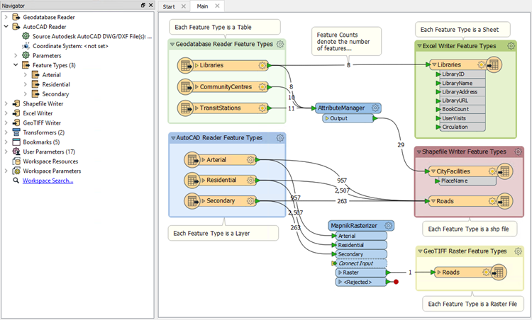

## Workspace Components ##

A workspace is the primary element in an FME translation and is responsible for storing a translation definition. Think of a workspace as the container for all the functionality of a translation, which are stored in the following components:

### Readers and Writers ###
A **reader** is the FME term for the component in a translation that reads a source dataset. Likewise, a **writer** is the component that writes to a destination dataset.

Readers and writers are represented by entries in the Navigator window.

### Feature Types ###
**Feature type** is the FME term that describes a subset of records. Depending on format this could correspond to *layer*, *table*, *sheet*, *feature class*, and *object class*. For example, each layer in a DWG file, or each table in an Oracle database, is defined by a feature type in FME.

Feature types are represented by objects that appear on the Workbench canvas.

### Features ###
**Features** are the smallest single components of an FME translation. Depending on format this could correspond to individual *geometric features* in spatial data, *rows or records* in a table, or (by default) *top-level objects or elements* in a format like JSON or XML. What data becomes features depends on your desired workflow and how you set up your reader.

Features aren’t individually represented within a workspace, except by the feature counts on a completed translation.

### Relationships ###

Each workspace can contain multiple readers and writers, each of which can have multiple feature types, with multiple features. They exist in a hierarchy that looks like this:

A workspace with multiple readers and writers might look like this:

This workspace has two readers (each with three feature types), and three writers (with one, two, and one feature types). Each reader and writer is a different format, and each has a different name for its feature types.
