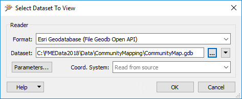

# Using the FME Data Inspector #

With the FME Data Inspector, it’s easy to open and view any number of datasets and to query features within them.

## Viewing Data ##
The FME Data Inspector provides two methods for viewing data: opening or adding.

***Opening*** a dataset opens a new view window for it to be displayed in. ***Adding*** a dataset displays the data in the existing view window; this way multiple datasets can be viewed simultaneously.

### Opening a Dataset ###
Datasets can be opened in the FME Data Inspector in several ways.

- Select File > Open Dataset from the menu bar
- Select the toolbar button Open Dataset.
- Drag and drop a file onto any window (except the View window)
- Open from within Workbench

Opening data from within FME Workbench is achieved by simply right-clicking on a canvas feature type (either source or destination) and choosing the option ‘Inspect.'

All of these methods cause a dialog to open in the FME Data Inspector in which to define the dataset to view.

### Adding a Dataset ###
Opening a dataset causes a new View tab to be created and the data displayed. To open a dataset within an existing view tab requires the use of tools to add a dataset.

- Selecting File > Add Dataset from the menu bar
- Selecting the toolbar button Add Dataset
- Dragging and Dropping a file onto the view window

### Windowing Tools ###
Once data has been opened in the FME Data Inspector, there are many tools available for altering the view.

- Pan
- Zoom In
- Zoom Out
- Zoom to a selected feature
- Zoom to the full extent of the data

---

<!--Tip Section-->

<table style="border-spacing: 0px">
<tr>
<td style="vertical-align:middle;background-color:darkorange;border: 2px solid darkorange">
<i class="fa fa-info-circle fa-lg fa-pull-left fa-fw" style="color:white;padding-right: 12px;vertical-align:text-top"></i>
TIP
</td>
</tr>

<tr>
<td style="border: 1px solid darkorange">

Press the Shift key on the keyboard and it will activate the zoom-in tool in the Inspector.
Press the Ctrl key, which will activate the zoom-out tool. Release the key to revert to the previous tool.
  
This functionality allows users to quickly move between query and navigation modes at the press of a key, so there's no need to click between query and navigation tools on the menubar or toolbar.

</td>
</tr>
</table>
