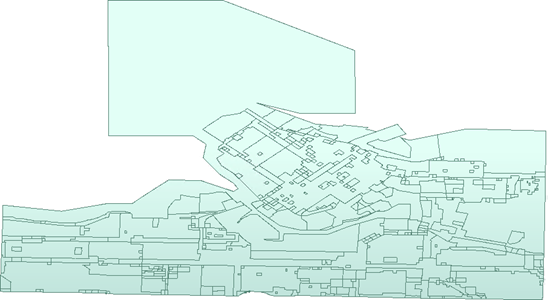
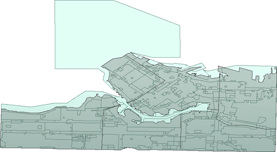

<!--Exercise Section-->

<table style="border-spacing: 0px;border-collapse: collapse;font-family:serif">
<tr>
<td width=25% style="vertical-align:middle;background-color:darkorange;border: 2px solid darkorange">
<i class="fa fa-cogs fa-lg fa-pull-left fa-fw" style="color:white;padding-right: 12px;vertical-align:text-top"></i>
Exercise 3
</td>
<td style="border: 2px solid darkorange;background-color:darkorange;color:white">
Basic Data Inspection
</td>
</tr>

<tr>
<td style="border: 1px solid darkorange; font-weight: bold">Data</td>
<td style="border: 1px solid darkorange">Zoning Data (GeoJSON) Neighborhoods (Google KML)</td>
</tr>

<tr>
<td style="border: 1px solid darkorange; font-weight: bold">Overall Goal</td>
<td style="border: 1px solid darkorange">Inspect the output from a previous translation</td>
</tr>

<tr>
<td style="border: 1px solid darkorange; font-weight: bold">Demonstrates</td>
<td style="border: 1px solid darkorange">Basic data inspection with the FME Data Inspector</td>
</tr>

<tr>
<td style="border: 1px solid darkorange; font-weight: bold">Start Workspace</td>
<td style="border: 1px solid darkorange">None</td>
</tr>

<tr>
<td style="border: 1px solid darkorange; font-weight: bold">End Workspace</td>
<td style="border: 1px solid darkorange">None</td>
</tr>

</table>

In the previous exercise, you were asked to convert some data between formats. Before you send the converted data out, you should inspect it to make sure it is correct. Let’s see how the FME Data Inspector interface works by inspecting the output from that quick translation.

**1) Start FME Data Inspector**
 Start the FME Data Inspector by selecting it from the Windows start menu. You’ll find it under Start > FME Desktop 2018.0 > FME Data Inspector 2018.0.

 **2) Open Dataset**
 The FME Data Inspector will start up and begin with an empty view display.

To open a dataset, select File > Open Dataset from the menubar.
When prompted, fill in the fields in the Select Dataset dialog as follows:

<table style="border: 0px">

<tr>
<td style="font-weight: bold">Reader Format</td>
<td style="">GeoJSON (Geographic JavaScript Object Notation)</td>
</tr>

<tr>
<td style="font-weight: bold">Reader Dataset</td>
<td style="">C:\FMEData2018\Output\Training\Zones.json</td>
</tr>

</table>

***NB:*** *If you can't find the dataset - maybe you didn't complete the first exercise, or wrote the data to a different location - then you can open the original zoning dataset as described in Exercise 2.*

The GeoJSON dataset looks like this:

 **3) Browse Data**
 Use the windowing tools on the toolbar to browse through the dataset, inspecting it closely. Use the Query tool to query individual features and inspect the information in the Feature Information Window.

Try right-clicking in the different Data Inspector windows, to discover functionality that exists on context menus.

 **4) Add Dataset**
 Let's add a second dataset to the display to compare to our zoning data. This dataset will be a KML file of neighborhood boundaries. Then we'll be able to see which neighborhood each zone overlaps.

To add a dataset, select File > Add Dataset from the menubar. When prompted, fill in the fields in the Select Dataset dialog as follows:

<table style="border: 0px">

<tr>
<td style="font-weight: bold">Reader Format</td>
<td style="">Google KML</td>
</tr>

<tr>
<td style="font-weight: bold">Reader Dataset</td>
<td style="">C:\FMEData2018\Data\Boundaries\VancouverNeighborhoods.kml</td>
</tr>

</table>

The display now looks like this:

Use the Table View to practice inspecting the tabular data for each feature type. Click on the dropdown arrow at the top of Table View and switch back and forth between the Zones.json and Neighborhoods.kml tables:

 

<!--Exercise Congratulations Section-->

<table style="border-spacing: 0px">
<tr>
<td style="vertical-align:middle;background-color:darkorange;border: 2px solid darkorange">
<i class="fa fa-thumbs-o-up fa-lg fa-pull-left fa-fw" style="color:white;padding-right: 12px;vertical-align:text-top"></i>
CONGRATULATIONS
</td>
</tr>

<tr>
<td style="border: 1px solid darkorange">

By completing this exercise you have learned how to:
 
<ul><li>Open datasets in a new view in the FME Data Inspector</li>
<li>Use the windowing and inspection tools in the FME Data Inspector</li>
 

</td>
</tr>
</table>
