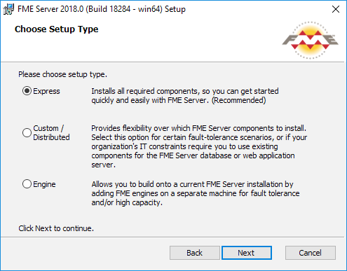
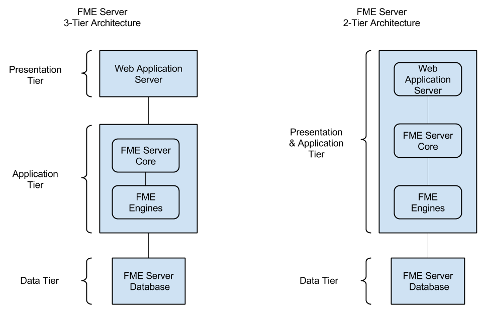
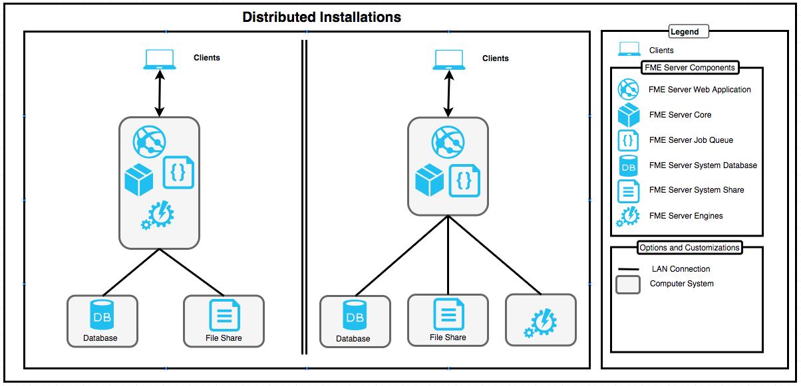

# Installation Types #

There are three options when you install FME Server: Express, Custom/Distributed, or Engine.

<!-- update to 2018 installer -->

## Express Installation ##

The Express option allows you to package all the components, or layers, of the FME Server architecture into a single machine. It is the quickest and easiest of the installation options since all components are provided for you, and you only need to provide a single server to host the installation.

Use the Express installation for any of these scenarios:

- You want to get started quickly with a single installation of FME Server.
- You are not concerned about planning for distributed or fault tolerance environments with this system.
- [ADVANCED] You want to implement a fault Tolerant environment in the future. In this scenario, you conduct multiple Express installations (as many as you plan for your network), which you link together using your third-party load balancer. It does require that the FME Server System Share is set to a UNC path during the Express Installation.  In the future, the System Database changed to a fault tolerant database which then allows this system to be joined by another similar FME Server install.
 <!-- for 2018.1 this may be possible but need to confirm that even an Express Installation can do this.  My understanding is yes, this can be done this way. -->

## Custom/Distributed Installation ##  
<!-- this option will become Distributed/Fault Tolerant in 2018.1 -->

Another option is to install with the Distributed option. With Distributed, you can physically distribute the components into 3-tier or 2-tier configurations:

<!--   <!-- this needs to be updated -->

A Distributed Installation allows you to distribute the FME Server Application (FME Server Core, FME Server Queue, FME Server Web Application), FME Engines, FME Server Database, and the FME Server System Share across physically separate servers. If you choose this distributed architecture, you must provide and manage:

- a server for the FME Server Application (and optionally for any of the distributed FME Engines)
<!--. You can run the FME Server Web Services on your own servlet (Apache Tomcat and Oracle WebLogic are supported), or use an Apache Tomcat servlet provided with the installation.-->
- A database server to host the FME Server Database (Oracle, PostgreSQL, and SQL Server are supported).
- A remote file system to host shared resources. This must be accessible using the UNC protocol and through not mapped network drives.

The diagram above shows the two distributed installations types recommended by Safe Software.

### Benefits of a distributed Architecture ###

Implementing a multi-tier architecture is good if you want to keep components separate so that each can be managed by the appropriate expert team. You also have finer control over applying security updates to the FME Server, FME Server Engines and Database servers when you supply your own. If you use the default FME provided components, you do not have the same amount of control for security.

### Implementing an multi-tier Architecture ###

You can implement an multi-tier architecture by:

1. Choosing one of the Distributed Installation options at installation time, or
2. After an Express installation by performing the following reconfiguration:
	- Changing the database provider for the FME Server Database.

## Engine Installation ##
The third option for FME Server installation is an Engine-only installation. The Engine installation allows you to build onto a current FME Server distributed installation by adding FME Engines on a separate machine for fault tolerance and/or high capacity. By installing additional FME Engines on a separate computer from the FME Server Core, you can add processing capacity to your FME Server.

**NOTE 2018.0 to 2018.1 Engine Only Updates are not supported**

## Silent Installation ##
There is also the option for Silent installation with either Linux or Windows.

When performing a Silent installation, you can override any default installation properties to customize the installation. Installation properties can be set in advance or run with their default values.

The following command is an example of a silent installation on Windows for an install with all default options (similar to an Express install), with logging enabled:
<pre>
msiexec /i fme-server-2017.1.1-b17650-win-x64.msi /qb /norestart /l*v installFMEServerLog.txt
</pre>
