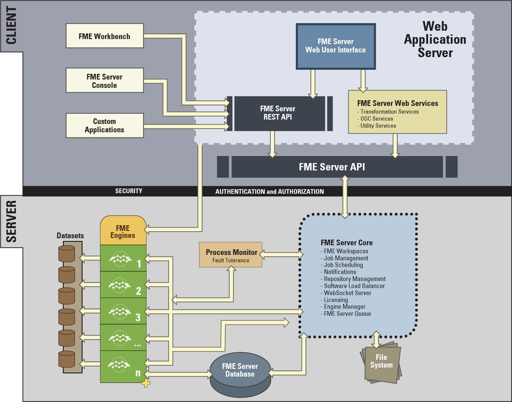

# FME Server Architecture #

FME Server has a number of components, some of  which are considered part of the FME Server Core and others that are considered clients of FME Server.

FME Server Clients include:

- Web Services (for example, the Job Submitter Service).
- Web Clients of FME Server such as Web User Interface.
- Non-Web Clients of FME Server, which include the FME Server Console, FME Workbench, and any custom application that uses the FME Server REST API.

Components that are part of the FME Server Core include:

- Process Monitor
- Repository Manager
- FME Server Database
- Repository File System
- FME Engines
- Scheduling Manager
- Relay Manager
- FME Publishers
- FME Subscribers
- WebSocket Server

## FME Server Components ##

The Web Application Server is required in order to run the FME Server Web User Interface, FME Server Web Services, and any other web clients. The Web User Interface is included with FME Server and can be run in a browser.
Custom web clients can be developed on top of the FME Server REST API.

Non-Web Clients are FME Workbench for authoring jobs to FME Server, FME Server Console is a command line interface to FME Server, and custom clients can be developed on top of the FME Server REST API service.

All requests are sent to FME Server through the FME Server API.

The FME Server Core manages and distributes job requests (queuing, request routing, scheduling), the repository contents (workspaces, custom formats, custom transformers, data), and notification requests. The FME Server Core contains a Software Load Balancer (SLB) that distributes jobs to FME Engines.

The Process Monitor provides fault tolerance functionality ensuring that the FME Server Core and FME Engines remain available to process requests, and provides a mechanism for managing the FME Server and FME Engine components.

FME Engines process job requests by running FME Workspaces.

The FME Server Core uses the FME Server Database to store job and repository information.