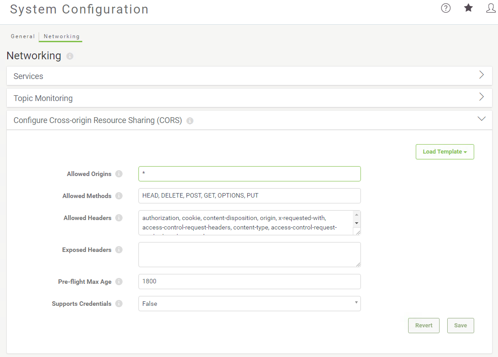

# CORS #

Cross-Origin Resource Sharing (CORS) allows you to specify websites hosted on other domains that can access resources from the FME Server through Ajax requests.

CORS is enabled by default to allow any host to access FME Server resources.

**To disable CORS:**

1. Click *Load Template*, and select *Disable CORS*.
2. Click *Save Changes*. (Or to cancel, click *Revert Changes*).

**To re-enable CORS:**

1. Click *Load Template*, and select *Allow All Hosts* or *Allow Specific Hosts*.
2. Configure the remaining settings as desired.
3. Click *Save Changes*. (Or to cancel, click *Revert Changes*).

### CORS Settings Options ###

*Allowed Origins*: A comma-separated list of hosts that are allowed access to the FME Server. An asterisk (&#42;) allows access from any host. An asterisk cannot be specified if any origins are passing credentials. For an example of how to specify the list of hosts, click *Load Template* and select *Allow Specific Hosts*.

*Allowed Methods*: A comma-separated list of HTTP methods that may be used in requests from the allowed origins.

*Allow Headers*: A comma-separated list of permitted request headers from the allowed origins. A request header is any custom header set by the browser JavaScript application through method *XMLHttpRequest.setRequestHeader()*.

*Exposed Headers*: A comma-separated list of non-standard response headers that are safe to expose to the requestor (initiated through the *XMLHttpRequest.getResponseHeader()* method). This information is returned in the *Access-Control-Expose-Headers* response header.

*Pre-flight Max Age*: Specifies how long, in seconds, the results of a pre-flight request can be cached by the requestor. This information is returned in the *Access-Control-Max-Age* response header.

*Support Credentials*: If TRUE, allows the requestor to include credentials to authorize with the FME Server, including cookies, HTTP authentication (tokens), or client-side certificates. This value is returned in the *Access-Control-Allow-Credentials* response header.

---

<!--Person X Says Section-->

<table style="border-spacing: 0px">
<tr>
<td style="vertical-align:middle;background-color:darkorange;border: 2px solid darkorange">
<i class="fa fa-quote-left fa-lg fa-pull-left fa-fw" style="color:white;padding-right: 12px;vertical-align:text-top"></i>
Miss Analyst says...
</td>
</tr>

<tr>
<td style="border: 1px solid darkorange">

FME Server 2017+ now has "Allow All Hosts" as the default setting for CORS.

</td>
</tr>
</table>
