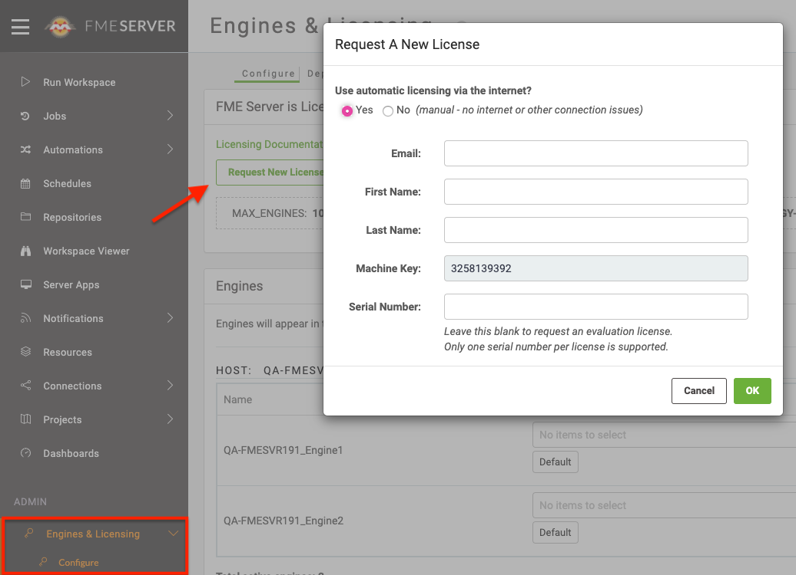

# Verify the Installation #

**Confirm the FME Services are running**

Open Services Desktop App and confirm the four "FME Server" Services (FME Server Core, FME Server Database, FME Server Engines and FME Server Application Server) are running.  On a windows machine these services should start automatically after installation and reboot of the computer.

**Confirm that the Web Services are available:**

Open the Web User Interface in a web browser:

http://<host>:<port>/fmeserver

If you see a login form, it means that the Web Application Server is running, the web applications have been deployed, and you specified the correct port when accessing the Web User Interface.

Note: If you are using a non-standard port, enter the port number after the host name, for example:

http://localhost:8080/fmeserver

**Confirm that FME Server is available:**

Log in to the Web User Interface with the username and password admin/admin.

If you are able to log in , it confirms that FME Server is installed and running.
If you cannot access the Web UI, the page shows a Server error, or you can confirm that FME Server is not running, you might have a problem with installation. Contact fmeserversupport@safe.com.

## Licensing FME Sever ##

#### Online Mode ####

The fastest and easiest method for licensing FME Server is to use the online method. FME Server requires only basic user information (Name, Email) and the serial number provided by your account manager. Requests are sent over HTTP/HTTPS to retrieve the license file from our backend databases.

You can request a license in the *Engines & Licensing* tab of FME Server:

By default, license files are installed to *C:\ProgramData\Safe Software\FME Server\licenses*.

<!--Person X Says Section-->

<table style="border-spacing: 0px">
<tr>
<td style="vertical-align:middle;background-color:darkorange;border: 2px solid darkorange">
<i class="fa fa-quote-left fa-lg fa-pull-left fa-fw" style="color:white;padding-right: 12px;vertical-align:text-top"></i>
Chef Bimm says...
</td>
</tr>

<tr>
<td style="border: 1px solid darkorange">

If you change the machine FME Server is installed to, you do not have to contact Safe Support or your account manager - simply request the license again after FME Server is installed to the new machine!

</td>
</tr>
</table>

#### Offline Mode ####

If the machine hosting the installation of FME Server is disconnected from the internet, or if firewall rules prevent your machine from communicating with our backend database, then there is an offline method for retrieving your FME Server license file.

In the Request License form, select 'No' to instead have a JSON file downloaded to your local file system. This file can then be forwarded to codes@safe.com where an automatic process (running FME in the background) will return a valid license file to you after a few minutes.

This file can then be drag-and-dropped onto the Engines & Licensing page to license FME Server.

## Testing the Engines ##

- Log in with the admin account.
- Click Run Workspace. On the Run a Workspace page, specify:
- Repository: Samples
- Workspace: austinApartments.fmw
- Service: Job Submitter
- Click Run Workspace.
- If you see a success message, your install was a success and you were able to use your engine.
