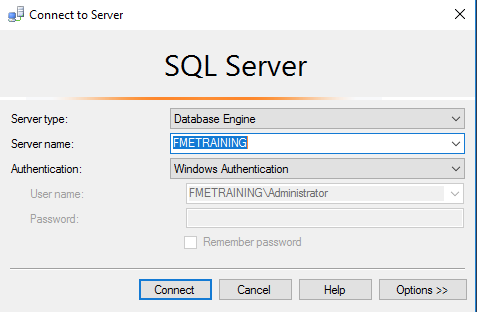
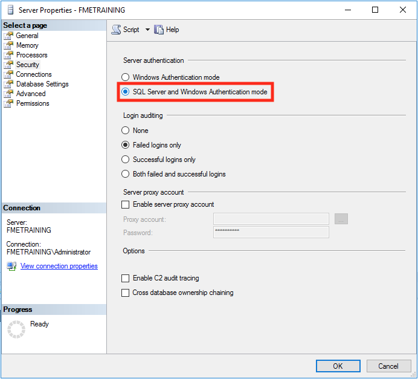
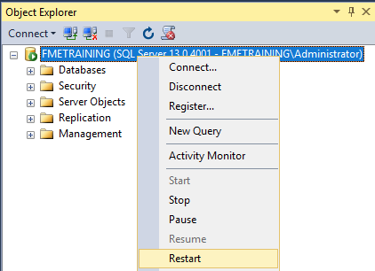
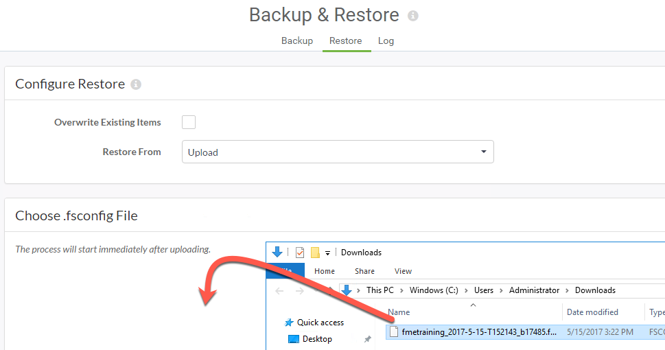

<!--Exercise Section-->

<table style="border-spacing: 0px;border-collapse: collapse;font-family:serif">
<tr>
<td width=25% style="vertical-align:middle;background-color:darkorange;border: 2px solid darkorange">
<i class="fa fa-cogs fa-lg fa-pull-left fa-fw" style="color:white;padding-right: 12px;vertical-align:text-top"></i>
Exercise 2
</td>
<td style="border: 2px solid darkorange;background-color:darkorange;color:white">
Changing the FME Server Database Provider
</td>
</tr>

<tr>
<td style="border: 1px solid darkorange; font-weight: bold">Data</td>
<td style="border: 1px solid darkorange">C:\Program Files\FMEServer\Server\database\sqlserver\sqlserver_createDB.sql
 C:\Program Files\FMEServer\Server\database\sqlserver\sqlserver_createUser.sql</td>
</tr>

<tr>
<td style="border: 1px solid darkorange; font-weight: bold">Overall Goal</td>
<td style="border: 1px solid darkorange">Change the database provider for FME Server</td>
</tr>

<tr>
<td style="border: 1px solid darkorange; font-weight: bold">Demonstrates</td>
<td style="border: 1px solid darkorange">Configuring a new SQL Server database</td>
</tr>

</table>

---

Your company has an Express Installation of FME Server already installed, but your Database Administrator has just informed you that you that the company will be switching its database providers from the default FME Database to a SQL Server database to allow for more control over database security.

---

<!--<table style="border-spacing: 0px">
<tr>
<td style="vertical-align:middle;background-color:darkorange;border: 2px solid darkorange">
<i class="fa fa-quote-left fa-lg fa-pull-left fa-fw" style="color:white;padding-right: 12px;vertical-align:text-top"></i>
FME Lizard says...
</td>
</tr>

<tr>
<td style="border: 1px solid darkorange">

If you have completed the Configuring for HTTPS exercise, remember that the URL to connect to FME Server is now https://localhost:8443/fmeserver and NOT http://localhost/fmeserver!

</td>
</tr>
</table>-->

 **1) Backup FME Server**
 Backing up your current FME Server instance is an important step before performing any post-installation configurations. Once you have changed the database provider, you can restore FME Server configurations all at once instead of having to go through the process of manually changing any settings, republishing workspaces, etc.

Note: If you have *already created an FME Server backup* you can use this existing .fsconfig file and continue to Step 2.

Open the FME Server web interface, either through the Web Interface option on the Windows Start Menu or directly in your web browser, and log in using the username and password *admin*.

Find **Backup & Restore** in the left sidebar, under the Admin heading in the FME Server web interface, and click to expand, then click **Backup**.

Select *Download* to save a backup file of FME Server - this can be thought of as a "snapshot." It will take a short time to run processes in the background to compile the FME Server backup, and once this is complete, it will automatically save to your local downloads folder.

---

<!--Tip Section-->

<table style="border-spacing: 0px">
<tr>
<td style="vertical-align:middle;background-color:darkorange;border: 2px solid darkorange">
<i class="fa fa-info-circle fa-lg fa-pull-left fa-fw" style="color:white;padding-right: 12px;vertical-align:text-top"></i>
TIP
</td>
</tr>

<tr>
<td style="border: 1px solid darkorange">

If you have a PostgreSQL installation instead of SQLServer, you can follow the instructions in the <a href="https://safe-software.gitbooks.io/fme-server-administration-training-2017/content/ServerAdmin4Scalability/Exercise2_SwitchingToAPostgreSQLDatabaseWithWindowsSystem.html">Server Administrator 2017 Course</a>. Just note that the path names might have changed slightly since 2017.

</td>
</tr>
</table>

 **2) Initial Database Configuration**
 For the purposes of this exercise a separate SQL Server database has been installed to the Training Machines.

The two SQL scripts we'll be using for this step and the next (3) can be found at: **C:\Program Files\FMEServer\Server\database\sqlserver\**
  - sqlserver_createDB.sql
  - sqlserver_createUser.sql

We need to create the FMESERVER database schema by configuring the local SQL Server database for FME Server. From the Windows Start Menu open **Command Prompt**.

<!--**Create the FMESERVER database schema**: The next step is to configure the local SQL Server database for FME Server. From the Windows Start Menu, open **Command Prompt**. -->

First, create a new database using the sqlserver_createDB.sql script.  You can review the SQL scripts in a text editor if you wish, but it isn't necessary. In the **Command Prompt** run the following:

    sqlcmd -S FMETRAINING\SQLEXPRESS -i "C:\Program Files\FMEServer\Server\database\sqlserver\sqlserver_createDB.sql"

The output should look like this now in the **Command Prompt** window:

This confirms the new Database "fmeserver" was created.  This SQL script creates all FME Server related tables, indexes, views, and triggers.

 **3) Create the FME Server Database User**

Next, we will create the new user *fmeserver* and grant all necessary permissions to the new user.
This SQL script creates a new user *fmeserver* with password *fmeserver*.  It uses the sqlserver_createUser.sql script.

    sqlcmd -S FMETRAINING\SQLEXPRESS -i "C:\Program Files\FMEServer\Server\database\sqlserver\sqlserver_createUser.sql"

The new user will be created with the appropriate login and permissions to access the *fmeserver* database.

 Exit the **Command Prompt**.

<!-- May add SQL Server Studio steps to confirm database and user was created successfully.  This is optional to include but would help a new user confirm the database and user were created. -->

 **4) Configure the Database Connection**
 Open the *fmeCommonConfig.txt* file, located in the *C:\Program Files\FMEServer\Server\\* directory, using a text editor in administrator mode.

Under the heading *FME SERVER SETTINGS START*, locate the section titled *Database Connection*. We want to disable the default connection to the Postgres database and instruct FME Server to connect to the SQL Server database.

Comment out the *DB_TYPE=postgresql* section, by adding a number sign (#) in front of each line and uncomment the *DB_TYPE=sqlserver* section.  The final edits should look at as follows:

    #DB_TYPE=postgresql
    #DB_DRIVER=org.postgresql.Driver
    #DB_JDBC_URL=jdbc:postgresql://localhost:7082/fmeserver
    #DB_USERNAME=fmeserver
    #DB_PASSWORD=fmeserver
    #DB_CONNECT_EXPIRY=60
    #DB_SQLSTMTS_PATH=C:/Program Files/FMEServer/Server/database

    DB_TYPE=sqlserver
    DB_DRIVER=com.microsoft.sqlserver.jdbc.SQLServerDriver
    DB_JDBC_URL=jdbc:sqlserver://localhost:1433;databaseName=fmeserver
    DB_USERNAME=fmeserver
    DB_PASSWORD=$FME$1ser$ver
    DB_CONNECT_EXPIRY=60
    DB_SQLSTMTS_PATH=C:/Program Files/FMEServer/Server/database

Save and close the *fmeCommonConfig.txt* file.

 **5) SQL Server Modifications**

From the Start menu, Open **Microsoft SQL Server 2016 &#62; SQL Server Management Studio**
Accept the default server name *FMETRAINING* and *Windows Authentication* and click **Connect**.

The first step is to set the Database Server to allow for SQL Server Authentication. This will permit the new *fmeserver* user to connect to the database.

In the *Object Explorer* tree right-click on the **FMETRAINING** and select *Properties*.

In the resulting dialog click on *Security* and select the *SQL Server and Windows Authentication* option.

Click OK, acknowledging that SQL Server requires a restart.

In the *Object Explorer* tree right-click on the **FMETRAINING** and select *Restart*.

And when prompted click *Yes*.

 Finally, **Restart FME Server**.  From the start menu select **FME Server 2019.0.0.3 &#62; Restart FME Server**.

 **6) Restore Your FME Server Configuration**
 Since a backup of FME Server was created in Step 1, we can now restore that same FME Server instance which contains all of the previous FME Server configuration settings.

Login to the FME Server web interface and select **Backup & Restore &gt; Restore** from the left sidebar.

Upload your saved backup configuration file from the beginning of this exercise. Navigate to *C:\Users\Administrator\Downloads\\* and locate the FME Server backup file (Hint: It has *.fsconfig* extension!). Drag-and-drop this file onto the FME Server Restore page:

The FME Server web interface will report if the restore is successful. If it is not, the log file is easily accessible from this page if further investigation is needed.

<!-- **8) Update Service URLs to HTTPS**
Finally, since restoring the configuration does not update the service URLs we must redo the step from Chapter 3, Exercise3.  The reason the service URLs are not updated when restoring a configuration is that we may be restoring to an entirely different system with different URLs.

 To enable SSL for FME Server Services, login to the FME Server web interface (username and password *admin*), and select **Services** on the left sidebar.

On the *Services* page, you can update specific services or all services at once. Let's update all services. Click **Change All Hosts**

The *Change All Hosts* dialog opens. Make sure **Host** is set to _https://localhost:8443_ and click **OK**.

The URLs will be updated to their new, correct values on the Services page.

-->
---

<!--Exercise Congratulations Section-->

<table style="border-spacing: 0px">
<tr>
<td style="vertical-align:middle;background-color:darkorange;border: 2px solid darkorange">
<i class="fa fa-thumbs-o-up fa-lg fa-pull-left fa-fw" style="color:white;padding-right: 12px;vertical-align:text-top"></i>
CONGRATULATIONS!
</td>
</tr>

<tr>
<td style="border: 1px solid darkorange">

By completing this exercise you have learned how to:
 
<ul><li>Change the database provider for FME Server</li></ul>

</td>
</tr>
</table>
