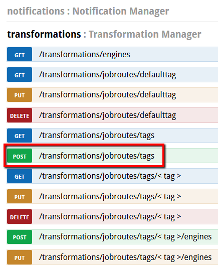
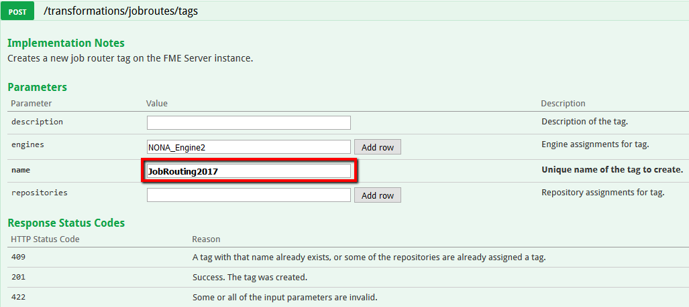
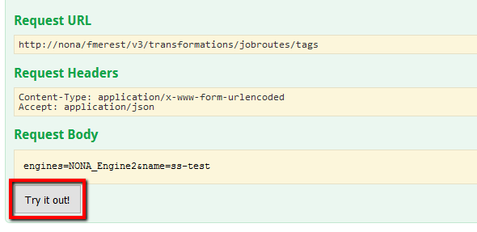
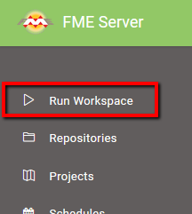
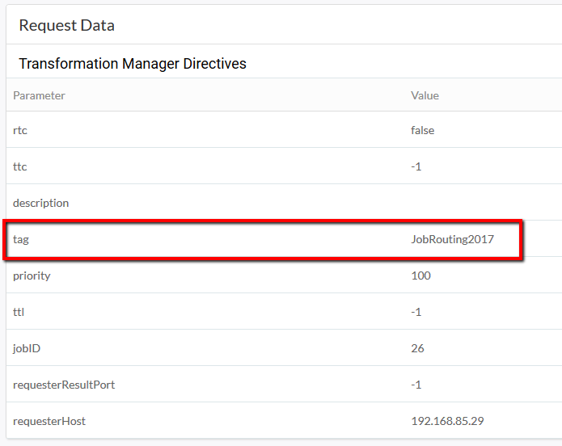

# Exercise - Job Routing #

Your GIS department is all onboard with FME Server and translating jobs with the Web User Interface, but jobs are always being queued, even the quick translations. You are wondering if there is a way to set aside one of the FME Server engines for quick translations only so that you and your fellow technical analysts do not have to wait too long for your smaller jobs to complete. With Job Routing you can allocate specific engines to specific tasks.

 
1) To configure a Job Routing Tag, use the FME Server REST API V3. Click on the API link for the interactive page where you can try each method live:

2) Select **transformations: Transformation Manager** to see the related methods. Click on the **POST** option of **/transformations/jobroutes/tags**:

This is where we will specify the tag we want to create.

3) Under Parameters, fill in **name** with the unique name of the tag you want to create, for example JobRouting2017:

<!--Note Section--> 

<table style="border-spacing: 0px">
<tr>
<td style="vertical-align:middle;background-color:darkorange;border: 2px solid darkorange">
<i class="fa fa-bolt fa-lg fa-pull-left fa-fw" style="color:white;padding-right: 12px;vertical-align:text-top"></i>
Note
</td>
</tr>

<tr>
<td style="border: 1px solid darkorange">

Parameters documented in boldface are required while parameters in normal font are optional.

</td>
</tr>
</table>

You also have the option to specify which engines you want this tag to be associated with, the repository assignments for the tag, and a description of the tag if you so desire.

4) Next, click the button **Try it out!** located at the bottom of the form:

You will be prompted for a Username and Password to acquire a Token. A token is required to access the REST API. This must be provided with every request, and can be specified in a header or querystring or form parameter.

In this case, your Username and Password are the username and password of your FME Server Administrator’s account.

Click **Lookup Existing Token** and then **Generate Token** to authorize the token request.

5) Click **Try it out!** once more to run the method now that your token is registered

A Response Code value of 201 means you have successfully created your tag!

Now you can use the tag to route jobs through the specified engines.

<!--Tip Section--> 

<table style="border-spacing: 0px">
<tr>
<td style="vertical-align:middle;background-color:darkorange;border: 2px solid darkorange">
<i class="fa fa-info-circle fa-lg fa-pull-left fa-fw" style="color:white;padding-right: 12px;vertical-align:text-top"></i>
TIP
</td>
</tr>

<tr>
<td style="border: 1px solid darkorange">

If you wanted to retrieve job router tags, Click on the GET option of /transformations/jobroutes/tags:
  
  Fill in the engine name found in Engines & Licensing on the Web User Interface and then click Try it out!:
  

</td>
</tr>
</table>
 

6) Now we will create a workspace in FME Workbench so that we have a job to test our Job Routing Tag with.

Open FME Workbench and add a Creator transformer and connect it to a Logger transformer.

Now we have a job that we can route.

7) Publish the workspace to FME Server from the file menu in FME Workbench:

8) Once you have a published workspace uploaded to FME Server, you can run the workspace and utilize the Job Routing option.

9) In Run Workspace, fill out the Repository you saved your workspace to, the name of your workspace, and the type of Service the workspace is to be run as: 

10) If you then expanded the Advanced options, there is the Job Routing Tag which can be used to associate the scheduled job with a specific FME Engine by specifying the name of the job routing tag associated with that engine:

Enter JobRouter2017 (the name of the tag that you created from the FME Server REST API).

11) Click **Run**.

12) Check Jobs Completed:

12) Select the workspace that you just ran to open the job details.

13) In the Request Data section you can see your tag name that the job was routed through: 

14) Click the Resubmit Job button at the top of the page:

Click the Resubmit Job button several times; we want to make sure that every time we run the workspace with the Job Routing tag that it is sending the job to the correct engine.

15) Go back to the Jobs Completed section to verify that the job was always sent to the correct engine.

Congratulations on creating a Job Routing Tag and successfully routing a job through a specific engine!