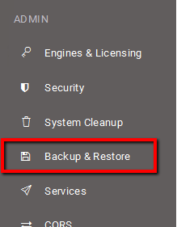
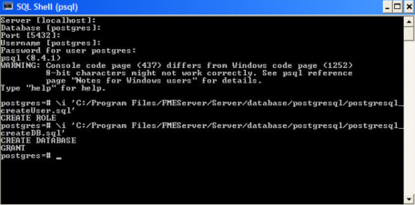
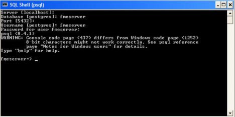
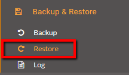

# Exercise - Switching to a PostgreSQL Database with Windows System #

Your company has an Express Installation of FME Server already installed but your Database Administrator has just informed you that you that the company will be switching its database providers from the default FME Database to a PostgreSQL database to allow for more control over database security.

### Backup your FME Server configuration ###

Backing up your current FME Server instance is important before altering your current FME Server so that once you have reinstalled your new database, you can restore your past FME Server configurations all at once instead of having to go through the process of manually changing the configurations settings afterwards.

You can save your current configuration settings by going to Backup & Restore:

… and then downloading the configuration files onto the computer:

Next step is to configure the new database server. Run the necessary database configuration scripts and post-configuration scripts for your new database provider.

### Database Configuration ###

<!--Tip Section--> 

<table style="border-spacing: 0px">
<tr>
<td style="vertical-align:middle;background-color:darkorange;border: 2px solid darkorange">
<i class="fa fa-info-circle fa-lg fa-pull-left fa-fw" style="color:white;padding-right: 12px;vertical-align:text-top"></i>
Note
</td>
</tr>

<tr>
<td style="border: 1px solid darkorange">

C:\Program Files\FMEServer is used in the following steps to indicate the path for where the FME Server installation directory is saved.

</td>
</tr>
</table>

**Using the Command Prompt:**

1. Go to the directory where your postgreSQL files are stored
2. Open psql and log on as a user with the appropriate privileges.
3. Create an FME Server database user as follows:

	- From the SQL prompt, run the *postgresql\_createUser.sql* script by entering the following command:
*\i 'C:\Program Files\FMEServer/Server/database/postgresql/postgresql_createUser.sql'*
	- By default, the provided SQL script creates an FME Server database user named *fmeserver* with the password *fmeserver*.

4. Create an FME Server database.

	- From the SQL prompt, run the *postgresql\_createDB.sql* script by entering the following command:
*\i 'C:\Program Files\FMEServer/Server/database/postgresql/postgresql_createDB.sql'*
	- By default, the provided SQL creates an FME Server database name *fmeserver* and grants all privileges on the database to the user *fmeserver*.

  
5. Quit psql and log on as the FME Server database user.

 
 
6. Create the FME Server database schema as follows:

- From the SQL prompt, run the *postgresql\_createSchema.sql* script by entering the following command:
 	*\i ‘C:\Program Files\FMEServer/Server/database/postgresql/postgresql_createSchema.sql'*
	
- By default, the provided SQL script creates all FME Server related tables, indexes, views, and triggers.

### Post-Configuration ###

1. Ensure that FME Server is running. 
2. On the machine on which the FME Server database server is installed, open *C:\Program Files\PostgreSQL\9.5\data\pg_hba.conf*.
	 Change the following lines:

	

	To:

	

	Restart the FME Server Database service.

3. Run the following scripts:
	- On the machine on which the FME Server Core is installed (primary and failover), open *C:\Program Files\FMEServer\Utilities\\*, and run *runPostInstall.bat* by right-clicking the file and selecting *Run as administrator*.

### Configure the Database Connection ###

Open the *fmeCommonConfig.txt* file, located in your *C:\Program Files\FMEServer\Server\\* directory.

Under the heading *FME SERVER SETTINGS START*, locate the section titled *Database Connection* and update the parameters for the database you want to use for your repository.

### Restore Your FME Server Configuration ###

Since we did a backup of the last FME Server instance, we can now restore that same FME Server instance which contains all of the previous FME Server configuration settings.

Click *Backup & Restore* back on the Web User Interface, and select the *Restore* option:

Upload your saved backup configuration file:

Congratulations on successfully changing your FME Server Database provider!
