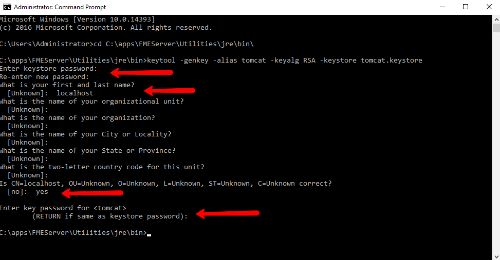
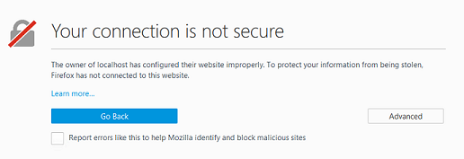

<!--Exercise Section-->

<table style="border-spacing: 0px;border-collapse: collapse;font-family:serif">
<tr>
<td width=25% style="vertical-align:middle;background-color:darkorange;border: 2px solid darkorange">
<i class="fa fa-cogs fa-lg fa-pull-left fa-fw" style="color:white;padding-right: 12px;vertical-align:text-top"></i>
Exercise 3
</td>
<td style="border: 2px solid darkorange;background-color:darkorange;color:white">
Configuring FME Server for HTTPS
</td>
</tr>

<tr>
<td style="border: 1px solid darkorange; font-weight: bold">Data</td>
<td style="border: 1px solid darkorange">C:\FMEData2018\Resources\ServerAdmin\server.xml C:\FMEData2018\Resources\ServerAdmin\web.xml C:\FMEData2018\Resources\ServerAdmin\context.xml</td>
</tr>

<tr>
<td style="border: 1px solid darkorange; font-weight: bold">Overall Goal</td>
<td style="border: 1px solid darkorange">Change access to the FME Server web interface to HTTPS</td>
</tr>

<tr>
<td style="border: 1px solid darkorange; font-weight: bold">Demonstrates</td>
<td style="border: 1px solid darkorange">Creating a self-signed certificate and importing into the FME Server keystore</td>
</tr>

</table>

---

Your company is rapidly expanding and hiring many new employees. Now, instead of having everyone able to access to FME Server, you have set up logins so only trusted personnel have access. You also want to set up extra precautions to keep the transferred information secure.

HTTPS ensures that communication between the client and the server is encrypted, so that if it is intercepted, the third party cannot easily view or use the information. For FME Server, you can use HTTPS to ensure that sensitive login information is not exposed.

For any HTTPS (SSL) page, a certificate is required. For development and testing purposes, self-signed certificates are supported. For production use, we recommend that you use SSL certificates from a verified SSL certificate authority (CA).

 **1) Create a Keystore File**
 First, you must generate a keystore that contains a certificate chain using the Java Keytool from the Java Developer Kit (JDK).

Open a **Command Prompt** as an administrator.

Navigate to the FME Server Java bin directory:
	
	cd C:\apps\FMEServer\Utilities\jre\bin\

Run the following command to create a new keystore file:

	keytool -genkey -alias tomcat -keyalg RSA -keystore tomcat.keystore
 
Set the following values when prompted:

- **Keystore Password:** tomcat
- **First and Last Name:** localhost
- ***&lt;Remaining Parameters&gt;:*** *&lt;leave_blank&gt;*

Enter *yes* when prompted if the input is correct. When prompted for the key password for &lt;tomcat&gt;, press RETURN.

A new keystore is created in *C:\apps\FMEServer\Utilities\jre\bin\\*

Copy the new keystore file to the tomcat directory in the FME Server installation: 

	copy tomcat.keystore C:\apps\FMEServer\Utilities\tomcat\tomcat.keystore

 **2) Working with the Certificate** 
 The new keystore must be imported into the FME Server keystore for trusted certificates. In the command prompt, enter the following command:

	keytool -importkeystore -srckeystore tomcat.keystore -destkeystore C:\apps\FMEServer\Utilities\jre\lib\security\cacerts

You will be prompted to enter two passwords. One for the destination keystore and one for the source keystore. The password for the destination keystore is **changeit**. The password for the source keystore is **tomcat**.

---

**Configuring Tomcat**
 In the next steps, we need to modify three configuration files of Apache Tomcat. All three files are located in the FME Server installation directory: *C:\apps\FMEServer\Utilities\tomcat\conf\\* 

It is a good idea to make copies of any files you will be changing and place them in a separate directory until you have verified that the edits are working successfully.

---

**3) Configure server.xml**
 Open *C:\apps\FMEServer\Utilities\tomcat\conf\server.xml* file in a text editor in administrator mode.

Locate the *SSLEngine* setting in the *&lt;Listener&gt;* element, including *className="org.apache.catalina.core.AprLifecycleListener"* and change the *“on”* value to *“off”*.

		<Listener className="org.apache.catalina.core.AprLifecycleListener" SSLEngine="off" />

Locate the *&lt;Connector&gt;* element that contains *protocol="org.apache.coyote.http11.Http11NioProtocol"* and replace it with the following:

		<Connector protocol="org.apache.coyote.http11.Http11NioProtocol"
		port="8443" minSpareThreads="5"
		enableLookups="true" disableUploadTimeout="true"
		acceptCount="100" maxThreads="200"
		scheme="https" secure="true" SSLEnabled="true"
		keystoreFile="C:\apps\FMEServer\Utilities\tomcat\tomcat.keystore"
		keystorePass="tomcat"
		clientAuth="false" sslEnabledProtocols="TLSv1,TLSv1.1,TLSv1.2"
		sslImplementationName="org.apache.tomcat.util.net.jsse.JSSEImplementation"
		ciphers="TLS_ECDHE_RSA_WITH_AES_128_CBC_SHA256,TLS_ECDHE_RSA_WITH_AES_128_CBC_SHA,
		TLS_ECDHE_RSA_WITH_AES_256_CBC_SHA384,TLS_ECDHE_RSA_WITH_AES_256_CBC_SHA,
		TLS_RSA_WITH_AES_128_GCM_SHA256,TLS_RSA_WITH_AES_256_GCM_SHA384,
		TLS_RSA_WITH_AES_128_CBC_SHA256,TLS_RSA_WITH_AES_256_CBC_SHA256,
		TLS_RSA_WITH_AES_128_CBC_SHA,TLS_RSA_WITH_AES_256_CBC_SHA,
		SSL_RSA_WITH_3DES_EDE_CBC_SHA"
		URIEncoding="UTF8" />
 
		<Connector port="80" protocol="HTTP/1.1"
		redirectPort="8443"/>
		**SM: may need to look at HTTP/2.0**

Save and close the *server.xml* file.

 **4) Configure web.xml**
 Open the *web.xml* file in a text editor in administrator mode.

Add the following code block to the end of the file, just before the closing *&lt;/web-app&gt;* element:

		<security-constraint>
		<web-resource-collection>
		<web-resource-name>HTTPSOnly</web-resource-name>
		<url-pattern>/*</url-pattern>
		</web-resource-collection>
		<user-data-constraint>
		<transport-guarantee>CONFIDENTIAL</transport-guarantee>
		</user-data-constraint>
		</security-constraint>

Save and close the *web.xml* file.

 **5) Configure context.xml**
 Open the *context.xml* file in a text editor in administrator mode.

Add the following to the end of the file, just before the closing *&lt;/context&gt;* element:

		<Valve className="org.apache.catalina.authenticator.SSLAuthenticator"
		disableProxyCaching="false" />

Save and close the *context.xml* file.

 **6) Verify the Configuration** 
 Now that we have made our changes, we want to verify that HTTPS was configured correctly for FME Server.

Restart the FME Server Application service from the **Start menu &gt; FME Server 2017.1 &gt; Restart FME Server**.

Open a browser and navigate to *https://localhost:8443/fmeserver*. 

You should see the FME Server login page in a secured format.

Note: If a self-signed certificate is used for testing, your browser may report the page as not secure:

For self-signed certificates, some browsers will allow you to add an exception for *https://localhost:8443/*.

 **7) Modify Service URLs to Use HTTPS** 
 To enable SSL for FME Server Services, login to the FME Server web interface (username and password *admin*), and select **Services** on the left sidebar. 

On the *Services* page, you can update specific services or all services at once. Let's update all services. Click **Change All Hosts**

The *Change All Hosts* dialog opens. Make sure **Host** is set to *https://localhost:8443* and click **OK**.

The URLs will be updated to their new, correct values on the Services page.

---

<!--Exercise Congratulations Section--> 

<table style="border-spacing: 0px">
<tr>
<td style="vertical-align:middle;background-color:darkorange;border: 2px solid darkorange">
<i class="fa fa-thumbs-o-up fa-lg fa-pull-left fa-fw" style="color:white;padding-right: 12px;vertical-align:text-top"></i>
CONGRATULATIONS!
</td>
</tr>

<tr>
<td style="border: 1px solid darkorange">

By completing this exercise you have learned how to:
 
<ul><li>Create a self-signed certificate</li>
<li>Import a certificate in the FME Server Java keystore</li>
<li>Change FME Server Web Services to use HTTPS URLs</li></ul>

</td>
</tr>
</table>
