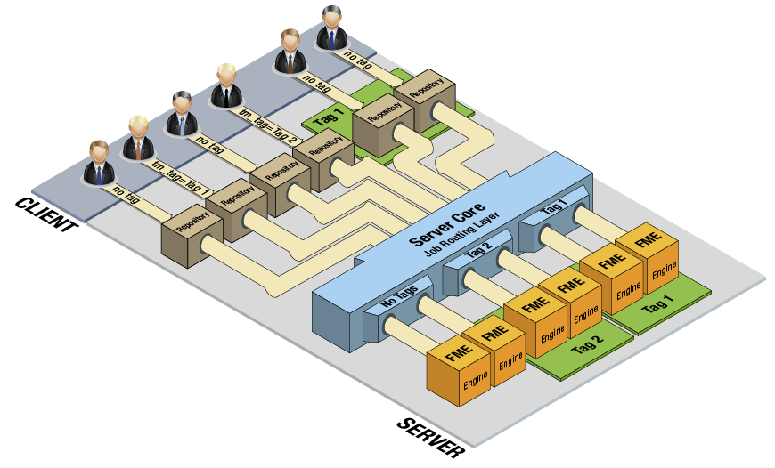

# Job Routing #

Job Routing is a mechanism for sending specific jobs to specific FME Engines. The reasons for doing this include:

- Sending jobs to an FME Engine in close proximity to a data source.
- Sending jobs to an FME Engine that supports a particular format.
- Reserving an FME Engine for a scheduled task.
- Reserving an FME Engine for quick jobs.

Job routing uses *tags* to assign jobs to a subset of available FME Engines. With tags, you can associate specific jobs with certain engines, or associate all jobs in a repository with certain engines.

---

<!--Person X Says Section-->

<table style="border-spacing: 0px">
<tr>
<td style="vertical-align:middle;background-color:darkorange;border: 2px solid darkorange">
<i class="fa fa-quote-left fa-lg fa-pull-left fa-fw" style="color:white;padding-right: 12px;vertical-align:text-top"></i>
Miss Vector says...
</td>
</tr>

<tr>
<td style="border: 1px solid darkorange">

How can you create a Job Routing tag?
  1. When you install a new FME Engine.
 2. On the Engines & Licensing page of the Web User Interface.
 3. The FME Server REST API.
 4. On the Resources page of the Web User Interface.

</td>
</tr>
</table>

---