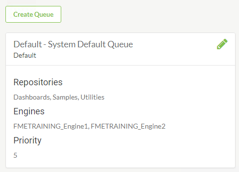
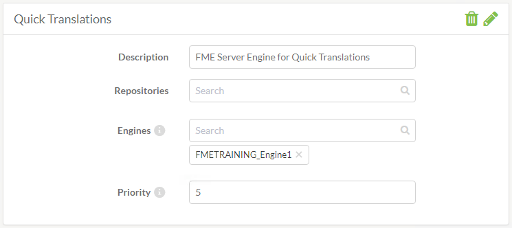
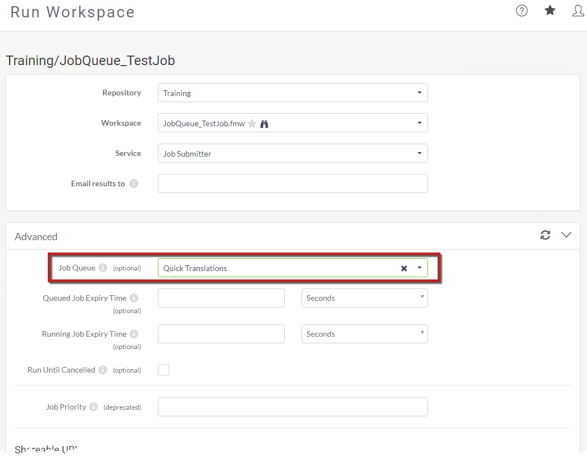

<!--Exercise Section-->

<table style="border-spacing: 0px;border-collapse: collapse;font-family:serif">
<tr>
<td width=25% style="vertical-align:middle;background-color:darkorange;border: 2px solid darkorange">
<i class="fa fa-cogs fa-lg fa-pull-left fa-fw" style="color:white;padding-right: 12px;vertical-align:text-top"></i>
Exercise 1
</td>
<td style="border: 2px solid darkorange;background-color:darkorange;color:white">
Job Queues
</td>
</tr>

<tr>
<td style="border: 1px solid darkorange; font-weight: bold">Data</td>
<td style="border: 1px solid darkorange">N/A</td>
</tr>

<tr>
<td style="border: 1px solid darkorange; font-weight: bold">Overall Goal</td>
<td style="border: 1px solid darkorange">Send a job through a specific FME Engine</td>
</tr>

<tr>
<td style="border: 1px solid darkorange; font-weight: bold">Demonstrates</td>
<td style="border: 1px solid darkorange">Creating a job queue and assigning jobs to queues</td>
</tr>

<tr>
<td style="border: 1px solid darkorange; font-weight: bold">Start Workspace</td>
<td style="border: 1px solid darkorange">None</td>
</tr>

<tr>
<td style="border: 1px solid darkorange; font-weight: bold">End Workspace</td>
<td style="border: 1px solid darkorange">C:\FMEData2017\Workspaces\ServerAdmin\JobQueues-Ex1-Complete.fmw</td>
</tr>

</table>

---

Your GIS department is all onboard with FME Server and translating jobs with the Web User Interface, but jobs are always being queued, even the quick translations. You are wondering if there is a way to set aside one of the FME Server engines for quick translations only so that you and your fellow technical analysts do not have to wait too long for your smaller jobs to complete. With job queues you can allocate specific engines to specific tasks.

---

<!--Miss Vector says...--> 

<table style="border-spacing: 0px">
<tr>
<td style="vertical-align:middle;background-color:darkorange;border: 2px solid darkorange">
<i class="fa fa-quote-left fa-lg fa-pull-left fa-fw" style="color:white;padding-right: 12px;vertical-align:text-top"></i>
Miss Vector says...
</td>
</tr>

<tr>
<td style="border: 1px solid darkorange">

If you have completed the Configure for HTTPS exercise, remember that the URL to connect to FME Server is now https://localhost:8443/fmeserver and NOT http://localhost/fmeserver!

</td>
</tr>
</table>

 **1) Create a Job Queue**
 Job queues are created in the FME Server web interface.

Login to the FME Server web interface and select **Admin &gt; Engines & Licensing** in the left sidebar.

Scroll down to the *Job Queues* heading and select **Create Job Queue**.

Give it the name *Quick Translations* and click OK.

 **2) Assign FME Engines**
 Now that the job queue has been created, specific FME Engines – and repositories – can be assigned to the queue.

Click on the *edit button*. Select **localhost_Engine1** from the drop-down selection for Engines.

To save your edits click the edit button again.

 **3) Create FME Workspace**
 To confirm that the job queue is operating correctly, we can run a workspace in FME Server that specifies the *Quick Translations* queue. For this exercise we do not need a complicated workspace, just a job that will run.

Open FME Workbench and create a new Blank Workspace.

Add a **Creator** transformer and connect it to a **Logger** transformer.

 **4) Publish to FME Server**
 Publish the workspace to FME Server by selecting **Publish to FME Server** from the File menu in FME Workbench:

When prompted in the Publish to FME Server Wizard, publish the workspace to:

- **Repository Name:** Training
- **Workspace Name:** JobQueue_TestJob.fmw
- **Service:** Job Submitter

 **5) Connect to FME Server**
 Open the FME Server web interace, either through the Web User Interface shortcut in the Windows Start Menu or directly in your web browser.

 **6) Assign and Run Workspace in Job Queue**
 Once you have a published to FME Server, you can run the **JobQueue_TestJob** workspace and set the Job Queue parameter.

Select *Run Workspace* in the left sidebar of the FME Server web interface.

On Run Workspace page, fill out the parameters as follows:

- **Repository:** Training
- **Workspace:** JobQueue_TestJob

Next, expand the **Advanced** options on the Run Workspace page. Set the *Job Queues* parameter to **QuickTranslations** (the name of the queue created in Step 1):

Click **Run** at the bottom of the Run Workspace page.

 **7) Verify Job Queue Configuration**
 You want to make sure that the job was routed to the correct engine and not just the first available engine.

In the left sidebar of the FME Server web interface select **Jobs &gt; Completed**.

Select the workspace that just ran to open the *Job Details* page.

Click to expand the **Request Data** section. Next to the **queue** parameter you will see the name of the specified job queue: 

Go back to *Jobs &gt; Completed* to verify that the job was sent to the correct engine. When testing, you may consider submitting the job multiple times for an added verification step, and piece of mind, but this isn't necessary of course!

---

<!--Exercise Congratulations Section--> 

<table style="border-spacing: 0px">
<tr>
<td style="vertical-align:middle;background-color:darkorange;border: 2px solid darkorange">
<i class="fa fa-thumbs-o-up fa-lg fa-pull-left fa-fw" style="color:white;padding-right: 12px;vertical-align:text-top"></i>
CONGRATULATIONS!
</td>
</tr>

<tr>
<td style="border: 1px solid darkorange">

By completing this exercise you have learned how to:
 
<ul><li>Create a Job Queue</li>
<li>Successfully route a job through a specific engine</li>
</ul>

</td>
</tr>
</table>
