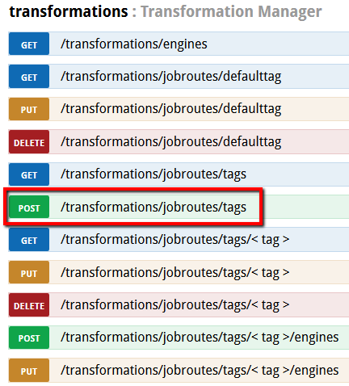

<!--Exercise Section-->

<table style="border-spacing: 0px;border-collapse: collapse;font-family:serif">
<tr>
<td width=25% style="vertical-align:middle;background-color:darkorange;border: 2px solid darkorange">
<i class="fa fa-cogs fa-lg fa-pull-left fa-fw" style="color:white;padding-right: 12px;vertical-align:text-top"></i>
Exercise 1
</td>
<td style="border: 2px solid darkorange;background-color:darkorange;color:white">
Job Routing
</td>
</tr>

<tr>
<td style="border: 1px solid darkorange; font-weight: bold">Data</td>
<td style="border: 1px solid darkorange">N/A</td>
</tr>

<tr>
<td style="border: 1px solid darkorange; font-weight: bold">Overall Goal</td>
<td style="border: 1px solid darkorange">Send a job through a specific engine</td>
</tr>

<tr>
<td style="border: 1px solid darkorange; font-weight: bold">Demonstrates</td>
<td style="border: 1px solid darkorange">Creating a job routing tag for an engine and sending a job through that particular engine</td>
</tr>

<tr>
<td style="border: 1px solid darkorange; font-weight: bold">Start Workspace</td>
<td style="border: 1px solid darkorange">None</td>
</tr>

<tr>
<td style="border: 1px solid darkorange; font-weight: bold">End Workspace</td>
<td style="border: 1px solid darkorange"></td>
</tr>

</table>

---

Your GIS department is all onboard with FME Server and translating jobs with the Web User Interface, but jobs are always being queued, even the quick translations. You are wondering if there is a way to set aside one of the FME Server engines for quick translations only so that you and your fellow technical analysts do not have to wait too long for your smaller jobs to complete. With Job Routing you can allocate specific engines to specific tasks.

 
**1) Create a Job Routing Tag**

To configure a Job Routing Tag, use the [FME Server REST API V3](https://docs.safe.com/fme/html/FME_REST/apidoc/v3/index.html). Click **API** for the interactive page where you can try each method live:

Select **transformations: Transformation Manager** to see the related methods. Click on the **POST** option of **/transformations/jobroutes/tags**:

This is where we will specify the tag we want to create.

**2) Name Your Tag**

Under Parameters, fill in **name** with the unique name of the tag you want to create, for example *JobRouting2017*:

---

<!--Sister Intuitive says...--> 

<table style="border-spacing: 0px">
<tr>
<td style="vertical-align:middle;background-color:darkorange;border: 2px solid darkorange">
<i class="fa fa-bolt fa-lg fa-pull-left fa-fw" style="color:white;padding-right: 12px;vertical-align:text-top"></i>
Sister Intuitive says...
</td>
</tr>

<tr>
<td style="border: 1px solid darkorange">

Parameters documented in boldface are required while parameters in normal font are optional.

</td>
</tr>
</table>

---

You also have the option to specify which engine(s) you want this tag to be associated with, the repository assignments for the tag, and a description of the tag if you so desire.

Fill in the name of one of your engines found in the *Engines & Licensing* tab of FME Server.

Next, click the button **Try it out!** located at the bottom of the form:

**3) Generate a Token**

You will be prompted for a Username and Password to acquire a Token. A token is required to access the REST API. This must be provided with every request, and can be specified in a header or querystring or form parameter.

In this case, your Username and Password are the username and password of your FME Server Administrator’s account.

Click **Lookup Existing Token** and then **Generate Token** to authorize the token request.

Click **Try it out!** once more to run the method now that your token is registered

A Response Code value of 201 means you have successfully created your tag!

Now you can use the tag to route jobs through the specified engine.

**4) Create a Workspace**

Now we will create a workspace in FME Workbench so that we have a job to test our Job Routing Tag with.

Open FME Workbench and create a new Blank Workspace.

Add a **Creator** transformer and connect it to a **Logger** transformer.

Now we have a job that we can route.

**5) Publish to FME Server**

Publish the workspace to FME Server from the file menu in FME Workbench:

When prompted, publish the workspace to:

- **Repository Name:** testing
- **Workspace Name:** JobRouting_Job.fmw
- **Service:** Job Sumbitter

**6) Connect to FME Server**

Open the FME Server Web User Interface, either through the Web User Interface option on the Windows Start Menu or directly in your web browser (http://localhost/fmeserver), and log in using the username and password *admin*.

**7) Run the Workspace**

Once you have a published to FME Server, you can run the **JobRouting_Job** workspace and utilize the Job Routing option.

In *Run Workspace*, fill out the parameters as follows:

- **Repository:** testing
- **Workspace:** JobRouting_Job
- **Service:** Job Submitter 

**8) Advanced Options**

If you then expanded the *Advanced* options, there is the *Job Routing Tag* which can be used to associate the scheduled job with a specific FME Engine by specifying the name of the job routing tag associated with that engine. Enter *JobRouter2017* (the name of the tag that you created from the FME Server REST API).:

Click **Run**.

**9) Ensure the Job Routed correctly**

Check **Jobs &gt; Completed**:

Select the workspace that you just ran to open the job details.

In the *Request Data* section you can see your tag name that the job was routed through: 

**10) Resubmit the Job**

Click the *Resubmit Job* button at the top of the page:

Click the *Resubmit Job* button several times; we want to make sure that every time we run the workspace with the Job Routing Tag that it is sending the job to the correct engine.

**11) Verify the Subsequent Jobs Routed Correctly**

Go back to the completed jobs section to verify that the job was always sent to the correct engine.

---

<!--Exercise Congratulations Section--> 

<table style="border-spacing: 0px">
<tr>
<td style="vertical-align:middle;background-color:darkorange;border: 2px solid darkorange">
<i class="fa fa-thumbs-o-up fa-lg fa-pull-left fa-fw" style="color:white;padding-right: 12px;vertical-align:text-top"></i>
CONGRATULATIONS!
</td>
</tr>

<tr>
<td style="border: 1px solid darkorange">

By completing this exercise you have learned how to:
 
<ul><li>Create a Job Routing Tag</li>
<li>Successfully route a job through a specific engine</li>
</ul>

</td>
</tr>
</table>

---

