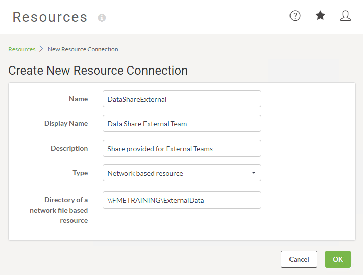

# Adding Shared Resources #

The Resources page is a convenient way to store and access the following:

- FME Server backup files.
- HTML reports generated for Dashboards.
- Data files that can be shared between different workspaces that are run from FME Server, regardless of the repository.
- FME Engine Resources, including custom formats, custom transformers, custom coordinate systems, and custom Java and Python modules that can be shared between different workspaces that are run from FME Server.
- FME Server and database log files.
- Connections to your own network resources and Amazon Web Services (AWS) S3 buckets.
- Temporary files created by FME Server.

### Uploading Files and Folders ###

1. To overwrite existing files with the same names as those being uploaded, select *Overwrite Existing Files*.
2. Select *Upload* and specify whether to upload an entire folder or specific files. Alternatively, drag and drop a file or folder on to the page.

### Creating New Network Resources ###

New in 2018.0 you can create new network shares in the FME Server Web Interface.  Ensure the FME Server Web Application, FME Server Core, and FME Server Engine **services** are running as a domain service account with the correct network access permissions as required.  **(Read|Write)**

### Sharing Resources ###

To share a resource, click the *Share with Others* icon. Through sharing, you can grant levels of permissions on an item to other users. You can share an item if you own it, or if you are a user with Manage Security permissions, such as an administrator.

Upon successfully adding the connection it will appear in the *Resources* page.

---

<!--Miss Vector Says Section-->

<table style="border-spacing: 0px">
<tr>
<td style="vertical-align:middle;background-color:darkorange;border: 2px solid darkorange">
<i class="fa fa-quote-left fa-lg fa-pull-left fa-fw" style="color:white;padding-right: 12px;vertical-align:text-top"></i>
Miss Vector says...
</td>
</tr>
<tr>
<td style="border: 1px solid darkorange">

How would you allow other users to access shared resources?
  <a href="http://52.73.3.37/fmedatastreaming/Manual/QAResponse2017.fmw?chapter=28&question=2&answer=1&DestDataset_TEXTLINE=C%3A%5CFMEOutput%5CQAResponse.html">1. Grant permissions to specific users.
 <a href="http://52.73.3.37/fmedatastreaming/Manual/QAResponse2017.fmw?chapter=28&question=2&answer=2&DestDataset_TEXTLINE=C%3A%5CFMEOutput%5CQAResponse.html">2. Grant permissions to a role.
 <a href="http://52.73.3.37/fmedatastreaming/Manual/QAResponse2017.fmw?chapter=28&question=2&answer=3&DestDataset_TEXTLINE=C%3A%5CFMEOutput%5CQAResponse.html">3. Tag a user you want to share the resources with when you upload the file(s).

</td>
</tr>
</table>
